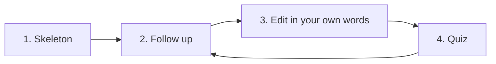

# Chapter 2. Chat

> Paste a file. Ask a bad question. Watch it fail. Ask a good one. Walk away with a learning note you wrote yourself.

This chapter is your first real **rep**. There's no workflow to install. No agent to configure. Just a chat window, a 20-line script, and a handful of prompt templates that turn "explain this code" into something that actually teaches you.

## What this chapter ships

- [`dump.py`](dump.py). The 20-line repo serializer from §2.2. Skip the noise, paste the rest.
- [`prompts/`](prompts/). Five reusable prompt templates, one per technique the chapter teaches.
- [`examples/nanochat-codebase.md`](examples/nanochat-codebase.md). A worked example of a finished learning note for karpathy/nanochat. What yours could look like after one pass through the cycle.

That's it. Everything else, you do by hand in a chat window. The chapter argues that doing it by hand is exactly what builds understanding, so the repo refuses to automate it.

## Quickstart

### 1. Dump a repo

```bash
python dump.py path/to/repo > dump.txt
```

`dump.py` skips `.git`, `node_modules`, `__pycache__`, and the rest of the usual noise. Regenerate the dump any time with `python dump.py path/to/repo > dump.txt`.

### 2. Open a chat window

Any frontier model with a generous context window works: [Claude](https://claude.ai), [ChatGPT](https://chat.openai.com), [Gemini](https://gemini.google.com). All have free tiers. Pick whichever you have access to.

### 3. Run the cycle



For each step, copy the matching prompt from [`prompts/`](prompts/), paste it into the chat, fill in the bracketed bits, and send.

| Step | Prompt | What you get back |
| ---- | ------ | ----------------- |
| 1. Skeleton | [`learning-note-skeleton.md`](prompts/learning-note-skeleton.md) | 8 concepts + 8 files + a dependency chain. Save it as a markdown file in your editor and start editing. See [`examples/nanochat-codebase.md`](examples/nanochat-codebase.md) for a finished one. |
| 2. Follow up | [`follow-up.md`](prompts/follow-up.md) | A concrete distinction for any line you only *think* you understand. |
| 3. Edit | _(no prompt; you do this part)_ | Rewrite the AI's words as your own. This is the step everyone skips. |
| 4. Quiz | [`quiz-me.md`](prompts/quiz-me.md) | 3 multiple-choice questions that connect specific code locations. The ones you fail are the ones worth learning. |

## The three techniques (use anywhere)

These show up in the prompts above, but they're general purpose. Reach for them whenever a chat answer feels vague.

| Template | The rule | When to reach for it |
| -------- | -------- | -------------------- |
| [`story-not-category.md`](prompts/story-not-category.md) | Ask for one specific person with one specific frustration. | "Who is this for?" type questions. |
| [`numbers-not-adjectives.md`](prompts/numbers-not-adjectives.md) | Replace "keep it simple" with hard caps ("max 10 nodes, 2 to 4 words each"). | Diagrams, summaries, anything where the AI defaults to verbose. |
| [`toy-example.md`](prompts/toy-example.md) | "One model, one weight, 4 samples. Show every number." | Anything mathy you nodded at the first time. |

Adjectives give the model permission to improvise. Numbers and stories give it boundaries.

## When chat hits a wall

Chat depends on *you* knowing what to ask, and on the repo fitting in one paste. nanochat (about 130k tokens) fits. A 500-file backend doesn't. When either constraint breaks, that's your cue to move on to [Chapter 3](../ch03-workflow/), which automates the systematic scan, and [Chapter 4](../ch04-agent/), which decides what to read on its own.
