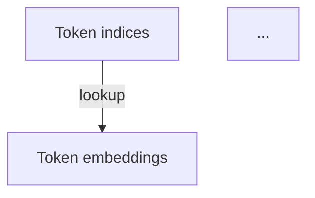

Generate a mermaid flowchart of the architecture of the codebase I pasted above. One diagram that shows the spine: how data or control flows from the entry point through the major components to the output.

## Hard constraints (these are numbers, follow them exactly)

- **At most 10 nodes.** If you need more, cut.
- **2 to 4 words per node.** Not a phrase, not a tensor shape, not a description.
- **Arrow labels: one word or one short phrase.** "lookup", "add", "softmax". Not "performs a lookup of...".
- **No emojis.** Not even one.
- **No colors, no styling, no subgraphs.** Default mermaid styling only.
- **No multi-line node labels.** One line per node.

Mental target: a beginner could memorize this in 60 seconds and redraw it on a whiteboard the next day.

## Output

Just the mermaid block. Nothing before, nothing after. I will paste it directly into a markdown file.

## Calibration

Bad node: `[🔤 Raw Tokens [batch, sequence_len] integers like 314, 7, 492...]`
Why bad: emoji, tensor shape, comma-listed examples, three concepts in one node.

Good node: `[Token indices]`
Why good: two words, one concept, memorizable.

Bad arrow: `-->|Linear projection split into Q, K, V|`
Why bad: tries to teach the operation inside the label.

Good arrow: `-->|project to QKV|`
Why good: three words, names the operation, lets the reader look up the rest.

## If the architecture is too complex for 10 nodes

Pick the spine: the path one input takes from entry to exit. Branches and edge cases don't belong in this diagram. The spine is what someone learning the system needs first.
