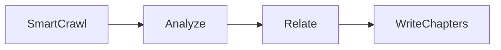

# Chapter 3. Workflow

> Build a Codebase Knowledge Builder. Point it at any repo. Get back a multi-chapter tutorial with diagrams, cross references, and a learning order.

## What this chapter ships

The book chapter walks you through building this from scratch in about 100 lines of plain Python. The public repo packages the same pipeline as a PocketFlow workflow so you get retry and clean node boundaries for free, but every node maps one to one to a function in the chapter.

- [`workflow/`](workflow/). Four nodes: smart crawl, analyze, relate, write chapters. PocketFlow Node with `max_retries=3` so flaky LLM calls don't kill a run.
- [`prompts/`](prompts/). The four prompts the chapter teaches. One file each.
- [`instructions/`](instructions/). Four swappable lenses (the chapter's punchline). Same pipeline, different output.
- [`skill/CODEBASE-TOUR.md`](skill/CODEBASE-TOUR.md). The agent equivalent.

## Quickstart

```bash
# From the repo root — install once for all chapters.
# Pick the provider you want to use:
pip install -e .               # Anthropic (default)
pip install -e ".[openai]"     # OpenAI
pip install -e ".[google]"     # Gemini

# Or with uv:
uv sync                        # Anthropic (default)
uv sync --extra openai
uv sync --extra google

# Export the matching key:
export ANTHROPIC_API_KEY=...
# export OPENAI_API_KEY=...
# export GEMINI_API_KEY=...
# export OLLAMA_HOST=http://localhost:11434   # local Ollama, no key needed

cd workflow
python main.py path/to/repo
```

Output:

```
  Selected 20 files (280,023 chars)
  Found 8 abstractions
  Found 13 relationships
  Chapter 1/8: Tokenizer
  Chapter 2/8: GPT
  Chapter 3/8: COMPUTE_DTYPE
  ...

Wrote tour to ../output/nanochat-tour/
  Open ../output/nanochat-tour/index.html in a browser
```

You get back:

```
output/nanochat-tour/
├── index.md            # mermaid diagram + chapter links
├── index.html          # same, browser ready, links to chapter HTML
├── 01_tokenizer.md     # plus 01_tokenizer.html
├── 02_gpt.md           # plus 02_gpt.html
├── 03_compute_dtype.md
└── ...
```

## Swap the lens

Same pipeline. Same code. Different `instructions/` file. Different output entirely.

```bash
python main.py path/to/repo --instructions architecture-review
python main.py path/to/repo --instructions security-audit
python main.py path/to/repo --instructions onboarding-guide
```

| Lens | What you get back |
| ---- | ----------------- |
| `beginner-tutorial` (default) | Analogies, code blocks under 10 lines, "what happens when you close a tab" style openings |
| `architecture-review` | Design decisions, alternatives, what breaks under load, technical debt |
| `security-audit` | Trust boundaries, validation gaps, blast radius |
| `onboarding-guide` | First week TODO list, what to touch and avoid, real shell commands |

## How it works



1. **SmartCrawl** ([§3.2 of the book](https://example.com)). Two phases. First filter by extension and skip the obvious noise (`tests/`, `docs/`, lock files, anything over 500 KB). Then build a preview manifest (first ~N chars of each remaining file) and ask the LLM to pick the 0.1 to 2 percent that actually matter. Uses the four selection rules from [`prompts/select-files.md`](prompts/select-files.md).
2. **Analyze** ([§3.3](https://example.com)). One LLM call. Returns YAML: 5 to 10 abstractions with analogies, plus a learning order.
3. **Relate** ([§3.3](https://example.com)). One LLM call. Returns edges between abstractions.
4. **WriteChapters** ([§3.3](https://example.com)). NOT a batch. Loops through chapters in learning order, passing every previous chapter forward as context. That's what makes the output read like a tutorial instead of a pile of disconnected pages.

The chapter writing step is sequential on purpose. Parallel batching loses the cross references and analogy reuse that make the tutorial coherent.

## Example output

Four real tours, generated end to end with Gemini 2.5 Flash. Open the `index.html` in any of these in a browser:

| Tour | Repo | Files in | Files selected | Abstractions | Cost |
| ---- | ---- | -------- | -------------- | ------------ | ---- |
| [`output/nanochat-tour/`](output/nanochat-tour/) | [karpathy/nanochat](https://github.com/karpathy/nanochat) | 56 | 20 | Tokenizer, GPT, COMPUTE_DTYPE, DataLoader, MuonAdamW, CheckpointManager, Task, Engine | ~$0.02 |
| [`output/flask-tour/`](output/flask-tour/) | [pallets/flask](https://github.com/pallets/flask) | 236 | 20 | Flask, Config, Request, Response, AppContext, url_for, render_template, Blueprint | ~$0.03 |
| [`output/express-tour/`](output/express-tour/) | [expressjs/express](https://github.com/expressjs/express) | 213 | 8 | app, req, res, Middleware, Router, Route, View | ~$0.01 |
| [`output/micrograd-tour/`](output/micrograd-tour/) | [karpathy/micrograd](https://github.com/karpathy/micrograd) | 13 | 3 | Value, backward, Module, Neuron, Layer, MLP | ~$0.005 |

Each tour contains one markdown and one HTML file per abstraction, plus an `index.html` with the mermaid architecture diagram and chapter list. The chapter HTML files render code blocks, tables, and mermaid sequence diagrams cleanly.

