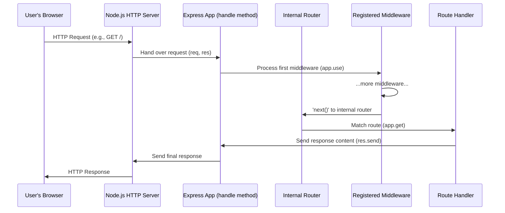

# Chapter 1: app

Imagine you're building a bustling online store, a social media platform, or even a simple personal blog. How does your computer program, your web server, know when someone visits your homepage? What happens when a user clicks a "buy now" button, sending new information to your server? How do you set up the basic structure of your application to handle all these different interactions?

This is where the `app` instance in Express.js steps in. Think of the `app` as the **main switchboard operator** for your entire web application. Every incoming call (HTTP request) first arrives at this switchboard. The operator's job is to listen for calls, direct them to the correct department (route handler), manage the rules and settings for the entire operation, and ensure the right responses are sent back.

### Getting Started: Creating Your App

To begin, you first need to bring Express into your project and create an `app` instance. This `app` object is the central instance of your web server, created by calling `express()`.

Here’s how you summon your switchboard operator:

```javascript
const express = require('express');
const app = express(); // This is your app instance!
```

In this tiny snippet, `express()` is a function that returns the `app` object. This `app` object is where all the magic of configuring and running your server will happen.

### Opening for Business: Listening for Requests

Once you have your `app` instance, the first thing you want to do is tell it to start listening for incoming requests. This is like the switchboard operator saying, "Okay, I'm ready to take calls now!"

You do this using the `app.listen()` method:

```javascript
const express = require('express');
const app = express();
const port = 3000; // The port your server will listen on

app.listen(port, () => {
  // This callback runs once the server is successfully listening
  console.log(`Server listening on port ${port}`);
});
```

When you run this code, your Express `app` will start a Node.js HTTP server. It will wait patiently on the specified `port` (e.g., `3000`) for any incoming web traffic. Any request sent to `http://localhost:3000` will now be picked up by your `app` operator.

### Directing Incoming Calls: Routing

Now that your server is listening, how do you tell it what to do when a specific URL is accessed? For instance, if someone visits `/about`, you want to show them the about page, not your homepage.

The `app` instance is responsible for directing these requests to the appropriate handler functions based on the HTTP method (like GET, POST) and the URL path. This process is called "routing."

```javascript
// Example: Handle GET requests to the homepage (/)
app.get('/', (req, res) => {
  res.send('Welcome to the homepage!');
});
```

```javascript
// Example: Handle GET requests to the /about page
app.get('/about', (req, res) => {
  res.send('Learn more about us!');
});
```

*   `app.get()` is one of several methods (`app.post()`, `app.put()`, `app.delete()`, `app.all()`) that link an HTTP method and a URL path to a *route handler function*.
*   The first argument is the path (e.g., `'/'`, `'/about'`).
*   The second argument is the handler function that gets executed when a matching request arrives. For now, `res.send()` is simply a way to quickly send a text response.

Just like the switchboard operator knows to direct calls to "extension 101" for sales and "extension 102" for support, your `app` uses these `app.get()`, `app.post()`, etc., calls to know which function to run for each specific request.

### Setting Server Rules: Configuration

Your `app` also acts as the central hub for configuring various settings for your web server. These settings can affect how Express handles requests, generates responses, and integrates with other modules.

You use `app.set()` to define a setting and `app.get()` to retrieve its value.

```javascript
const express = require('express');
const app = express();

// Enable a setting: e.g., 'view cache' for production
app.enable('view cache');

// Disable a setting: e.g., 'x-powered-by' header for security
app.disable('x-powered-by');

// Set a custom value for a setting
app.set('title', 'My Awesome App');
app.set('json spaces', 2); // Prettify JSON responses

// You can also use app.set() to get a setting if only one argument is provided
console.log('App Title:', app.get('title')); // Output: My Awesome App
console.log('View cache enabled:', app.enabled('view cache')); // Output: true
```

*   `app.set(setting, value)`: Assigns a `value` to a named `setting`.
*   `app.get(setting)`: Retrieves the `value` of a named `setting`.
*   `app.enable(setting)`: A shortcut for `app.set(setting, true)`.
*   `app.disable(setting)`: A shortcut for `app.set(setting, false)`.
*   `app.enabled(setting)`: Checks if a `setting` is `true`.
*   `app.disabled(setting)`: Checks if a `setting` is `false`.

These settings act like global configurations for your server, influencing its behavior across all requests unless overridden.

### Pre-processing Calls: Middleware

Sometimes, before a call even reaches a specific department, you might want to perform some general actions, like logging the call, checking caller ID, or decrypting a secure message. In Express, this is the job of **middleware**.

The `app.use()` method allows you to add middleware functions that run for *every* incoming request, or for requests matching a specific path prefix.

```javascript
const express = require('express');
const app = express();

// This middleware will run for every request
app.use((req, res, next) => {
  console.log('A new request arrived at:', new Date());
  next(); // Don't forget to call next() to pass control to the next middleware/route!
});

// A route that will be handled after the middleware
app.get('/', (req, res) => {
  res.send('Homepage handled!');
});

app.listen(3000, () => console.log('Server running on port 3000'));
```

The `app.use()` method is incredibly powerful and forms a core part of how Express applications work. We'll dedicate an entire chapter to [Middleware](04_middleware.md) later. For now, just understand that `app` is the place where you register these pre-processing steps.

### How the `app` Handles Requests

Here's a simplified flow of how your Express `app` orchestrates the handling of an incoming HTTP request:



As you can see, the `App` instance is at the center of everything, receiving the raw request from the Node.js HTTP server, guiding it through middleware, and delegating it to the correct route handler.

### The App's Helpers: `req` and `res`

While the `app` instance is the brain and the switchboard operator, it doesn't actually *speak* to the callers directly. When a call is directed to a specific department or individual (your route handler), two other crucial tools are used for communication:

*   The `req` object: This represents the **incoming request**. It's how your handler function understands everything the caller said or sent – their phone number, the message they left, the details of their order, etc.
*   The `res` object: This represents the **outgoing response**. It's how your handler function speaks back to the caller – sending them a welcome message, confirming their order, or politely telling them the line is busy.

In the route handlers like `app.get('/', (req, res) => { ... });`, these `req` and `res` objects are passed as arguments. They are the primary way your code interacts with the client making the request.

Now that you understand the central role of the `app` instance, you might be curious about how exactly you use those `req` and `res` objects to understand and respond to client requests. That's precisely what we'll explore in the next two chapters! We'll start by delving into the [req](02_req.md) object to see how you can extract all the juicy details from an incoming request.