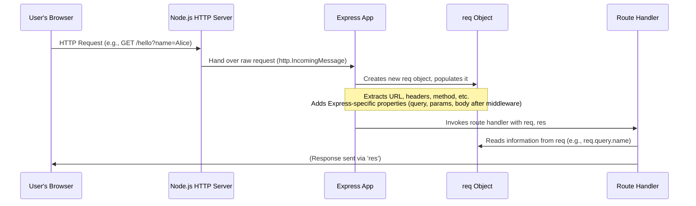

# Chapter 2: req

In [Chapter 1: app](01_app.md), we learned that the `app` instance acts as the main switchboard operator for your web application. It listens for incoming calls (HTTP requests) and directs them to the right department (your route handler). But once a call is connected to a specific department, how does that department actually understand what the caller wants? What information did the customer provide on their order form?

This is where the `req` object comes in. Short for "request," this object contains all the incoming details from a client. It's like a detailed letter or a filled-out order form from a customer, holding information such as the requested URL, submitted data, and client headers, which your server can then read and process. Every route handler function you define receives this `req` object as its first argument.

### Understanding the Incoming Request

Let's revisit our basic route handler. When a user visits your homepage, what does your server know about their request?

```javascript
const express = require('express');
const app = express();

app.get('/', (req, res) => {
  // The 'req' object is right here!
  console.log('Incoming Request Details:', req);
  res.send('Hello, you sent a request!');
});

app.listen(3000, () => console.log('Server running on port 3000'));
```

If you run this code and navigate to `http://localhost:3000` in your browser, the `console.log(req)` statement will output a very large object in your terminal. This `req` object is an enhanced version of Node.js's standard `http.IncomingMessage` object, extended by Express with many useful properties and methods to make accessing request information easier.

Let's break down some of the most frequently used parts of this "order form":

#### What resource is being requested? (`req.url`, `req.path`)

The client always requests a specific resource, identified by its URL.
*   `req.url`: Provides the full URL path, including the query string.
*   `req.path`: Provides only the URL pathname, without the query string.

Imagine a user visits `http://localhost:3000/products/electronics?category=laptops&brand=dell`.

```javascript
app.get('/products/:type', (req, res) => {
  console.log('Full URL:', req.url);   // Output: /products/electronics?category=laptops&brand=dell
  console.log('Pathname:', req.path); // Output: /products/electronics
  res.send('Resource requested.');
});
```

#### What kind of operation? (`req.method`)

HTTP requests aren't just about *what* resource is requested, but *how* it's requested. This is the HTTP method.
*   `req.method`: A string indicating the HTTP method (e.g., 'GET', 'POST', 'PUT', 'DELETE').

```javascript
app.get('/submit-form', (req, res) => {
  console.log('Method for GET:', req.method); // Output: GET
  res.send('View form.');
});

app.post('/submit-form', (req, res) => {
  console.log('Method for POST:', req.method); // Output: POST
  res.send('Form submitted!');
});
```

#### Dynamic Parts of the URL (`req.params`)

Sometimes, your application needs to handle URLs with dynamic segments, like `/users/123` where `123` is a user ID. These are called route parameters.

```javascript
app.get('/users/:userId/profile', (req, res) => {
  // If user visits /users/42/profile
  console.log('User ID:', req.params.userId); // Output: 42
  res.send(`Viewing profile for user ${req.params.userId}`);
});
```

In this example, `:userId` is a placeholder. Express parses it and makes the value (`42`) available on `req.params`. You can access it using the name you defined in the route (`userId`).

#### Query String Parameters (`req.query`)

Often, clients send additional, optional information in the URL's query string (the part after the `?`).
*   `req.query`: An object containing a property for each query string parameter.

Using the example URL `http://localhost:3000/products/electronics?category=laptops&brand=dell`:

```javascript
app.get('/products/:type', (req, res) => {
  console.log('Category:', req.query.category); // Output: laptops
  console.log('Brand:', req.query.brand);     // Output: dell
  res.send(`Searching for ${req.query.brand} ${req.query.category}.`);
});
```

#### Submitted Data (`req.body`)

For requests that send data to the server, like a POST request from a form or a PUT request updating a resource, the data is typically in the request body.
*   `req.body`: An object containing the data submitted in the request body.

**Important Note:** By default, Express does *not* parse the request body. To make `req.body` available, you need to use **middleware**, like Express's built-in `express.json()` or `express.urlencoded()`. We will delve into [Middleware](04_middleware.md) in a dedicated chapter, but for now, here's how you'd enable it:

```javascript
const express = require('express');
const app = express();

// Enable JSON body parsing middleware
app.use(express.json());
// Or for URL-encoded form data:
// app.use(express.urlencoded({ extended: true }));

app.post('/new-post', (req, res) => {
  // If client sends { "title": "My Post", "content": "Hello world!" }
  console.log('Post Title:', req.body.title);     // Output: My Post
  console.log('Post Content:', req.body.content); // Output: Hello world!
  res.send('Post created successfully!');
});

app.listen(3000, () => console.log('Server running on port 3000'));
```

#### Request Headers (`req.headers`, `req.get()`)

Clients send various headers with their requests, providing meta-information about the request, the client, or acceptable responses.
*   `req.headers`: An object containing all HTTP request headers. Header names are lowercased.
*   `req.get(name)`: A convenient method to get the value of a specific header, case-insensitively.

```javascript
app.get('/headers-info', (req, res) => {
  console.log('User-Agent:', req.get('User-Agent')); // e.g., Mozilla/5.0 ...
  console.log('Accepts:', req.get('Accept'));       // e.g., text/html,application/xhtml+xml,...
  res.send('Header information logged.');
});
```

#### Client IP Address (`req.ip`)

Knowing the client's IP address can be useful for logging, analytics, or security.
*   `req.ip`: The remote IP address of the request.

```javascript
app.get('/who-am-i', (req, res) => {
  console.log('Client IP Address:', req.ip); // Output: ::1 (for localhost IPv6) or 127.0.0.1 (IPv4)
  res.send(`You are connecting from ${req.ip}`);
});
```

### The Journey of a Request and `req`

Let's visualize how the `req` object is created and used within your Express application:



As you can see, the `Express App` takes the raw request from the Node.js server, enriches it, and then hands off this comprehensive `req` object to your `Route Handler`. This allows your code to easily access all the client's intentions and data.

### Conclusion

The `req` object is your window into the client's request. It’s how your server "reads" the customer's order form, understanding what they want, how they asked for it, and any details they provided. Mastering `req` allows you to build dynamic and responsive web applications that adapt to user input.

Now that you know how to *read* all the incoming details from a client using the `req` object, the next logical step is to learn how to *send back a response*. In the next chapter, we'll dive into the [res](03_res.md) object, which is how your server "speaks back" to the client, sending data, setting status codes, and much more.