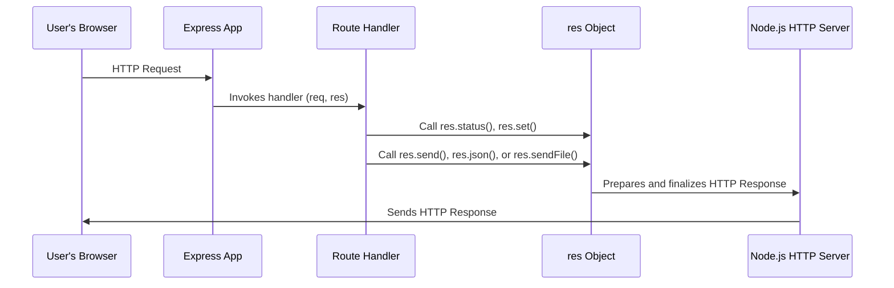

# Chapter 3: res

In [Chapter 1: app](01_app.md), we established `app` as the main switchboard operator for your web server. Then, in [Chapter 2: req](02_req.md), we explored how the `req` object allows your server to "read" all the incoming details from a client's request—like a detailed order form filled out by a customer. But what happens after your server has processed the request? How does it *send* a reply back to the customer? How do you package up the requested information, add a status, and make sure it reaches the right client?

This is precisely the role of the `res` object. Short for "response," this object is the server's reply letter or the **prepared package ready to be sent back**. It's the primary way your application communicates back to the client, providing methods to set the HTTP status, add headers, send various types of data (like HTML, JSON, or files), or even redirect the client to a different URL. Every route handler function receives this `res` object as its second argument, empowering it to craft and deliver the perfect response.

Let's see how your server uses this powerful `res` object to "speak back" to clients.

### The Most Basic Reply: `res.send()`

The simplest way to send *any* kind of data back to the client is using `res.send()`. Express is smart enough to often guess the `Content-Type` header based on the data you provide.

```javascript
const express = require('express');
const app = express();

app.get('/', (req, res) => {
  res.send('Hello from your Express server!'); // Sends a simple text string
});

app.get('/data', (req, res) => {
  res.send({ message: 'This is JSON data', status: 'success' }); // Sends a JSON object
});

app.listen(3000, () => console.log('Server running on port 3000'));
```

*   When you visit `/`, `res.send()` sends the string `'Hello from your Express server!'` and automatically sets the `Content-Type` header to `text/html`.
*   When you visit `/data`, `res.send()` detects that you've passed an object and automatically converts it to a JSON string, setting the `Content-Type` header to `application/json`.

This method is like putting a simple note into an envelope and sending it off, letting the postal service figure out the basic delivery details.

### Setting the Tone: HTTP Status Codes

Every HTTP response needs a status code to tell the client whether the request was successful, if there was an error, or if something else happened. Think of this as the "outcome" stamp on your package—was it delivered successfully (200 OK), not found (404 Not Found), or was there a server error (500 Internal Server Error)?

#### `res.status(code)`: Setting the Status

This method sets the HTTP status code for the response. You still need to send data afterward.

```javascript
app.get('/not-found', (req, res) => {
  res.status(404).send('Sorry, the page you requested could not be found.');
});

app.post('/create-item', (req, res) => {
  // Imagine item was successfully created
  res.status(201).send('Item created successfully!'); // 201 Created
});
```

Here, `res.status(404)` explicitly tells the client "Not Found" before `res.send()` delivers the custom message.

#### `res.sendStatus(code)`: Status with a Standard Message

For common status codes, `res.sendStatus()` is a convenient shortcut. It sets the status code *and* sends a default, human-readable message associated with that code (e.g., "Not Found" for 404).

```javascript
app.get('/unauthorized', (req, res) => {
  res.sendStatus(401); // Sends "Unauthorized" as the body
});

app.get('/ok', (req, res) => {
  res.sendStatus(200); // Sends "OK" as the body
});
```

This is like sending a pre-printed response card with a standard message for common scenarios.

### Sending Specific Content Types

While `res.send()` is versatile, `res` also provides specialized methods for common data types, ensuring the correct headers are set for optimal client handling.

#### `res.json(data)`: Sending Structured Data

When building APIs, sending JSON is incredibly common. `res.json()` explicitly formats your JavaScript object into a JSON string and sets the `Content-Type` header to `application/json`.

```javascript
app.get('/api/users', (req, res) => {
  const users = [
    { id: 1, name: 'Alice' },
    { id: 2, name: 'Bob' }
  ];
  res.json(users); // Sends JSON array
});
```

This is like preparing a meticulously organized spreadsheet to send to a business partner, making sure it's in a format they can easily process.

#### `res.sendFile(path, [options], [callback])`: Sending Files

To send static files like HTML pages, images, PDFs, or other documents, use `res.sendFile()`.

```javascript
// Assuming a 'public' directory with 'index.html'
const path = require('node:path');

app.get('/homepage', (req, res) => {
  res.sendFile(path.join(__dirname, 'public', 'index.html'));
});
```

**Important:** For security and ease of use, it's often better to specify a `root` directory in the options, especially for dynamic paths. For example, if your file is in a `public` directory at the root of your project:

```javascript
const path = require('node:path');

app.get('/my-document', (req, res) => {
  const options = {
    root: path.join(__dirname, 'public') // Defines the base directory for files
  };
  res.sendFile('document.pdf', options); // Client requests /my-document, server sends public/document.pdf
});
```

This is like retrieving a specific item from your warehouse and packaging it for delivery.

#### `res.download(path, [filename], [callback])`: Prompting a Download

If you want the client's browser to *download* a file rather than display it (e.g., download a PDF instead of opening it in a new tab), use `res.download()`. This sets the `Content-Disposition` header appropriately.

```javascript
const path = require('node:path');

app.get('/download-report', (req, res) => {
  const filePath = path.join(__dirname, 'reports', 'annual_report.pdf');
  // The user will download a file named 'annual_report.pdf'
  res.download(filePath, 'annual_report.pdf');
});
```

This is like putting a "Download This" label on your package, instructing the client's software on how to handle it.

#### `res.render(viewName, [locals], [callback])`: Sending Dynamic HTML

While we'll dive deeper into this in [Chapter 7: View](07_view.md), `res.render()` is how you send dynamic HTML pages generated from templates.

```javascript
// Example (requires a view engine like EJS, Pug, Handlebars to be set up)
app.get('/dashboard', (req, res) => {
  res.render('dashboard', { userName: 'Charlie', data: ['item1', 'item2'] });
});
```

This is like taking a blank letter template, filling it out with personalized information, and then sending the customized letter.

### Customizing the Package: HTTP Headers and Cookies

The `res` object allows you to control the meta-information sent with your response, much like adding special instructions or labels to your package.

#### `res.set(field, value)`: Setting HTTP Headers

You can set any custom HTTP header with `res.set()` (or its alias `res.header()`).

```javascript
app.get('/cached-content', (req, res) => {
  res.set('Cache-Control', 'public, max-age=3600'); // Cache for 1 hour
  res.set('X-Custom-Header', 'My-App-Value');
  res.send('This content can be cached!');
});
```

This is like adding specific shipping labels or handling instructions (e.g., "Fragile," "Keep Refrigerated") to your package.

#### `res.cookie(name, value, [options])`: Setting Cookies

Cookies are small pieces of data stored on the client's browser. `res.cookie()` makes it easy to set them, often used for sessions or user preferences.

```javascript
app.get('/set-preference', (req, res) => {
  res.cookie('theme', 'dark', { maxAge: 900000, httpOnly: true }); // Expires in 15 mins
  res.send('Dark theme preference set!');
});
```

#### `res.clearCookie(name, [options])`: Clearing Cookies

To remove a cookie from the client's browser, use `res.clearCookie()`.

```javascript
app.get('/logout', (req, res) => {
  res.clearCookie('session_token');
  res.send('Logged out successfully!');
});
```

These methods are like attaching a tiny, self-destructing sticky note to the client's browser, which can store a small piece of information.

### Guiding the Client: Redirections

Sometimes, instead of sending data, you want to tell the client's browser to navigate to a different URL. This is called a redirection.

#### `res.redirect(url)` or `res.redirect(status, url)`

`res.redirect()` sends an HTTP redirect response, typically with a 302 (Found) status by default, telling the browser to load a new page.

```javascript
app.get('/old-path', (req, res) => {
  res.redirect('/new-path'); // Redirects to /new-path with status 302
});

app.get('/moved-permanently', (req, res) => {
  res.redirect(301, 'http://www.example.com/permanent-location'); // 301 Moved Permanently
});
```

This is like handing a customer a note that says, "We've moved! Please go to this new address for what you're looking for."

### The Journey of a Response and `res`

Let's trace how the `res` object is used to send the final reply:



As you can see, the `Route Handler` directly manipulates the `res` object, which then works with the underlying Node.js HTTP server to construct and send the final response back to the client.

### Conclusion

The `res` object is your server's voice, its means of replying to every incoming request. From simple text messages to complex JSON APIs, downloadable files, and strategic redirections, `res` provides all the tools you need to effectively communicate with clients. Mastering `res` means mastering how your web application delivers its value to users.

Now that you understand how to read client requests with `req` and craft server responses with `res`, you might be wondering about those "pre-processing steps" we briefly mentioned in [Chapter 1: app](01_app.md). How can you run code for *every* request, or modify requests and responses before they even reach your route handlers? That's the power of **Middleware**, which we'll explore in the next chapter!