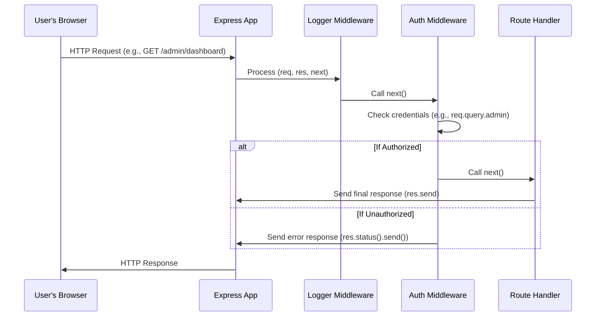

# Chapter 4: Middleware

Imagine you're trying to send a letter through a postal service. Before it even reaches the main sorting facility (your specific route handler) for delivery, it might pass through several checkpoints:

*   **Customs check:** Does it contain anything forbidden?
*   **Weight verification:** Is the postage correct?
*   **Address standardization:** Is the address correctly formatted to speed up delivery?

Only if all these checks pass does the letter continue its journey to the next stage. If a check fails (e.g., forbidden contents), the letter might be stopped immediately.

This "series of checkpoints" perfectly describes **Middleware** in Express.js. In [Chapter 1: app](01_app.md), we briefly touched on `app.use()`, which allows you to register these pre-processing steps. Now, we'll dive deep into how middleware functions intercept, process, and sometimes even terminate HTTP requests, acting like a **series of processing stations on an assembly line**. Each station performs a specific task on the item (your incoming request) before passing it to the next.

### What is Middleware? The Assembly Line Analogy

When a request arrives at your Express application (the main `app` instance, as we discussed in [Chapter 1: app](01_app.md)), it doesn't immediately jump to the final route handler. Instead, it enters a pipeline, a series of functions that execute in order. Each function in this pipeline is a middleware.

A middleware function has three powerful capabilities:

1.  **Access:** It can access the `req` (request) and `res` (response) objects. This means it can read incoming data and prepare outgoing data.
2.  **Execute Tasks:** It can perform any code: log data, check authentication, parse incoming data, modify the request or response objects, etc.
3.  **Control Flow:** It can either pass control to the *next* middleware function in the pipeline (using `next()`) or terminate the request-response cycle by sending a response back to the client.

If a middleware doesn't explicitly pass control to the next function, or send a response, the request will hang, and the client will eventually time out. This is a common pitfall for newcomers!

### Building Your First Checkpoint: A Logging Middleware

Let's start with a simple middleware that logs every incoming request. This is like the first station on our assembly line that stamps the current time on every item.

```javascript
const express = require('express');
const app = express();

// A simple logging middleware
app.use((req, res, next) => {
  console.log(`[${new Date().toLocaleString()}] Incoming request: ${req.method} ${req.url}`);
  next(); // IMPORTANT: Pass control to the next middleware or route handler
});

// Our route handler, which will run after the logging middleware
app.get('/', (req, res) => {
  res.send('Hello from the homepage!');
});

app.listen(3000, () => {
  console.log('Server running on port 3000');
});
```

Here's what's happening:

*   `app.use((req, res, next) => { ... });` registers our middleware. The `req` and `res` objects are the same ones we explored in [Chapter 2: req](02_req.md) and [Chapter 3: res](03_res.md).
*   `console.log(...)` performs our desired task: logging the request method and URL.
*   `next()` is a function that, when called, tells Express to pass control to the *next* middleware function in the stack, or if there are no more middleware, to the matching route handler. Without `next()`, the request would simply stop here, and the client would never receive a response.

Run this code, then visit `http://localhost:3000` in your browser. You'll see the log message in your terminal *before* the "Hello from the homepage!" message is sent back to the browser.

### Path-Specific Middleware: Targeted Processing

Sometimes you don't want a middleware to run for *every* request. You can make middleware specific to certain URL paths, much like a special inspection station only for items going to a particular destination.

```javascript
const express = require('express');
const app = express();

// Global logging middleware (runs for all requests)
app.use((req, res, next) => {
  console.log(`Global Log: ${req.method} ${req.url}`);
  next();
});

// Authentication middleware for /admin routes only
app.use('/admin', (req, res, next) => {
  const isAdmin = req.query.admin === 'true'; // A very simple (and insecure) check
  if (isAdmin) {
    req.user = { id: 1, role: 'admin' }; // Attach user info to the request object
    console.log('Admin access granted!');
    next(); // Pass to next middleware/route in the /admin path
  } else {
    console.log('Admin access denied!');
    res.status(401).send('Unauthorized - You are not an admin!'); // Terminate the cycle
  }
});

// This route runs after global middleware and authentication if path is /admin
app.get('/admin/dashboard', (req, res) => {
  res.send(`Welcome to the Admin Dashboard, User ID: ${req.user.id}`);
});

// This route only runs after global middleware
app.get('/', (req, res) => {
  res.send('Welcome to the Public Homepage!');
});

app.listen(3000, () => console.log('Server running on port 3000'));
```

Try visiting these URLs:

*   `http://localhost:3000/`
    *   Output: `Global Log: GET /`
    *   Browser: `Welcome to the Public Homepage!`
*   `http://localhost:3000/admin/dashboard`
    *   Output: `Global Log: GET /admin/dashboard`
    *   Output: `Admin access denied!`
    *   Browser: `Unauthorized - You are not an admin!`
*   `http://localhost:3000/admin/dashboard?admin=true`
    *   Output: `Global Log: GET /admin/dashboard?admin=true`
    *   Output: `Admin access granted!`
    *   Browser: `Welcome to the Admin Dashboard, User ID: 1`

Notice how `req.user` was modified by the middleware and then accessible in the route handler. This is a common pattern for authentication and data enrichment. Also, when `res.status(401).send(...)` is called, `next()` is *not* called, and the request-response cycle terminates immediately.

### Built-in Middleware: `express.json()` and `express.static()`

Express comes with some powerful built-in middleware. We briefly mentioned `express.json()` in [Chapter 2: req](02_req.md) when discussing `req.body`. Let's see it in action, along with `express.static()` for serving static files.

#### Parsing Request Bodies (`express.json()`, `express.urlencoded()`)

When clients send data to your server via POST or PUT requests (e.g., submitting a form or sending JSON for an API), that data is in the request body. By default, Express doesn't automatically parse this body. You need middleware to do it.

```javascript
const express = require('express');
const app = express();

// Middleware to parse JSON bodies from incoming requests
app.use(express.json());
// Middleware to parse URL-encoded bodies (e.g., from HTML forms)
app.use(express.urlencoded({ extended: true }));

app.post('/submit-data', (req, res) => {
  console.log('Received data:', req.body);
  res.json({ message: 'Data received!', yourData: req.body });
});

app.listen(3000, () => console.log('Server running on port 3000'));
```

To test this, you'd need a tool like Postman or `curl`:

```bash
# Example using curl for JSON data
curl -X POST -H "Content-Type: application/json" \
     -d '{"name": "Alice", "age": 30}' \
     http://localhost:3000/submit-data

# Example using curl for URL-encoded form data
curl -X POST -d "product=laptop&price=1200" \
     http://localhost:3000/submit-data
```

The `express.json()` and `express.urlencoded()` middleware inspect the `Content-Type` header of the incoming request. If it matches, they parse the body and populate `req.body` with the parsed data, making it easily accessible to your route handlers.

#### Serving Static Files (`express.static()`)

Many web applications serve static assets like CSS files, JavaScript bundles, images, and HTML pages. `express.static()` is a highly optimized middleware for this purpose.

```javascript
const express = require('express');
const path = require('node:path');
const app = express();

// Serve static files from the 'public' directory
// Any file in 'public' can be accessed directly via the URL.
// E.g., if you have public/index.html, it's at http://localhost:3000/index.html
app.use(express.static(path.join(__dirname, 'public')));

// Create a simple index.html inside a 'public' folder:
// public/index.html
// <html><body><h1>Welcome!</h1></body></html>
// public/my-image.png (an actual image file)

app.get('/hello', (req, res) => {
  res.send('This is a dynamic response!');
});

app.listen(3000, () => console.log('Server running on port 3000'));
```

To test this, create a directory named `public` in the same location as your `index.js` file. Inside `public`, create an `index.html` file and maybe an `image.png`.
Then, navigate to `http://localhost:3000/index.html` or `http://localhost:3000/image.png`. The `express.static` middleware handles these requests directly.

### Error Handling Middleware

What happens if an error occurs in a middleware or route handler? Express has a special type of middleware for error handling, distinguishable by its four arguments: `(err, req, res, next)`.

```javascript
const express = require('express');
const app = express();

app.get('/error-route', (req, res, next) => {
  // Simulate an error
  const error = new Error('Something went wrong!');
  error.status = 400; // Custom status for the error
  next(error); // Pass the error to the next middleware (which will be an error handler)
});

// This *must* be the last middleware registered
app.use((err, req, res, next) => {
  console.error('An error occurred:', err.message);
  // Default to 500 if no specific status was set
  const statusCode = err.status || 500;
  res.status(statusCode).send(`Error: ${err.message}`);
});

app.listen(3000, () => console.log('Server running on port 3000'));
```

When you visit `http://localhost:3000/error-route`, the `next(error)` call will skip all regular middleware and route handlers, jumping directly to the error-handling middleware.

### The Middleware Flow: The Assembly Line in Action

Here's how middleware orchestrates the processing of a request:



This diagram illustrates that each middleware (`LoggerMw`, `AuthMw`) gets a chance to act. If it calls `next()`, the request proceeds down the line. If it sends a response (`res.status().send()`), the journey ends there.

### Conclusion

Middleware functions are the unsung heroes of Express.js. They allow you to add reusable, modular functionality like logging, authentication, data parsing, and static file serving without cluttering your main route handlers. By strategically placing middleware with `app.use()`, you control the flow of requests through your application's processing pipeline, making your code cleaner, more efficient, and easier to maintain.

Now that you understand how middleware adds processing steps to your application, you might be wondering how to better organize your routes, especially in larger applications, without having one giant `index.js` file. That's where Express's `Router` comes into play, which we'll explore in the next chapter! We'll see how `Router` instances allow you to create modular, mountable middleware and route handlers, making your application scalable and maintainable.