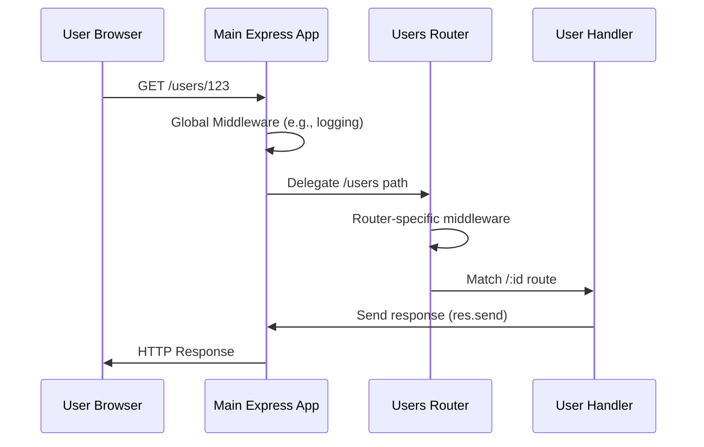

# Chapter 5: Router

In [Chapter 1: app](01_app.md), we learned that the `app` instance is the main switchboard operator, receiving all incoming calls (HTTP requests). We also saw how `app.get()`, `app.post()`, and similar methods allow the `app` to direct specific calls (requests to certain URLs and HTTP methods) to their respective handler functions. This works well for small applications, but what happens when your web application grows, handling dozens or even hundreds of different types of requests?

Imagine our postal sorting office analogy. The main `app` is the central post office. Initially, it sorts all letters directly: "Letters for Paris go here," "Letters for Berlin go there." This is manageable when you only handle a few cities. But as the volume and complexity of mail increase, with packages, international mail, express delivery, and so on, it becomes inefficient and chaotic for one central office to manage every single detail. It would become a single, massive sorting hall.

This is the problem the `Router` in Express.js solves. A `Router` is like a **specialized departmental sorting office** within the larger postal system. Instead of the main post office sorting every single letter itself, it can say: "All mail for the 'Customer Support' department, send it to the Customer Support Sorting Office. All mail for 'Product Orders,' send it to the Product Orders Sorting Office." Each specialized sorting office then has its own, internal rules for sorting and handling its specific type of mail. This keeps your application organized, scalable, and much easier to manage.

### Creating a Specialized Sorting Office: `express.Router()`

To create one of these specialized sorting offices, you use `express.Router()`. This creates a completely isolated instance of a router, a mini-application that can handle requests and middleware just like the main `app`.

```javascript
const express = require('express');
const router = express.Router(); // This is your specialized sorting office!
```

This `router` object can define its own routes (using `router.get()`, `router.post()`, etc.) and its own middleware (using `router.use()`).

### Delegating Mail: Modularizing Routes

Let's say your application has user-related routes (like `/users`, `/users/:id`) and product-related routes (like `/products`, `/products/:id`). Instead of putting all of them directly on the `app` instance in your main file, you can create separate router files for each feature.

**1. Create `users.js` for User Routes:**

In a new file (e.g., `routes/users.js`):

```javascript
// routes/users.js
const express = require('express');
const router = express.Router(); // Create a new router instance

// Middleware specific to this router
router.use((req, res, next) => {
  console.log('Time for user route:', Date.now());
  next();
});

// Define routes relative to this router
router.get('/', (req, res) => {
  res.send('List of users');
});

router.get('/:id', (req, res) => {
  // Access path parameter from req.params as we learned in Chapter 2: req
  res.send(`Details for user ${req.params.id}`);
});

router.post('/', (req, res) => {
  res.send('Create a new user');
});

module.exports = router; // Export the router
```

**2. Integrate into Your Main Application:**

Now, in your main application file (e.g., `app.js` or `index.js`), you import and "mount" this specialized router onto a specific base path using `app.use()`.

```javascript
// app.js
const express = require('express');
const app = express();
const usersRoutes = require('./routes/users'); // Import our specialized router

// Mount the user router at the /users base path
app.use('/users', usersRoutes);

// Other general routes
app.get('/', (req, res) => {
  res.send('Welcome to the homepage!');
});

app.listen(3000, () => console.log('Server running on port 3000'));
```

Now, when a request comes in for `http://localhost:3000/users` or `http://localhost:3000/users/123`, the `app` (main post office) sees the `/users` prefix and delegates the request to `usersRoutes` (the specialized user sorting office). The `usersRoutes` then handles the rest of the path (`/` or `/:id`) and its own middleware.

Notice how the paths defined in `users.js` (`/` and `/:id`) are relative to the path where the router is mounted (`/users`). So `router.get('/')` effectively becomes `GET /users`, and `router.get('/:id')` becomes `GET /users/:id`.

### Router as Mountable Middleware

As seen in the example above, a `Router` instance is essentially a type of middleware itself. When you use `app.use('/users', usersRoutes)`, you are telling Express: "For any request that starts with `/users`, apply the `usersRoutes` middleware (which is our router) to handle it."

This means that any middleware you define *on the router* (like `router.use((req, res, next) => { ... });` in `users.js`) will *only* run for requests that hit that mounted router's path. This is incredibly powerful for applying specific logic, such as authentication, logging, or data validation, only to relevant parts of your application, building upon what we learned in [Chapter 4: Middleware](04_middleware.md).

For instance, you could have a separate `adminRoutes.js` file with a specific authentication middleware applied to it:

```javascript
// routes/admin.js
const express = require('express');
const adminRouter = express.Router();

// Middleware specific to admin routes for authentication
adminRouter.use((req, res, next) => {
  if (req.headers.authorization === 'Bearer ADMIN_TOKEN') {
    console.log('Admin authenticated!');
    next(); // Authorized, pass to next handler
  } else {
    res.status(403).send('Forbidden: Admin access required.'); // Not authorized, terminate response
  }
});

adminRouter.get('/dashboard', (req, res) => {
  res.send('Welcome to the Admin Dashboard!');
});

module.exports = adminRouter;
```

Then in `app.js`:

```javascript
// app.js (continued)
const adminRoutes = require('./routes/admin');
app.use('/admin', adminRoutes); // Mount admin router
// ... rest of app.js
```

Now, only requests to `/admin` paths will go through the `adminRouter.use()` authentication middleware. Requests to `/users` or `/` will not.

### Understanding `req.baseUrl` and `req.originalUrl`

When a request is delegated to a router, the `req` object (from [Chapter 2: req](02_req.md)) still holds all the original request details. However, Express adds a couple of helpful properties to `req` to give context within the mounted router:

*   `req.baseUrl`: The URL path on which the router was mounted. In our `/users` example, inside `usersRoutes`, `req.baseUrl` would be `'/users'`.
*   `req.originalUrl`: The full URL path of the incoming request, unchanged. For `http://localhost:3000/users/123?param=foo`, `req.originalUrl` would be `'/users/123?param=foo'`.

This is like knowing which specialized sorting office the letter arrived at (`req.baseUrl`) versus the full original address on the envelope (`req.originalUrl`).

### How Requests Flow with Routers

Here's a simplified view of how a request moves through your `app` and a mounted `Router`:



As you can see, the `App` acts as the initial gatekeeper, directing specific types of requests to the appropriate `UsersRouter`. The `UsersRouter` then takes over, applies its own rules, and finds the final `UserHandler`.

### Conclusion

The `Router` is your key to building modular, organized, and maintainable Express.js applications. By breaking down your application's routes and middleware into specialized, mountable units, you avoid a chaotic single file, making your codebase easier to understand, test, and scale. It transforms your single, central switchboard into a well-structured organization with clear lines of responsibility for different types of customer inquiries.

Now that you understand how to organize your routes using `Router` instances, you might be curious about an even finer level of control: defining multiple HTTP methods for a *single* path. How do you handle `GET`, `POST`, `PUT`, and `DELETE` requests for the *exact same* URL in a clean and readable way? That's where the concept of `Route` comes in, which we'll explore in the next chapter!