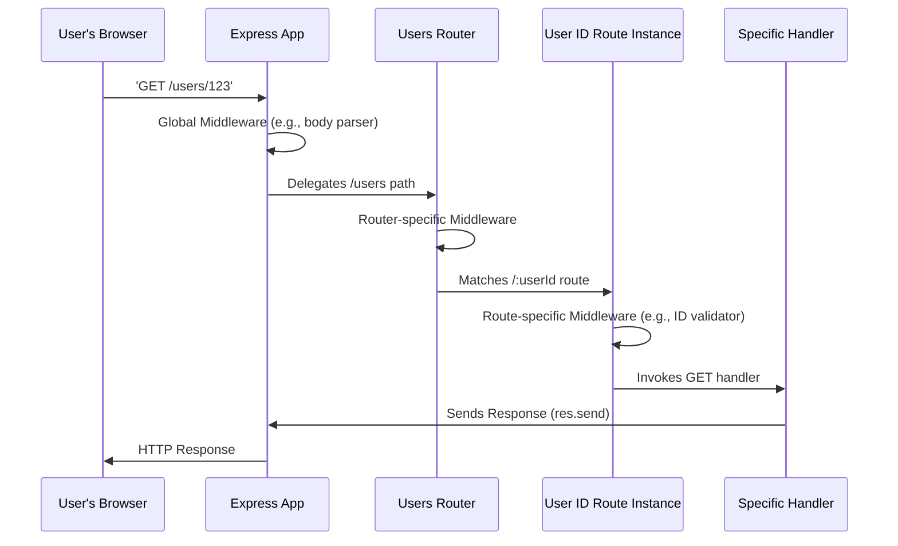

# Chapter 6: Route

In [Chapter 5: Router](05_router.md), we learned how to organize our web application by creating specialized `Router` instances. This allowed us to group related routes (like all `/users` related paths) into their own modular files, making our codebase cleaner and more manageable. But what if you have multiple HTTP methods (like GET, POST, PUT, DELETE) that all apply to the *exact same* URL path?

Imagine you're managing a single, specific item in your inventory system. You want to:
*   `GET` the details of that item.
*   `PUT` new information to update that item.
*   `DELETE` that item entirely.
*   Perhaps `POST` an action specific to that item, like adding a review.

If you were to define these using `app.get()`, `app.put()`, `app.delete()`, etc., you'd end up repeating the same path (`/api/items/:id`) for each method. This can feel repetitive and make it harder to see all operations related to that single resource at a glance.

This is where the Express `Route` comes into play. If our `Router` is like a specialized departmental sorting office, then a `Route` is a **specific counter at that office, designated for all operations related to a single type of request item**. It's like a dedicated "Order Modification Desk" where you can bring an order to *look it up* (GET), *change its details* (PUT), or *cancel it* (DELETE). All these actions for that one order happen at that single, well-defined counter.

### Creating a Dedicated Counter: `app.route(path)` and `router.route(path)`

Express provides the `app.route(path)` method (and `router.route(path)` if you're using a `Router` instance) to create a `Route` instance. This instance then allows you to chain HTTP method handlers (`.get()`, `.post()`, `.put()`, `.delete()`, etc.) and middleware for that *specific, single path*.

Let's look at an example for handling `GET` and `POST` requests to a `/products` endpoint:

```javascript
const express = require('express');
const app = express();

// Middleware to parse JSON bodies, as discussed in Chapter 4: Middleware
app.use(express.json());

// Create a Route instance for the /products path
app.route('/products')
  .get((req, res) => {
    // Handler for GET /products
    res.send('Display a list of all products');
  })
  .post((req, res) => {
    // Handler for POST /products
    console.log('Received new product:', req.body);
    res.status(201).send(`Product "${req.body.name}" created.`);
  });

app.listen(3000, () => {
  console.log('Server running on port 3000');
});
```

In this example, `app.route('/products')` creates a `Route` object. We then chain `.get()` and `.post()` methods directly onto this `Route` object. This clearly groups all the logic for the `/products` path together. It's concise and easy to read.

To test this:
*   Visit `http://localhost:3000/products` in your browser (sends a GET request).
*   Use a tool like `curl` or Postman for the POST request:
    ```bash
    curl -X POST -H "Content-Type: application/json" \
         -d '{"name": "Laptop", "price": 1200}' \
         http://localhost:3000/products
    ```

### Combining `Router` with `Route` for Finer Granularity

The true power of `Route` often shines when combined with `Router` instances. You can define specific "item" routes within your feature-specific routers.

Let's extend our `usersRoutes` from [Chapter 5: Router](05_router.md) to handle specific user operations:

**1. Create `routes/users.js`:**

```javascript
// routes/users.js
const express = require('express');
const router = express.Router(); // Our specialized sorting office

// A simple middleware for this router (runs for all /users paths)
router.use((req, res, next) => {
  console.log(`User-related request at: ${req.baseUrl}`); // From Chapter 5: Router
  next();
});

// Route for /users (list all users, create new user)
router.route('/')
  .get((req, res) => {
    res.send('Fetching all users...');
  })
  .post((req, res) => {
    // This assumes body parsing middleware is set up on the main app
    res.status(201).send(`Creating new user: ${req.body ? req.body.name : 'unknown'}`);
  });

// Route for /users/:userId (get, update, delete a specific user)
router.route('/:userId')
  .get((req, res) => {
    // req.params.userId is available from Chapter 2: req
    res.send(`Getting details for user ID: ${req.params.userId}`);
  })
  .put((req, res) => {
    res.send(`Updating user ID: ${req.params.userId} with data: ${req.body ? JSON.stringify(req.body) : 'none'}`);
  })
  .delete((req, res) => {
    res.send(`Deleting user ID: ${req.params.userId}`);
  });

module.exports = router; // Export the router
```

**2. Integrate into Your Main Application (`app.js`):**

```javascript
// app.js
const express = require('express');
const app = express();
const usersRoutes = require('./routes/users'); // Import our user router

// Middleware to parse JSON bodies globally
app.use(express.json());

// Mount the user router at the /users base path
app.use('/users', usersRoutes);

app.get('/', (req, res) => {
  res.send('Welcome to the homepage!');
});

app.listen(3000, () => console.log('Server running on port 3000'));
```

Now, when you interact with URLs like `http://localhost:3000/users/42`, all the specific actions (GET, PUT, DELETE) for user `42` are handled by the `router.route('/:userId')` definition in `routes/users.js`. This makes the code for handling user resources incredibly clean and organized.

### Route-Specific Middleware: Even More Control

Just like `app.use()` and `router.use()` can apply middleware to the entire application or a router, a `Route` instance can also have its own, even more granular, middleware stack. This is like having a specific checkpoint *only* for items passing through our "Order Modification Desk."

You can apply middleware to a `Route` using `route.all()` or by simply adding the middleware function before the final handler:

```javascript
// routes/users.js (modifying the existing user ID route)
router.route('/:userId')
  // Middleware specific to this :userId route, applied to all methods
  .all((req, res, next) => {
    const userId = parseInt(req.params.userId, 10);
    if (isNaN(userId)) {
      // If ID is not a number, terminate the request here
      return res.status(400).send('Invalid User ID provided. Must be a number.');
    }
    // Attach the parsed ID to the request object for later use
    req.parsedUserId = userId;
    console.log(`Validated User ID: ${req.parsedUserId}`);
    next(); // Pass control to the next handler/middleware in this route
  })
  .get((req, res) => {
    // req.parsedUserId is now guaranteed to be a valid number
    res.send(`Getting details for user ID: ${req.parsedUserId}`);
  })
  .put((req, res) => {
    res.send(`Updating user ID: ${req.parsedUserId} with data: ${req.body ? JSON.stringify(req.body) : 'none'}`);
  })
  .delete((req, res) => {
    res.send(`Deleting user ID: ${req.parsedUserId}`);
  });
```

In this updated example, the `.all()` middleware will run for *any* HTTP method (GET, PUT, DELETE, etc.) that targets the `/:userId` path. It performs validation on the `userId` parameter and either sends an error response or passes control to the next function. This ensures that any handler for `/users/:userId` will always receive a validated `userId`. This builds on the concepts of [Middleware](04_middleware.md) by applying it at the most specific level possible.

### How Requests Flow with Route Instances

Let's visualize how a request makes its way through your application when `Route` instances are involved:



As you can see, the `Route` instance is the final, most specific dispatch point before your actual endpoint handler. It has its own dedicated pipeline for processing requests that target its specific path and HTTP method combination.

### Conclusion

The Express `Route` provides an elegant and powerful way to handle multiple HTTP methods for a single path. By chaining method handlers and applying route-specific middleware, you can keep your code highly organized, readable, and maintainable, especially when dealing with RESTful API design. It represents the ultimate level of specificity in Express's routing system, ensuring that each "customer service counter" is perfectly equipped to handle its designated "request items."

Now that you've mastered how to organize your application's logic from the main `app` to modular `Router` instances and specific `Route` definitions, there's one more crucial piece to building full-stack web applications: how do you dynamically generate and serve HTML pages to your users? That's what we'll explore in the final chapter, [View](07_view.md), where we'll dive into templating engines and rendering dynamic content.