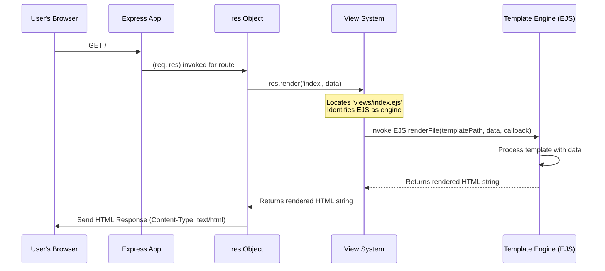

# Chapter 7: View

So far in our journey through Express.js, we've learned how the [app](01_app.md) instance orchestrates everything, how the [req](02_req.md) object helps us understand client requests, and how the [res](03_res.md) object allows us to send back various responses like simple text, JSON, or static files. We've also explored the power of [Middleware](04_middleware.md) for pre-processing requests, and how [Router](05_router.md) and [Route](06_route.md) keep our application organized.

But there's one crucial piece missing for building truly dynamic and user-friendly web applications: How do you serve a complete HTML page that isn't just a static file, but is dynamically generated based on data from your server? For example, how do you render a user's dashboard with their personalized name and recent activity, or a product page with details pulled from a database? Sending back raw HTML strings with `res.send()` quickly becomes unmanageable for anything beyond the simplest pages.

This is where **View** comes in. Think of the `View` system in Express.js as a **smart printer that fills out blank forms with specific information**. You provide the "blank form" (a template file like `.ejs` or `.pug`), and you provide the "specific information" (data from your server, perhaps pulled from a database). The `View` system then takes these two, combines them, and "prints out" the final, personalized HTML document to be sent back to the client. It knows where to find your forms, which specialized software (template engine) to use for each form type, and how to combine everything efficiently.

### Rendering Your First Dynamic Page: `res.render()`

In [Chapter 3: res](03_res.md), we briefly touched on `res.render()`. This is the primary method you'll use in your route handlers to send dynamic HTML pages. Behind the scenes, `res.render()` kicks off the entire `View` process.

To get started, you need two things: a **template engine** (the specialized software for filling out forms) and some **configuration** to tell Express where to find your template files.

Let's use EJS (Embedded JavaScript templates) as our example engine. First, install it:

```bash
npm install ejs
```

Now, configure your Express `app` and create a simple template:

**1. `app.js` (or `index.js`):**

```javascript
const express = require('express');
const path = require('node:path'); // For resolving file paths
const app = express();
const port = 3000;

// 1. Tell Express where your template files are located
app.set('views', path.join(__dirname, 'views'));

// 2. Tell Express which template engine to use by default
app.set('view engine', 'ejs');

app.get('/', (req, res) => {
  // 3. Use res.render() to render a template and send it
  res.render('index', {
    title: 'My Express App',
    message: 'Welcome to the homepage!'
  });
});

app.listen(port, () => {
  console.log(`Server listening on port ${port}`);
});
```

**2. `views/index.ejs` (create a `views` directory and this file inside it):**

```html
<!DOCTYPE html>
<html lang="en">
<head>
    <meta charset="UTF-8">
    <meta name="viewport" content="width=device-width, initial-scale=1.0">
    <title><%= title %></title>
    <style>
        body { font-family: sans-serif; text-align: center; margin-top: 50px; }
        h1 { color: #333; }
        p { color: #666; }
    </style>
</head>
<body>
    <h1><%= message %></h1>
    <p>This page was dynamically rendered with EJS.</p>
    <p>Current year: <%= new Date().getFullYear() %></p>
</body>
</html>
```

Run `node app.js` and visit `http://localhost:3000`. You should see a dynamically generated HTML page!

In this example:
*   `app.set('views', ...)` tells Express that all your "blank forms" (template files) are in the `views` directory.
*   `app.set('view engine', 'ejs')` configures Express to automatically use the `ejs` engine for files without an explicit extension when `res.render()` is called.
*   `res.render('index', { ... })` instructs Express to find `index.ejs` (because `view engine` is set to `ejs`), then pass the `{ title: '...', message: '...' }` object as data to the template.
*   Inside `index.ejs`, `<%= title %>` and `<%= message %>` are EJS syntax for embedding JavaScript expressions whose results are inserted into the HTML.

### How the `View` Abstraction Works Internally

The `View` isn't a single function you call directly; it's an internal abstraction (a JavaScript class, as seen in `lib/view.js`) that Express uses to manage the rendering process. It's the "master printer manager" coordinating everything:

1.  **Locating the Template:** When you call `res.render('index')`, the `View` instance first consults `app.set('views')` to find the root directory. Then, based on `app.set('view engine')` (or the explicit extension in the view name, like `res.render('index.html')`), it constructs the full path to the template file (e.g., `views/index.ejs`).
2.  **Identifying the Engine:** It determines which template engine (e.g., EJS, Pug, Handlebars) is associated with the file's extension. Express maintains an internal cache of loaded engines (`this.engines` in `lib/application.js`). If the engine isn't loaded, it `require()`s it dynamically (e.g., `require('ejs')`).
3.  **Invoking the Engine:** The `View` then calls the chosen template engine's `render` function (or equivalent) with the full template file path and the data object you provided in `res.render()`.
4.  **Returning Rendered HTML:** The template engine processes the template, substitutes the data, and returns a plain HTML string.
5.  **Sending the Response:** Finally, `res.render()` takes this HTML string and uses `res.send()` to deliver it to the client, setting the `Content-Type` header to `text/html`.

### Customizing Engine Associations: `app.engine()`

By default, Express expects a template engine to export a function named `__express` (e.g., `require('ejs').__express`) for rendering files with its native extension. What if you want to use a different extension, or an engine that doesn't follow this convention?

This is where `app.engine()` comes in. It allows you to explicitly map a file extension to a custom rendering function. This is like telling our "master printer manager": "Hey, for all files ending in `.html`, please actually use the EJS software to process them, not the default HTML renderer."

Let's say you prefer to use `.html` for your EJS templates:

**1. Modify `app.js`:**

```javascript
const express = require('express');
const path = require('node:path');
const app = express();
const port = 3000;

app.set('views', path.join(__dirname, 'views'));

// Map .html files to the EJS engine's renderFile method
app.engine('html', require('ejs').renderFile);

// Set the view engine to 'html' so that res.render('filename') looks for .html files
app.set('view engine', 'html');

app.get('/', (req, res) => {
  res.render('index', { // Still refer to it as 'index'
    title: 'My HTML/EJS App',
    message: 'Welcome to the HTML homepage!'
  });
});

app.listen(port, () => {
  console.log(`Server listening on port ${port}`);
});
```

**2. `views/index.html` (rename `index.ejs` to `index.html`):**

```html
<!DOCTYPE html>
<html lang="en">
<head>
    <meta charset="UTF-8">
    <meta name="viewport" content="width=device-width, initial-scale=1.0">
    <title><%= title %></title>
    <style>
        body { font-family: sans-serif; text-align: center; margin-top: 50px; }
        h1 { color: #333; }
        p { color: #666; }
    </style>
</head>
<body>
    <h1><%= message %></h1>
    <p>This page was dynamically rendered with EJS, but using a .html extension.</p>
    <p>Current year: <%= new Date().getFullYear() %></p>
</body>
</html>
```

Now, when you visit `http://localhost:3000`, Express still finds `index.html`, but thanks to `app.engine('html', ...)` and `app.set('view engine', 'html')`, it knows to pass it to the EJS engine for processing.

### The View Rendering Flow

Here's how the `View` abstraction orchestrates the rendering of a dynamic page:



This diagram illustrates how your `res.render()` call delegates the complex task of finding, processing, and generating HTML to the `View System` and the chosen `Template Engine`, streamlining your application's ability to serve dynamic content.

### Conclusion

The `View` system is the final piece in Express's puzzle, empowering your application to generate rich, dynamic HTML pages tailored to individual users or data. By combining template files with data, it bridges the gap between server-side logic and the user interface. Just like a smart printer efficiently fills out forms with custom details, the `View` system handles the intricate task of transforming your templates into the complete web pages that clients ultimately see.

This chapter concludes our deep dive into the core components of Express.js. From the central [app](01_app.md) instance, through the `req` and `res` objects for communication, to [Middleware](04_middleware.md) for processing, [Router](05_router.md) and [Route](06_route.md) for organization, and finally the `View` for dynamic presentation, you now have a comprehensive understanding of how Express applications are built, component by component. This foundational knowledge will serve you well as you build robust and scalable web applications.