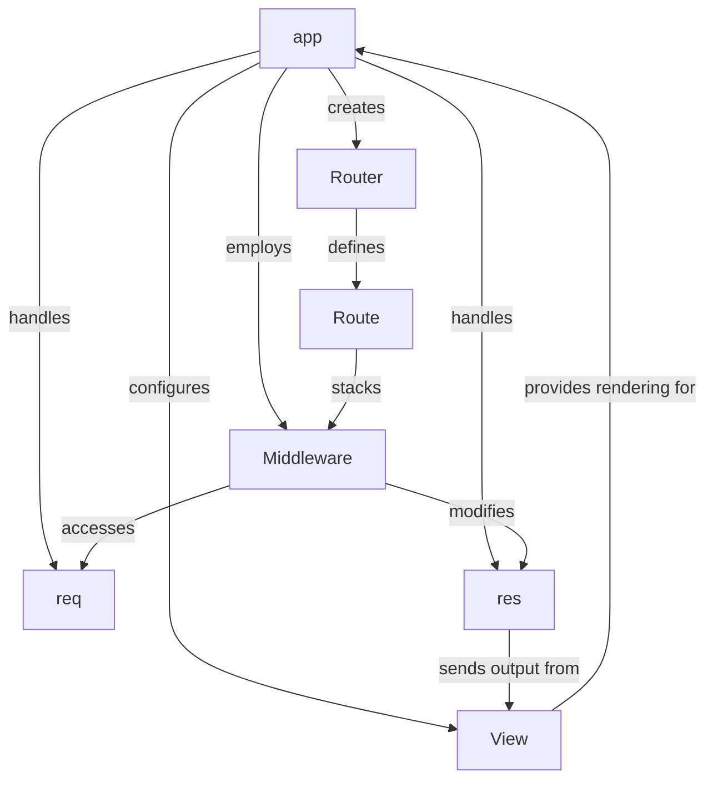

# express

_Lens: beginner-tutorial_

This codebase implements the core components of the Express.js web framework, providing a robust foundation for building web applications and APIs. It abstracts away the complexities of raw HTTP, offering tools for routing requests, managing responses, and integrating templating engines.

## Architecture

## Chapters

- [app](01_app.md)
- [req](02_req.md)
- [res](03_res.md)
- [Middleware](04_middleware.md)
- [Router](05_router.md)
- [Route](06_route.md)
- [View](07_view.md)