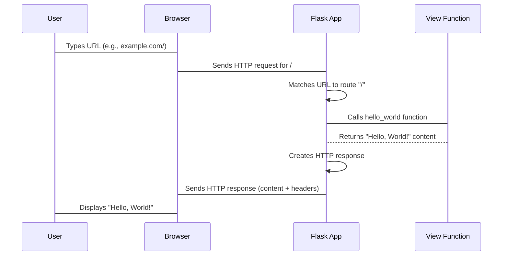

# Chapter 1: Flask

Imagine you're visiting a bustling restaurant. You walk in, take a seat, and eventually, a waiter comes to take your order. The kitchen then prepares your meal, and it's brought back to your table. But what happens behind the scenes? Who decides where you sit, what's on the menu, and which chef cooks your specific dish?

In the world of web applications, when you type a URL into your browser, a similar process unfolds. Your browser sends a request, and a server somewhere needs to figure out which piece of code should handle that request, what data it needs, and what to send back. This is where the `Flask` object comes in.

The `Flask` object is the central manager of your web application, much like the manager of our restaurant. It orchestrates everything: accepting customer orders (requests), figuring out what dish to prepare (routing the request), sending the order to the right chef (calling a view function), ensuring the meal is prepared correctly (processing logic), and serving it back to the customer (sending a response). It's the core around which all other parts of your web project revolve.

Let's start by creating our first Flask application.

```python
from flask import Flask

# Create the Flask application instance
app = Flask(__name__)

# Define a route and its view function
@app.route("/")
def hello_world():
    return "<p>Hello, World!</p>"

# Run the application
if __name__ == "__main__":
    app.run(debug=True)
```

In this small example, we've set up a basic Flask application. Let's break it down, line by line.

First, we import the `Flask` class:

```python
from flask import Flask
```

This line brings the `Flask` class into our Python script. It's the blueprint for our application manager.

Next, we create an instance of the `Flask` class:

```python
app = Flask(__name__)
```

Here, `app` becomes our application manager. The `__name__` argument is a special Python variable that tells Flask the name of the current module. Flask uses this name to locate resources like templates and static files relative to your application's root directory. Think of it as telling the restaurant manager where the restaurant's main office is located so they know where to find important documents.

Now, let's define what happens when a customer orders a specific "dish":

```python
@app.route("/")
def hello_world():
    return "<p>Hello, World!</p>"
```

This section is where the magic of routing happens.
*   `@app.route("/")` is a decorator. Decorators are Python functions that modify other functions. In this case, `@app.route("/")` tells our Flask `app` manager that whenever a client requests the root URL (`/`), the `hello_world` function should be called. This is like the restaurant manager linking a specific dish on the menu ("Today's Special") to a particular chef's station.
*   `def hello_world():` is our view function. This is the code that gets executed when the route matches a request. It's the chef preparing the actual dish.
*   `return "<p>Hello, World!</p>"` is what our view function sends back. In Flask, whatever a view function returns is converted into an HTTP response that the browser can display. Here, it's a simple HTML paragraph.

Finally, we tell our application manager to start taking orders:

```python
if __name__ == "__main__":
    app.run(debug=True)
```

This block ensures that the `app.run()` command is only executed when the script is run directly (not when it's imported as a module).
*   `app.run()` starts the Flask development server. This is the restaurant manager opening the doors for business.
*   `debug=True` enables debug mode. In this mode, Flask provides a friendly debugger if your application encounters an error, and it automatically reloads the server if you make changes to your code. It's like having a meticulous manager who instantly flags any kitchen mishaps and restarts service with the latest menu.

Let's visualize this process:



The `Flask` object manages the lifecycle of requests, from incoming HTTP messages to outgoing responses. It knows which function to call for which URL, and it provides the environment for those functions to do their work.

While `app.run()` is convenient for development, in a production environment, you would use a dedicated WSGI server (like Gunicorn or uWSGI) to run your Flask application for better performance and reliability. You'll also encounter the `flask run` command-line utility, which provides a more robust development server with features like automatic code reloading, leveraging the `Flask` object's CLI capabilities as seen in `src/flask/cli.py`.

Now you've seen the `Flask` object in action, acting as the central hub for your web application. But what about all the settings and configurations this manager needs to consider? How does it know the restaurant's policies, like how long a customer's session should last or which directory stores the menu photos? In the next chapter, we'll dive into how the `Flask` object manages its settings and policies using the [Config](02_config.md) object.