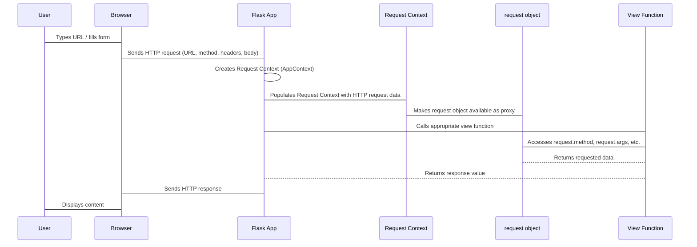

# Chapter 3: Request

Imagine you're running a busy online store. A customer visits your website, adds items to their cart, fills out a shipping form, and clicks "Place Order." As the shop owner, how do you know what page they were on, which products they selected, their shipping address, or even what type of browser they used? All this information is crucial for fulfilling their order.

In the world of web applications, every time your browser interacts with a Flask server, it sends a message packed with details. This message is called an HTTP request. Flask's job isn't just to receive this message, but to decode it, parse its contents, and make all that information easily accessible to your application. This is where the `request` object comes in.

The `request` object is a special proxy provided by Flask that represents all the incoming data from the current visitor's message. Think of it as that filled-out order form from our online store analogy, neatly organized and ready for you to read. It contains everything from the URL the user is trying to reach, to any data they might have sent (like form inputs or uploaded files), and even information about their browser.

You access this `request` object directly from `flask` to understand user intent and process their actions.

Let's see how we can use it in a simple Flask application.

```python
from flask import Flask, request

app = Flask(__name__)

@app.route("/")
def index():
    # What page did the user ask for?
    # What method did they use (GET, POST, etc.)?
    return f"You are on the {request.path} page, using the {request.method} method."

@app.route("/submit", methods=["GET", "POST"])
def submit_form():
    if request.method == "POST":
        # Access form data sent via POST
        user_name = request.form.get("username")
        return f"Hello, {user_name}! Your form was submitted."
    # If it's a GET request, show a simple form
    return """
        <form method="post">
            <label for="username">Username:</label>
            <input type="text" id="username" name="username">
            <input type="submit" value="Submit">
        </form>
    """

if __name__ == "__main__":
    app.run(debug=True)
```

In this example:

*   We import `request` from `flask`.
*   In the `index` view, we use `request.path` to get the requested URL path (e.g., `/`) and `request.method` to see if it was a `GET`, `POST`, etc.
*   In the `submit_form` view, we check `request.method`. If it's a `POST` request (meaning the form was submitted), we access the data sent in the form using `request.form.get("username")`. `request.form` behaves like a dictionary, allowing you to access input fields by their `name` attribute.

### Key Attributes of the `request` Object

The `request` object exposes a wealth of information through various attributes, making it the primary tool for interacting with incoming data.

#### 1. `request.method`

This attribute tells you the HTTP method used for the request (e.g., `GET`, `POST`, `PUT`, `DELETE`). This is crucial for distinguishing between, for example, a user simply viewing a page (`GET`) and a user submitting data (`POST`).

```python
@app.route("/data", methods=["GET", "POST", "PUT"])
def handle_data():
    if request.method == "POST":
        return "Received new data via POST."
    elif request.method == "PUT":
        return "Updated data via PUT."
    else: # GET
        return "You can GET, POST, or PUT to this endpoint."
```

#### 2. `request.args` (Query Parameters)

When you see a URL like `http://example.com/search?query=flask&page=1`, the `query` and `page` parts are called query parameters. `request.args` is a dictionary-like object that holds these parameters.

```python
@app.route("/search")
def search():
    query = request.args.get("query", "No query provided")
    page = request.args.get("page", "1")
    return f"Searching for '{query}' on page {page}."
```
Here, `.get()` is used for safety, providing a default value if the parameter isn't present, preventing errors.

#### 3. `request.form` (Form Data)

For data submitted through HTML forms using the `POST` method, `request.form` provides access to the input fields.

```python
@app.route("/profile", methods=["POST"])
def update_profile():
    email = request.form.get("email")
    password = request.form.get("password")
    return f"Profile updated for {email}!"
```

#### 4. `request.json` (JSON Data)

Modern web applications often send data in JSON format, especially with JavaScript frontends. If the incoming request has a `Content-Type: application/json` header, Flask will automatically parse the body into a Python dictionary or list, accessible via `request.json`.

```python
@app.route("/api/items", methods=["POST"])
def create_item():
    if request.is_json:
        data = request.json # This will be a Python dictionary/list
        item_name = data.get("name")
        item_price = data.get("price")
        return f"Created item: {item_name} at ${item_price}.", 201
    return "Request must be JSON", 400
```
Note `request.is_json` to easily check if the request contains JSON data.

#### 5. `request.headers` (HTTP Headers)

HTTP requests include various headers that provide metadata about the request, such as the `User-Agent` (browser info), `Referer` (previous page), or `Accept-Language`. `request.headers` gives you access to these.

```python
@app.route("/browser-info")
def browser_info():
    user_agent = request.headers.get("User-Agent")
    return f"Your browser: {user_agent}"
```

#### 6. `request.path` and `request.url`

*   `request.path`: The path component of the URL, without the domain, scheme, or query string (e.g., `/users/1`).
*   `request.url`: The full URL including scheme, domain, path, and query string (e.g., `http://localhost:5000/users/1?active=true`).

```python
@app.route("/page/<name>")
def show_page(name):
    return f"You visited {request.path}. The full URL was {request.url}."
```

### The Request Context and Global Proxy

As we learned in [Chapter 1: Flask](01_flask.md), the `Flask` object manages the application lifecycle. When a request comes in, Flask sets up a "request context." This context is like a temporary workspace that holds all the information pertaining to the *current* request, including the `request` object itself.

`request` (and other objects like `session` and `g`) aren't direct objects you create. They are special proxies that Flask automatically maps to the correct request-specific data for the current active request. This means that no matter where you access `request` in your code during the handling of an HTTP request, it will always refer to the details of *that specific request*.

If you try to access `request` outside of an active request context (e.g., directly in a Python script without running the Flask server), you'll get a `RuntimeError` because there's no "current request" for the proxy to point to.

You might remember from [Chapter 2: Config](02_config.md) how Flask uses configuration settings to define its behavior. The `request` object also interacts with `Config`. For instance, `app.config['MAX_CONTENT_LENGTH']` directly controls the maximum size of incoming request bodies, protecting your server from unusually large uploads.

```python
# From src/flask/wrappers.py
class Request(RequestBase):
    # ...
    @property
    def max_content_length(self) -> int | None:
        """The maximum number of bytes that will be read during this request. If
        this limit is exceeded, a 413 :exc:`~werkzeug.exceptions.RequestEntityTooLarge`
        error is raised.
        """
        if self._max_content_length is not None:
            return self._max_content_length

        if not current_app:
            return super().max_content_length

        return current_app.config["MAX_CONTENT_LENGTH"]
    # ...
```
This snippet from Flask's source shows how `request.max_content_length` defaults to the value set in `current_app.config`.

### The Request Lifecycle

Let's visualize how an incoming request becomes the accessible `request` object in your view function:



In this diagram:
1.  The **User** interacts with their **Browser**.
2.  The **Browser** sends an HTTP request to the **Flask App**.
3.  The **Flask App** (our restaurant manager from [Chapter 1: Flask](01_flask.md)) receives the raw HTTP message.
4.  Flask then creates a **Request Context** (which is an `AppContext` instance), a temporary container for all request-specific information.
5.  Within this context, Flask parses the raw HTTP request data and makes it available through the `request` proxy object.
6.  Flask routes the request to the correct **View Function**.
7.  The **View Function** can now easily access all the client's information through the `request` proxy.

Understanding the `request` object is fundamental to building interactive web applications with Flask. It's how your server "listens" to the client and understands what they want to do.

Now that you know how Flask receives and interprets client requests, the next logical step is to understand how your application sends information *back* to the client. This outgoing communication is handled by Flask's `Response` object, which we'll explore in the next chapter.

Go to [Response](04_response.md)