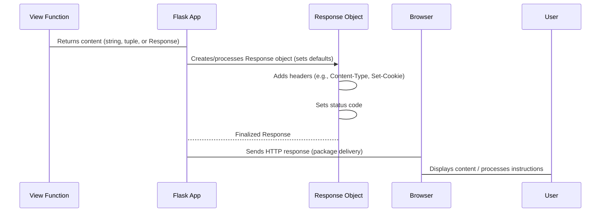

# Chapter 4: Response

You've navigated to a website, sent your request, and the server has processed it (as we saw with the `Request` object in [Chapter 3: Request](03_request.md)). Now, it's time for the server to send its reply back to your browser. What's in that reply? Is it just the HTML content you see, or is there more to it? How does the server tell your browser if everything went smoothly, or if there was an error? And how does it send little pieces of information, like remembering you're logged in, back to your browser?

This reply is known as the HTTP response, and in Flask, it's managed by the `Response` object. Think of it as the carefully packaged meal delivered back to your table in our restaurant analogy. It's not just the food itself; it's the plate it's on, any side dishes, a note from the chef, and perhaps a loyalty card stamp. All these components contribute to the complete customer experience.

Flask automatically takes whatever your view function returns and wraps it into a `Response` object. This object holds all the outgoing data: the actual content (like HTML or JSON), the HTTP status code (e.g., "200 OK"), and any additional metadata like HTTP headers or cookies your application might want to set.

Let's revisit our "Hello, World!" example from [Chapter 1: Flask](01_flask.md) and see the `Response` in action.

```python
from flask import Flask, Response, request

app = Flask(__name__)

@app.route("/")
def hello_world():
    # Flask automatically converts this string into a Response object
    return "<p>Hello, World!</p>"

@app.route("/custom-response")
def custom_response():
    # You can return a tuple: (content, status_code, headers)
    # This sets the status code to 201 (Created) and a custom header
    return "<h1>Resource Created!</h1>", 201, {"X-Custom-Header": "Flask-Powered"}

@app.route("/set-cookie")
def set_a_cookie():
    response = Response("You got a cookie!")
    # Set a simple cookie named 'my_cookie' with value 'yum'
    response.set_cookie("my_cookie", "yum")
    return response

if __name__ == "__main__":
    app.run(debug=True)
```

In the `hello_world` function, we just return a string. Flask is smart enough to turn that string into a `Response` object with a default status of 200 OK and a `Content-Type` header of `text/html`.

In `custom_response`, we demonstrate how a view function can return a tuple:
*   The first element is the content.
*   The second is the HTTP status code.
*   The third is a dictionary of custom HTTP headers.

This gives you fine-grained control over how the server replies.

In `set_a_cookie`, we explicitly create a `Response` object using `flask.Response`. This allows us to call methods directly on the response, such as `set_cookie()`, before returning it.

### Key Aspects of a Flask Response

#### 1. Content

This is the actual data sent back to the browser. It can be HTML, JSON, a file, plain text, or anything else. Flask automatically infers the `Content-Type` header based on what you return:
*   Strings and HTML are typically `text/html`.
*   Using `flask.jsonify` (which we'll see shortly) results in `application/json`.
*   Files sent via `send_file` will have their `Content-Type` inferred or explicitly set.

```python
from flask import Flask, jsonify, request

app = Flask(__name__)

@app.route("/api/data")
def get_json_data():
    # Use jsonify to return JSON content
    data = {"name": "Alice", "age": 30, "city": "New York"}
    return jsonify(data) # Automatically sets Content-Type to application/json
```
The `jsonify` helper (from `flask.json`) is a convenient way to serialize Python dictionaries or lists into JSON and return them with the correct `Content-Type` header.

#### 2. Status Code

Every HTTP response must include a status code, a three-digit number indicating the outcome of the request.
*   `200 OK`: The request was successful.
*   `201 Created`: The request was successful and a new resource was created.
*   `302 Found` / `303 See Other` / `307 Temporary Redirect` / `308 Permanent Redirect`: The client should be redirected to a different URL. (Flask's `redirect` helper defaults to `303` as of Flask 3.2).
*   `404 Not Found`: The requested resource could not be found.
*   `500 Internal Server Error`: An unexpected error occurred on the server.

You can specify the status code by returning it as the second element in a tuple:

```python
@app.route("/not-found")
def page_not_found():
    return "<h1>Page Not Found!</h1>", 404

@app.route("/unauthorized")
def unauthorized_access():
    return "You are not allowed to view this page.", 401
```

#### 3. Headers

HTTP headers provide metadata about the response. Common headers include:
*   `Content-Type`: Specifies the media type of the resource (e.g., `text/html`, `application/json`).
*   `Set-Cookie`: Instructs the browser to store a cookie.
*   `Location`: Used with redirect status codes to specify the new URL.
*   `Cache-Control`: Directs caching mechanisms.

You can add custom headers or override existing ones by returning a dictionary as the third element in a tuple, or by modifying the `response.headers` attribute directly.

```python
from flask import Flask, make_response

app = Flask(__name__)

@app.route("/download-page")
def download_page():
    content = "<html><body><h1>Download This!</h1></body></html>"
    response = make_response(content)
    response.headers["Content-Disposition"] = "attachment; filename=my_page.html"
    response.headers["Content-Type"] = "text/html" # Ensure correct content type for attachment
    return response
```
Notice the use of `make_response` here. When your view function returns something that Flask would normally convert (like a string or a template render), but you need to *modify* the `Response` object (e.g., to add a header or set a cookie), `make_response()` is your friend. It explicitly converts the return value into a `Response` object *before* your function returns, allowing you to manipulate it.

#### 4. Cookies

Cookies are small pieces of data that the server sends to the user's web browser, which the browser may store and send back with later requests. They are often used for session management (logging in users), personalization, and tracking.
Flask leverages `app.config` (as discussed in [Chapter 2: Config](02_config.md)) to control many aspects of session cookies, such as `SESSION_COOKIE_NAME`, `SESSION_COOKIE_DOMAIN`, `SESSION_COOKIE_PATH`, `SESSION_COOKIE_SECURE`, and `MAX_COOKIE_SIZE`.

You set cookies using the `response.set_cookie()` method:

```python
@app.route("/remember-me")
def remember_me():
    user_id = "user123"
    response = make_response(f"Hello, {user_id}! I'll remember you.")
    # Set a cookie that expires after 3600 seconds (1 hour)
    response.set_cookie("user_session_id", user_id, max_age=3600)
    return response
```
Conversely, you can remove a cookie using `response.delete_cookie()`.

### The Response Lifecycle

Let's visualize how the `Response` object is created and sent back to the user:


1.  The **View Function** finishes its work and returns a value (a string, a tuple, or an already-created `Response` object).
2.  The **Flask App** (our restaurant manager) takes this return value and converts it into a full-fledged **Response Object**.
3.  The **Response Object** is then configured: default headers are added, the status code is set, and any explicit modifications from the view function (like custom headers or cookies) are applied.
4.  The Flask application then takes this finalized `Response Object` and turns it into a raw HTTP response message.
5.  This HTTP response is sent over the network to the **Browser**.
6.  Finally, the **Browser** processes the content, displays it to the **User**, handles cookies, and performs any redirects.

The `Response` object is the final act of communication from your server to the client. It wraps up all the data and metadata into a single, understandable package.

Now that we've followed the journey of a request from the browser, through Flask's processing, and finally back out as a response, you might be wondering about the "context" that ties all these pieces together. How does Flask manage the environment so that `request`, `session`, `g`, and `current_app` are magically available within your view functions? That's the secret sauce of Flask's `AppContext` and `RequestContext`, which we'll explore in the next chapter.

Go to [AppContext](05_appcontext.md)