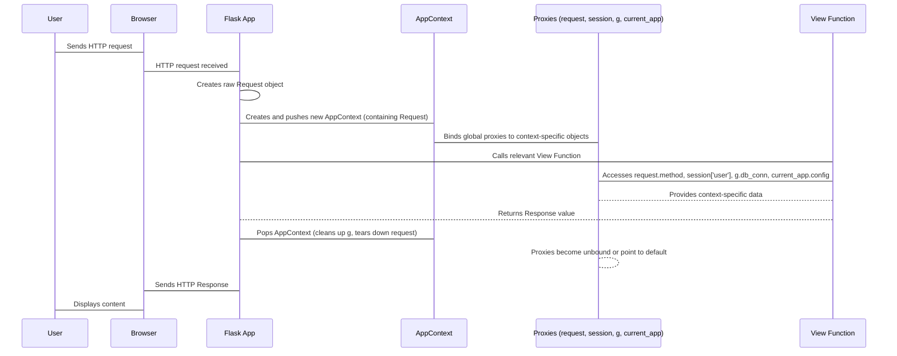

# Chapter 5: AppContext

Imagine you're a chef in a bustling kitchen. When an order comes in for a specific dish, you don't run around the entire kitchen looking for ingredients and tools every time. Instead, you have a personal workbench, perfectly set up with everything you need for *that specific order*: the recipe, the ingredients for that dish, the right knives, and your cutting board. Once you finish that dish, you clear your workbench, and it's ready for the next one.

In a Flask application, a similar concept exists. Every time a web request comes in, or even when you run a command-line task related to your app, Flask sets up a temporary, isolated "workbench" just for that operation. This workbench ensures that you always have the correct `current_app`, `request`, `session`, and `g` objects readily available, without having to pass them explicitly to every function. This temporary workspace is called the **AppContext**.

The `AppContext` is a central piece of Flask's design, providing a consistent environment for your code to execute. It's how Flask makes these special objects magically accessible via global proxies, ensuring they always point to the data relevant to the *current* operation.

### The Essential Tools on Your Workbench

Let's look at the key objects that become available within an `AppContext`:

1.  **`current_app`**: As introduced in [Chapter 1: Flask](01_flask.md), this is your main `Flask` application instance. Inside an `AppContext`, `current_app` always refers to the application that is currently processing the request or task.
2.  **`request`**: This is the incoming HTTP request, which we explored in detail in [Chapter 3: Request](03_request.md). It holds all the data sent by the client, like URL parameters, form data, and headers.
3.  **`session`**: This object represents the user's session data, allowing you to store information across multiple requests (e.g., login status, items in a shopping cart). The `session` data is typically stored in cookies, which are managed by Flask as part of the `Response` object ([Chapter 4: Response](04_response.md)).
4.  **`g` (globals)**: This is a unique object that acts as a simple scratchpad for the current application context. It's useful for storing temporary data that needs to be accessed by multiple functions during a single request or task, but shouldn't persist beyond that. Think of it as sticky notes on your workbench.

### The Lifecycle of an AppContext

The `AppContext` isn't something you usually create directly in your web views. Flask automatically handles its creation and destruction for you during each request.

When a client sends an HTTP request to your Flask application:
1.  Flask receives the request.
2.  It creates a new `AppContext` (which also contains request-specific data, effectively acting as a `RequestContext` as well – more on this below).
3.  This `AppContext` is "pushed" onto a special internal stack. This act of pushing makes `current_app`, `request`, `session`, and `g` available as context-local proxies.
4.  Your view function is executed, accessing these proxies as needed.
5.  Once your view function returns a response, the `AppContext` is "popped" from the stack, and all its associated data is cleaned up.

This mechanism ensures that even if many users access your application concurrently, each user's request operates within its own isolated `AppContext`, preventing data from one request "leaking" into another.

### Using AppContext Outside of Requests

While `AppContext` is automatically managed for web requests, there are times you might need to create one explicitly. For instance, when running background tasks, command-line scripts, or unit tests that interact with your Flask application's features (like accessing `current_app.config` or a database connection stored in `g`), you need to manually establish an `AppContext`.

Here's how you can create and use an `AppContext` manually:

```python
from flask import Flask, current_app, g

app = Flask(__name__)
app.config["MY_SETTING"] = "hello from app config"

def do_something_with_app_context():
    # Inside this function, current_app and g are available
    print(f"Current app name: {current_app.name}")
    print(f"My setting: {current_app.config['MY_SETTING']}")
    
    # Use 'g' as a temporary storage
    g.some_data = "This is temporary data for this context"
    print(f"Data in g: {g.some_data}")

# --- Outside a request or CLI command ---
print("Before app context:")
# This would raise a RuntimeError:
# print(current_app.name)

# Manually push an app context
with app.app_context():
    print("Inside app context:")
    do_something_with_app_context()
    # The 'g' object is tied to this specific 'with' block
    print(f"Still inside context, data in g: {g.some_data}")

print("After app context:")
# Attempting to access current_app or g outside the 'with' block
# would again raise a RuntimeError because the context has been popped.
# print(current_app.name)
```

Running this script demonstrates that `current_app` and `g` are only accessible within the `with app.app_context():` block. Once the block exits, the context is automatically popped, and those objects become unavailable again.

Flask achieves this context management using Python's `ContextVar` and `LocalProxy` objects (from Werkzeug). `ContextVar` allows data to be associated with the current execution context, and `LocalProxy` is the "magic" that makes `current_app`, `request`, etc., appear as global variables while actually resolving to the correct context-specific object.

### AppContext and RequestContext: A Unified Workbench

Historically, Flask had both `AppContext` and `RequestContext`. The `AppContext` held application-wide data (`current_app`, `g`), while the `RequestContext` specifically managed request-related data (`request`, `session`, URL routing).

As of Flask 3.2, `RequestContext` has been merged into `AppContext`. This means that `AppContext` now serves as the single, unified workbench for all operations. When an HTTP request comes in, a single `AppContext` instance is created that holds both the general application context data *and* the specific request data. This simplifies context management and makes the overall system more streamlined. If you encounter older Flask tutorials or code referring to `RequestContext`, remember that it's now handled by the comprehensive `AppContext`.

### The AppContext in Action

Let's visualize how the `AppContext` brings all these pieces together during a typical web request:



In this flow, the `AppContext` acts as the orchestrator. It's responsible for setting up the environment before your view function runs, ensuring all global proxies resolve to the correct, isolated data for that specific request. It then meticulously cleans up after the request is processed, making the system ready for the next operation.

Understanding the `AppContext` is key to grasping how Flask provides a clean and thread-safe environment for your web applications. It's the invisible force that keeps `request`, `session`, `g`, and `current_app` always at your fingertips, specific to the current task.

Now that you know how Flask manages the environment for each request, you're ready to learn how to dynamically generate URLs, which is essential for building interconnected web applications. In the next chapter, we'll dive into the `url_for` helper function.