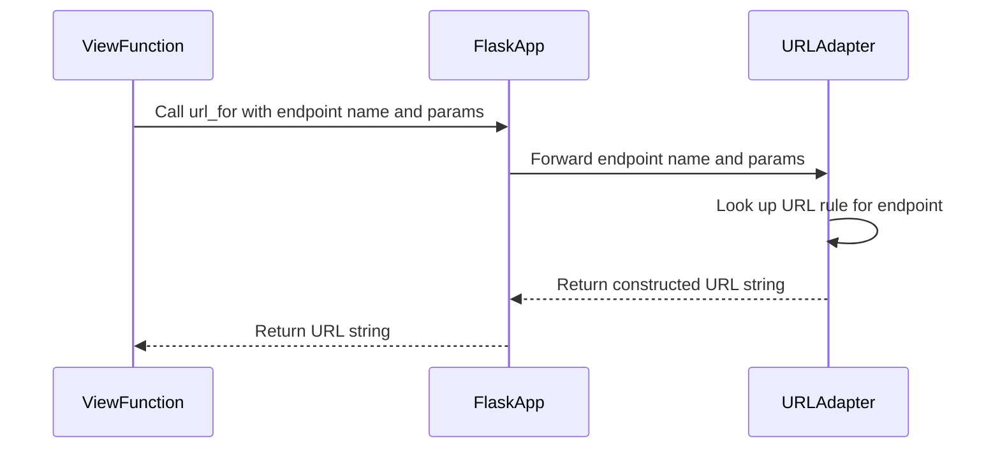

# Chapter 6: url_for

Imagine you're designing a sprawling city, and you need to put up signs guiding people to different landmarks: the library, the park, the museum. If you hardcode signs that say "Library: Go down Elm Street, take a left on Oak Avenue, then right on Maple Drive," what happens if you decide to move the library to a different location? All your signs would be instantly wrong, and your citizens would be lost.

In web applications, hardcoding URLs is like hardcoding those street directions. If you write links in your HTML like `<a href="/users/profile/123">My Profile</a>`, and then later decide to change the URL pattern for user profiles to `/profile/user/123`, all your existing links will break, leading to frustrating "404 Not Found" errors. This is where Flask's `url_for` function comes to the rescue.

`url_for` is Flask's smart navigation system. Instead of giving it explicit street directions (a hardcoded path), you give it the *name* of the landmark (your view function's endpoint), and it dynamically figures out the correct, up-to-date directions (the URL). It's like having a digital map that always knows where the library is, even if it moves.

This flexibility is a huge advantage:
*   **Maintainability**: If you change a route's URL pattern, `url_for` automatically generates the new correct URL everywhere you use it, without you having to manually update dozens or hundreds of links.
*   **Readability**: Your code refers to view functions by their logical names, making it easier to understand what a link is pointing to.
*   **Consistency**: `url_for` handles details like URL prefixes (which we'll see more of in [Chapter 8: Blueprint](08_blueprint.md)) and external vs. internal URLs, ensuring consistency across your application.

Let's see how this "smart navigator" works.

### Basic Usage: Linking to View Functions

Every time you define a route with `@app.route()`, you're implicitly giving that view function a *name*, also known as an **endpoint**. By default, this endpoint is the name of the Python function itself. You then pass this endpoint name to `url_for`.

```python
from flask import Flask, url_for

app = Flask(__name__)

@app.route("/")
def index():
    return f'Go to <a href="{url_for("about")}">About Us</a>'

@app.route("/about")
def about():
    return f'Go back to <a href="{url_for("index")}">Home</a>'

if __name__ == "__main__":
    app.run(debug=True)
```

In this example:
*   `url_for("about")` generates the URL for the `about` view function, which is `/about`.
*   `url_for("index")` generates the URL for the `index` view function, which is `/`.

If you were to later change `@app.route("/about")` to `@app.route("/our-story")`, `url_for("about")` would automatically start generating `/our-story`, and your links would never break!

### URLs with Variables: Providing Dynamic Data

Many URLs in a web application contain dynamic parts, like user IDs or product slugs. Flask's routing mechanism handles these with variable rules, and `url_for` knows how to fill them in.

```python
from flask import Flask, url_for

app = Flask(__name__)

@app.route("/user/<username>")
def user_profile(username):
    return f"Hello, {username}! Visit <a href='{url_for('product_detail', product_id=123)}'>Product 123</a>."

@app.route("/product/<int:product_id>")
def product_detail(product_id):
    return f"Product ID: {product_id}. See <a href='{url_for('user_profile', username='Alice')}'>Alice's profile</a>."

if __name__ == "__main__":
    app.run(debug=True)
```

Here:
*   The `user_profile` endpoint expects a `username` variable. When calling `url_for('user_profile', username='Alice')`, Flask constructs `/user/Alice`.
*   The `product_detail` endpoint expects an `int:product_id` variable. `url_for('product_detail', product_id=123)` constructs `/product/123`.

`url_for` takes these dynamic parts as keyword arguments, matching them to the variable names defined in your route.

### Adding Query Parameters: Filtering and Sorting

What if you need to add query parameters (the `?key=value&another=value` part of a URL) for things like search queries, pagination, or sorting? `url_for` handles this too. Any extra keyword arguments you pass to `url_for` that *don't* match a variable in the URL rule will automatically be appended as query parameters.

```python
from flask import Flask, url_for, request

app = Flask(__name__)

@app.route("/products")
def product_list():
    # Example: /products?category=electronics&sort=price
    category = request.args.get("category", "All")
    sort_by = request.args.get("sort", "name")
    
    # Link to another view, passing current category and different sort
    next_sort_link = url_for("product_list", category=category, sort="price_desc")

    return f"Displaying {category} products, sorted by {sort_by}. <a href='{next_sort_link}'>Sort by Price Desc</a>"

if __name__ == "__main__":
    app.run(debug=True)
```
If you visit `/products?category=clothing`, then `url_for("product_list", category=category, sort="price_desc")` would generate `/products?category=clothing&sort=price_desc`.

### Generating External URLs: Full Paths

Sometimes you need a complete, absolute URL, including the scheme (`http://` or `https://`) and the domain (`example.com`). This is common when sending emails with links, providing callbacks for APIs, or generating RSS feeds. For this, `url_for` accepts the `_external=True` argument.

```python
from flask import Flask, url_for

app = Flask(__name__)
app.config["SERVER_NAME"] = "localhost:5000" # Important for external URLs

@app.route("/welcome")
def welcome():
    # This will generate http://localhost:5000/welcome (or https if configured)
    full_url = url_for("welcome", _external=True)
    
    # You can also force a scheme
    secure_url = url_for("welcome", _external=True, _scheme="https")
    
    return f"External URL: {full_url}<br>Secure URL: {secure_url}"

if __name__ == "__main__":
    app.run(debug=True)
```
Notice that we set `app.config["SERVER_NAME"]`. For `url_for` to generate external URLs *outside* of an active HTTP request (e.g., in a CLI script or background task), Flask needs to know the domain. This is why configuring `SERVER_NAME` (as we discussed in [Chapter 2: Config](02_config.md)) is crucial for robust external URL generation. Inside an active request, Flask can often infer the server name from the incoming `Request` object ([Chapter 3: Request](03_request.md)).

### `url_for` and Blueprints: Relative Endpoints

While we'll dive deeper into [Chapter 8: Blueprint](08_blueprint.md), it's worth noting how `url_for` interacts with them. When you organize your application into blueprints, an endpoint name is usually prefixed with the blueprint's name (e.g., `'admin.dashboard'`).

`url_for` can simplify this with relative endpoint names. If you're currently within a blueprint and want to link to another view *within the same blueprint*, you can prepend the endpoint name with a dot (`.`).

```python
# Assuming this is part of a blueprint called 'admin_bp'
# For example, admin_bp.route("/dashboard") maps to admin_bp.dashboard
# And admin_bp.route("/settings") maps to admin_bp.settings

# In a view function *within* the 'admin_bp' blueprint:
# url_for('.settings') # would generate /admin/settings (assuming admin_bp prefix is /admin)
# url_for('admin_bp.dashboard') # would also work for the dashboard in the same blueprint
```
This keeps your blueprint code self-contained and flexible, as you don't need to hardcode the blueprint's full name everywhere.

### The `AppContext` and `url_for`

Like many core Flask features, `url_for` relies on an active application context (or request context, which includes it). As we learned in [Chapter 5: AppContext](05_appcontext.md), contexts provide the "workbench" where `current_app` and other proxy objects are available.

When you call `url_for`, it internally accesses `current_app.url_for()` to perform the URL building. The `Flask` application instance holds the `url_map` (from Werkzeug's routing system) which contains all the registered URL rules. `url_for` uses this map to reverse-lookup the URL based on the endpoint name and provided values. If there's no active application context, Flask wouldn't know which application's `url_map` to use, leading to a `RuntimeError`.


1.  Your **View Function** calls `url_for()` with an endpoint name and any necessary parameters.
2.  The **Flask App** (our central manager) receives this call. Because `url_for` is a helper, it internally delegates to the `current_app`'s `url_for` method.
3.  The Flask App, using its `url_map` and a **URL Adapter** (Werkzeug's powerful routing engine), looks up the rule associated with the given endpoint.
4.  The URL Adapter uses the provided parameters to fill in any variable parts of the URL and adds extra parameters as a query string.
5.  The constructed URL string is returned to the Flask App.
6.  The Flask App passes the final URL string back to your View Function.

By using `url_for`, you ensure your Flask application's navigation is robust, adaptable, and easy to maintain. It's an indispensable tool for building interconnected web experiences.

Now that you can dynamically generate URLs, the next step is to display these links and other dynamic content to your users. This is where Flask's templating engine, powered by Jinja, comes in. In the next chapter, we'll learn how to integrate dynamic data and generated URLs into beautiful HTML using `render_template`.

Go to [render_template](07_render_template.md)