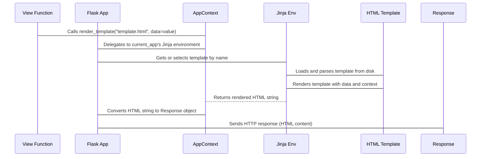

# Chapter 7: render_template

You've built a Flask application that can receive requests (using the `Request` object, as seen in [Chapter 3: Request](03_request.md)), understand their intent, and even generate smart URLs (with `url_for` from [Chapter 6: url_for](06_url_for.md)). You know how to send back a basic text response (via the `Response` object in [Chapter 4: Response](04_response.md)). But how do you create rich, dynamic web pages—pages that combine a consistent design with ever-changing data, like a user's name, their shopping cart items, or search results?

Returning simple HTML strings directly from your view functions, as we've done so far, quickly becomes cumbersome and unmanageable for anything beyond "Hello, World!". It's like trying to bake a new cake from scratch every time, rather than having a well-tested recipe and simply swapping out ingredients.

This is where templating engines come in, and Flask integrates beautifully with **Jinja2**. The `render_template` function is your chef, taking a Jinja2 template file (your carefully crafted recipe or HTML blueprint) and filling it with dynamic data (your fresh ingredients). It's like a designer taking a standard form and populating it with specific details to create a personalized document for each user, then returning the result.

The core idea is to separate your presentation (the HTML structure and styling) from your application logic (the Python code that fetches and processes data). Your view functions will gather the necessary data, and then `render_template` will combine that data with your HTML templates to produce the final, dynamic webpage.

### Setting Up Your Templates

By default, Flask looks for template files in a directory named `templates` located within your application's `root_path`. Let's create a `templates` folder in your project's root and add a simple HTML file, `index.html`:

```html
<!-- templates/index.html -->
<!DOCTYPE html>
<html lang="en">
<head>
    <meta charset="UTF-8">
    <title>My Flask App</title>
</head>
<body>
    <h1>Welcome!</h1>
    <p>Hello, {{ name }}!</p>
    <p>This is a dynamic page.</p>
</body>
</html>
```

Now, let's modify our Flask application to use this template:

```python
from flask import Flask, render_template

app = Flask(__name__)

@app.route("/")
def index():
    # Call render_template, passing 'name' as a keyword argument
    return render_template("index.html", name="Visitor")

if __name__ == "__main__":
    app.run(debug=True)
```

Run this code, and when you visit `http://127.0.0.1:5000/`, you'll see a personalized welcome message.

Let's break down `render_template("index.html", name="Visitor")`:
*   `"index.html"`: This is the name of the template file Flask should find and use. Flask's `jinja_env` (the Jinja2 environment, which is configured on your `Flask` object) is responsible for locating this file within your `templates` directory.
*   `name="Visitor"`: This is a keyword argument. Any keyword arguments passed to `render_template` are made available as variables within the template. In our `index.html`, `{{ name }}` is a Jinja2 placeholder that gets replaced by the value of the `name` variable (in this case, "Visitor").

### Integrating Dynamic Data and `url_for`

The real power of `render_template` shines when you combine it with the dynamic data you've learned to access from the `Request` object and the URL generation capabilities of `url_for`.

Let's create another template, `user.html`, and a view function that uses data from the URL and links to other pages:

```html
<!-- templates/user.html -->
<!DOCTYPE html>
<html lang="en">
<head>
    <meta charset="UTF-8">
    <title>User Profile</title>
</head>
<body>
    <h1>User Profile for {{ username }}</h1>
    <p>You are viewing the profile of <strong>{{ username }}</strong>.</p>
    <p>User ID: {{ user_id }}</p>
    <p><a href="{{ url_for('index') }}">Go to Home</a></p>
    <p><a href="{{ url_for('user_profile', username='Alice', user_id=1) }}">View Alice's Profile</a></p>
    <p><a href="{{ url_for('user_profile', username='Bob', user_id=2) }}">View Bob's Profile</a></p>
</body>
</html>
```

And update `app.py`:

```python
from flask import Flask, render_template, request, url_for

app = Flask(__name__)

@app.route("/")
def index():
    return render_template("index.html", name="Guest")

@app.route("/user/<username>/<int:user_id>")
def user_profile(username, user_id):
    # Pass URL variables and request data to the template
    return render_template(
        "user.html",
        username=username,
        user_id=user_id,
        current_method=request.method # Example of request data
    )

if __name__ == "__main__":
    app.run(debug=True)
```

In `user.html`:
*   We use `{{ username }}` and `{{ user_id }}` to display the data passed from the `user_profile` view function.
*   We use `url_for('index')` and `url_for('user_profile', username='Alice', user_id=1)` directly within the template. Jinja2 understands the `url_for` function because Flask automatically makes it available in the template context. This is much better than hardcoding `href="/user/Alice/1"`!

### The Template Context and Automatic Injections

You might be wondering: how is `url_for` available in the template without explicitly passing it from the view function, like we did with `name` and `user_id`?

This is thanks to Flask's **template context processors**. As part of its `AppContext` ([Chapter 5: AppContext](05_appcontext.md)) management, Flask automatically injects several useful variables and functions into *every* template's rendering context. These include:
*   `request`: The current `Request` object ([Chapter 3: Request](03_request.md)).
*   `session`: The `Session` object (for user-specific data).
*   `g`: The global "scratchpad" object for the current request.
*   `current_app.config`: The `Config` object ([Chapter 2: Config](02_config.md)) with all your application settings.
*   `url_for`: The function for generating URLs ([Chapter 6: url_for](06_url_for.md)).

This automatic injection means you rarely need to explicitly pass these common objects to `render_template`, keeping your view functions cleaner. You can even define your own custom template context processors to inject additional data into every template. The `_default_template_ctx_processor` in `src/flask/templating.py` shows how Flask does this internally.

### Advanced Usage: Template Lists and Streaming

`render_template` has a few more tricks up its sleeve:

1.  **Template Name List:** You can pass a list of template names. Flask will try to render the first template in the list that it finds. This is useful for providing fallbacks or specialized templates:

    ```python
    @app.route("/item/<item_type>")
    def show_item(item_type):
        # Tries to render "item_type.html", then "default_item.html"
        return render_template([f"{item_type}.html", "default_item.html"], item_type=item_type)
    ```

2.  **`render_template_string`:** For very simple, ad-hoc templates, or for testing purposes, you can render a template directly from a string:

    ```python
    from flask import render_template_string

    @app.route("/inline")
    def inline_template():
        template_content = "<h1>Hello from {{ source }}!</h1>"
        return render_template_string(template_content, source="an inline string")
    ```

3.  **`stream_template`:** For very large pages or long-running data generation, sending the entire response at once might be inefficient. `stream_template` (and `stream_template_string`) returns an *iterator* of strings, allowing you to stream the response to the client piece by piece. This is particularly useful when combined with the `Response` object for streaming HTTP responses, as discussed in [Chapter 4: Response](04_response.md).

    ```python
    from flask import Flask, render_template, Response, stream_template
    import time

    app = Flask(__name__)

    @app.route("/stream-data")
    def stream_data():
        def generate_items():
            yield "<h2>Starting Stream...</h2>"
            for i in range(5):
                time.sleep(1) # Simulate delay
                yield f"<p>Item {i}</p>"
            yield "<h2>Stream Finished!</h2>"
        # Render a base template, but the content will be streamed
        return Response(stream_template("stream_base.html", data_generator=generate_items()))

    # Assuming templates/stream_base.html looks something like:
    # <body>
    #   <h1>Streamed Content</h1>
    #   
    #     {{ item | safe }}
    #   
    # </body>
    ```
    Note the `| safe` filter in Jinja to prevent HTML escaping if the generated items already contain HTML. The `stream_with_context` helper ([Chapter 4: Response](04_response.md) also mentions it) ensures that the `AppContext` is preserved for the generator.

### `render_template` and the AppContext

Like `url_for`, `render_template` depends heavily on the `AppContext`. As we learned in [Chapter 5: AppContext](05_appcontext.md), this context is a temporary "workbench" that makes `current_app` readily available. `render_template` uses `current_app.jinja_env` to access the configured Jinja2 environment and load templates. Without an active application context, Flask wouldn't know which application's templates to use, leading to a `RuntimeError`.



1.  The **View Function** calls `render_template`, passing the template file name and dynamic data.
2.  Flask ensures an **AppContext** is active, making `current_app` available.
3.  `render_template` uses `current_app.jinja_env` to delegate the template loading and rendering to the **Jinja Environment**.
4.  The **Jinja Environment** locates and reads the **HTML Template** file.
5.  It then processes the template, replacing `{{ variables }}` with the provided data and executing ``. Crucially, it also automatically injects values from `request`, `session`, `g`, and `url_for` into the template's rendering scope.
6.  The rendered HTML string is returned.
7.  Flask (as seen in [Chapter 4: Response](04_response.md)) takes this HTML string and wraps it into a proper **Response** object.
8.  This response is sent back to the client.

By mastering `render_template`, you gain the ability to create dynamic, data-driven, and visually appealing web pages that form the user interface of your Flask application. It's the essential bridge between your Python logic and the user's browser.

But what if your application grows to have dozens or hundreds of routes and templates? How do you organize this complexity into manageable, reusable pieces without creating a monolithic, tangled mess? That's the challenge that Flask's **Blueprints** solve, and we'll explore them in the next chapter.

Go to [Blueprint](08_blueprint.md)