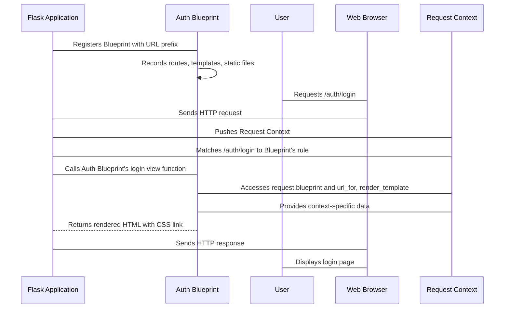

# Chapter 8: Blueprint

Imagine your restaurant from [Chapter 1: Flask](01_flask.md) has become incredibly popular. You started with a simple menu and one chef, but now you have a huge kitchen, multiple specialized chefs, and a sprawling menu with sections like "Italian Classics," "Asian Fusion," and "Desserts." If your single restaurant manager tried to oversee every single dish, every ingredient order, and every staff member directly, chaos would quickly ensue. The whole operation would grind to a halt.

Similarly, as your Flask application grows, adding dozens or hundreds of routes, templates, and static files directly to your main `app.py` file can lead to a messy, unmaintainable codebase. Finding the code for a specific feature, managing overlapping URL paths, or trying to reuse a set of related functionalities in another project would become a nightmare.

This is the problem that Flask's **Blueprint** solves. A Blueprint is like creating a specialized department within your application, complete with its own manager, menu, and internal logic. For example, you might have a "User Accounts Department" that handles everything related to user registration, login, profile management, and password resets. Or a "Blog Department" that manages post creation, display, and comments.

These departments (Blueprints) are self-contained, modular sections of your application that can define their own:
*   **Routes:** URL rules and their associated view functions.
*   **Templates:** HTML files to render using `render_template` ([Chapter 7: render_template](07_render_template.md)).
*   **Static Files:** CSS, JavaScript, images, etc.
*   **Error Handlers:** How to respond to errors specific to that department.
*   **Before/After Request Functions:** Logic that runs before or after requests handled by this department.

Once defined, these Blueprints can be registered (or "plugged in") to your main Flask application or even to other Blueprints. This keeps your code organized, maintainable, and even reusable across different Flask projects.

Let's start by creating a simple "authentication" Blueprint.

### Creating Your First Blueprint

Traditionally, you define blueprints in separate Python files. Let's create a new folder called `auth` and inside it, an `__init__.py` file (to make it a Python package) and a `views.py` file.

**File: `auth/views.py`**
```python
from flask import Blueprint, render_template, redirect, url_for

# Create a Blueprint instance
# 'auth' is the blueprint's name (used for routing, e.g., 'auth.login')
# __name__ is the import name for the blueprint
auth_bp = Blueprint('auth', __name__, template_folder='templates', static_folder='static')

@auth_bp.route('/login')
def login():
    return render_template('auth/login.html')

@auth_bp.route('/logout')
def logout():
    # In a real app, this would log the user out
    return "You have been logged out."

@auth_bp.route('/register')
def register():
    # Redirect to login page after successful registration (for example)
    return redirect(url_for('auth.login'))
```

In this `views.py` file:
*   We import `Blueprint` and other necessary Flask functions.
*   `auth_bp = Blueprint('auth', __name__, ...)` creates our Blueprint.
    *   `'auth'` is the name of our blueprint. This name is crucial because it's used to identify this blueprint when referencing its routes (e.g., `'auth.login'`) or static files.
    *   `__name__` helps Flask locate the blueprint's resources (like templates and static files) relative to this module.
    *   `template_folder='templates'` and `static_folder='static'` tell Flask to look for templates and static files inside `auth/templates` and `auth/static` respectively.
*   We define routes using `@auth_bp.route()` instead of `@app.route()`. These routes are now "owned" by the `auth_bp` blueprint.
*   Notice `url_for('auth.login')`. Because `login` is a route within the `auth` blueprint, we preface its endpoint name with the blueprint's name, separated by a dot. This ensures `url_for` ([Chapter 6: url_for](06_url_for.md)) correctly generates the URL, even if multiple blueprints have a `login` view function.

Now, let's create a template for our login page:

**File: `auth/templates/auth/login.html`**
```html
<!DOCTYPE html>
<html lang="en">
<head>
    <meta charset="UTF-8">
    <title>Login</title>
    <link rel="stylesheet" href="{{ url_for('auth.static', filename='css/style.css') }}">
</head>
<body>
    <h1>Login to Your Account</h1>
    <form action="#" method="post">
        <label for="username">Username:</label>
        <input type="text" id="username" name="username"><br><br>
        <label for="password">Password:</label>
        <input type="password" id="password" name="password"><br><br>
        <input type="submit" value="Login">
    </form>
    <p>Don't have an account? <a href="{{ url_for('auth.register') }}">Register here</a></p>
</body>
</html>
```
Here:
*   We link a static file using `url_for('auth.static', filename='css/style.css')`. This tells Flask to look for `style.css` in the `static` folder associated with the `auth` blueprint.
*   We link to another blueprint route using `url_for('auth.register')`.

Let's also add a static CSS file:

**File: `auth/static/css/style.css`**
```css
body {
    font-family: sans-serif;
    background-color: #f4f4f4;
    text-align: center;
    padding-top: 50px;
}
h1 {
    color: #333;
}
form {
    background: white;
    margin: 20px auto;
    padding: 30px;
    border-radius: 8px;
    box-shadow: 0 2px 4px rgba(0,0,0,0.1);
    width: 300px;
}
```

### Registering the Blueprint

To make our `auth` Blueprint active, we need to register it with our main Flask application.

**File: `app.py`**
```python
from flask import Flask, render_template
from auth.views import auth_bp # Import our blueprint

app = Flask(__name__)

# Register the blueprint
# All routes defined in auth_bp will now be available under the /auth prefix
app.register_blueprint(auth_bp, url_prefix='/auth')

@app.route('/')
def index():
    return render_template('index.html')

if __name__ == '__main__':
    app.run(debug=True)
```
And a simple `index.html`:

**File: `templates/index.html`**
```html
<!DOCTYPE html>
<html lang="en">
<head>
    <meta charset="UTF-8">
    <title>Main App</title>
</head>
<body>
    <h1>Welcome to the Main Application!</h1>
    <p>Go to the <a href="{{ url_for('auth.login') }}">Login Page</a></p>
</body>
</html>
```

Now, when you run `app.py` and navigate to:
*   `http://127.0.0.1:5000/`: You'll see the main app's index page.
*   `http://127.0.0.1:5000/auth/login`: You'll see the login page rendered from `auth/templates/auth/login.html`, with the stylesheet loaded from `auth/static/css/style.css`.
*   `http://127.0.0.1:5000/auth/register`: You'll be redirected to `/auth/login`.

The `url_prefix='/auth'` argument in `app.register_blueprint()` means that all routes defined in `auth_bp` will automatically be prefixed with `/auth`. So, `@auth_bp.route('/login')` effectively becomes `/auth/login`. This is immensely helpful for avoiding URL conflicts and maintaining clear separation.

### How Blueprint Registration Works

You might wonder how all these routes and configurations get transferred from the Blueprint to the main Flask `app` object. When you call `app.register_blueprint(auth_bp, ...)`, Flask internally performs a series of steps:

1.  It creates a `BlueprintSetupState` object (`src/flask/sansio/blueprints.py` shows its initialization). This object holds all the options you passed during registration (like `url_prefix`, `template_folder`, etc.) and a reference to the main `app`.
2.  The Blueprint then iterates through its list of `deferred_functions` (`src/flask/sansio/blueprints.py`). These are functions that were "recorded" when you used decorators like `@auth_bp.route()` or `@auth_bp.before_request()`.
3.  Each `deferred_function` is called with the `BlueprintSetupState` object. For a route, this function will call `state.add_url_rule()`, which in turn calls `app.add_url_rule()` on the main Flask application, effectively transferring the route.

This deferred setup is crucial. It means a Blueprint doesn't need to know anything about the `Flask` application when it's defined. It just records its intentions, and those intentions are executed once it's explicitly registered with a real application.

### Blueprints and Contexts

Like most Flask components, Blueprints work within the `AppContext` ([Chapter 5: AppContext](05_appcontext.md)). When a request comes in and is routed to a Blueprint's view function, an `AppContext` is pushed, and the `request` object ([Chapter 3: Request](03_request.md)) will contain information about the active blueprint (`request.blueprint`). This allows internal functions like `url_for` or `render_template` to correctly resolve blueprint-specific resources.

For instance, Flask's templating system (powered by Jinja2) uses a `DispatchingJinjaLoader` (`src/flask/templating.py`) that checks both the main application's template folder and any registered blueprints' template folders when `render_template` ([Chapter 7: render_template](07_render_template.md)) is called. This is how `auth/templates/auth/login.html` is found.


The Flask application acts as the central orchestrator. Once the `auth` Blueprint is registered, Flask routes incoming requests to the correct view function, which then leverages the `Request Context` to access blueprint-specific details like the `request.blueprint` name or to generate URLs and render templates using the blueprint's defined resources.

### Conclusion

Blueprints are an indispensable tool for building well-structured, scalable, and maintainable Flask applications. They allow you to:
*   **Modularize** your application into distinct, focused features.
*   **Organize** routes, templates, and static assets in a clear, hierarchical manner.
*   **Reuse** components across different projects.

By providing a clean way to compartmentalize your code, Blueprints empower you to grow your Flask application from a small script to a complex web service without getting tangled in its own logic.

This chapter on Blueprints concludes our journey through the core concepts of Flask. We started with the central `Flask` application object ([Chapter 1: Flask](01_flask.md)), learned how to configure it ([Chapter 2: Config](02_config.md)), and understood the lifecycle of an incoming `Request` ([Chapter 3: Request](03_request.md)) and an outgoing `Response` ([Chapter 4: Response](04_response.md)). We explored the magical `AppContext` that ties everything together ([Chapter 5: AppContext](05_appcontext.md)), discovered how to navigate our application with `url_for` ([Chapter 6: url_for](06_url_for.md)), and brought our web pages to life with `render_template` ([Chapter 7: render_template](07_render_template.md)). Finally, with Blueprints, you now know how to structure these components into a robust and scalable application.

These eight chapters have laid a solid foundation for your Flask development journey. From here, you can dive deeper into Flask's advanced features, explore extensions, and confidently build powerful web applications. Happy coding!