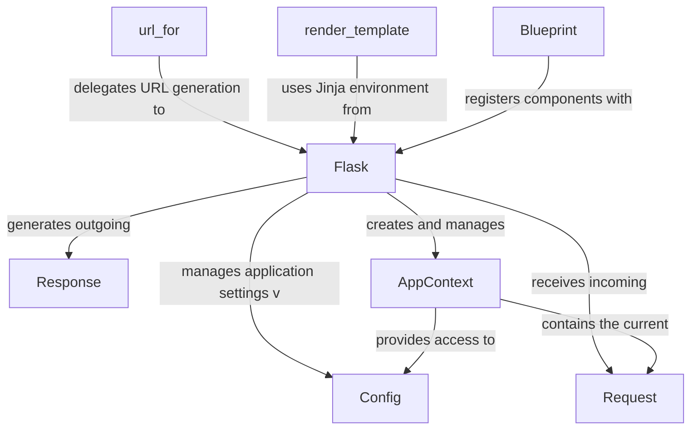

# flask

_Lens: beginner-tutorial_

Flask is a Python micro-web framework designed for building complex web applications with simplicity and extensibility. It provides the essential tools for routing, request/response handling, and templating, allowing developers to quickly create robust and scalable web services.

## Architecture

## Chapters

- [Flask](01_flask.md)
- [Config](02_config.md)
- [Request](03_request.md)
- [Response](04_response.md)
- [AppContext](05_appcontext.md)
- [url_for](06_url_for.md)
- [render_template](07_render_template.md)
- [Blueprint](08_blueprint.md)