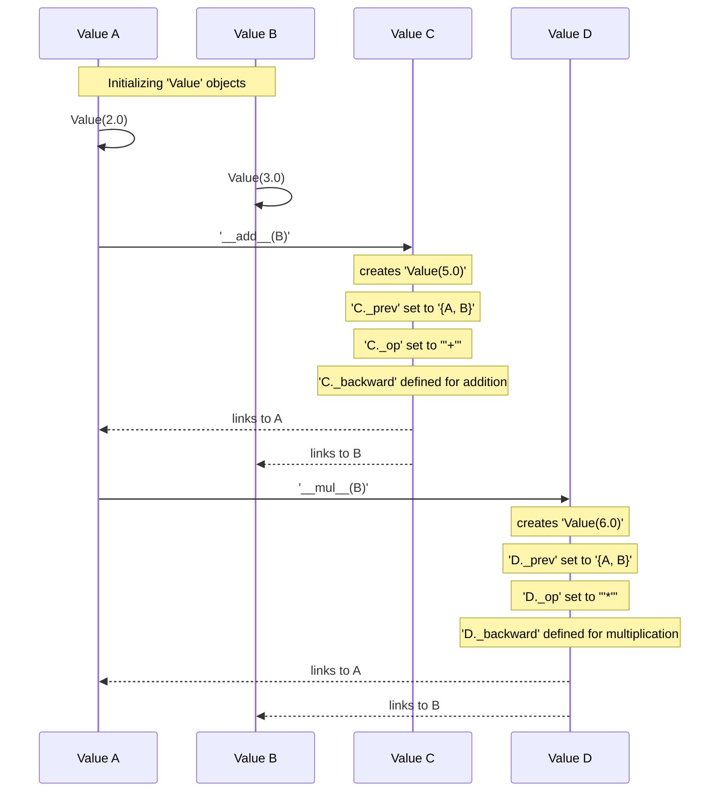

# Chapter 1: Value

## The Problem: Learning How to Learn

Neural networks are complex mathematical models. They take inputs, perform a series of calculations (additions, multiplications, and other transformations), and produce an output. For a neural network to "learn," it needs to adjust its internal parameters (called weights and biases) so that its output becomes more accurate.

But how does a neural network figure out *which* internal parameters to change, and by *how much*, to improve its performance?

Imagine you're trying to fine-tune a very intricate machine. You might gently adjust a small screw deep inside and observe how that tiny change affects the machine's overall output. If turning the screw slightly causes a dramatic shift in the output, you know that screw is highly *sensitive*. If it barely makes a difference, it's not very sensitive at all.

Neural networks face a similar challenge, but on a much larger scale. They need a systematic way to calculate this "sensitivity" (also known as a **gradient**) for every single number involved in their vast internal calculations. This is the core problem that micrograd's fundamental building block, the `Value` object, is designed to solve.

## Introducing the `Value` Object: A Number with a Memory

At its core, `micrograd` is about making scalar numbers (single numerical values) smarter. It wraps an ordinary number (like `3.14` or `-7`) inside a special `Value` object. This `Value` object doesn't just store the number itself; it also remembers how it was created and prepares itself to calculate its "sensitivity" to any final result.

Think of a `Value` object as a specialized sticky note that holds:

1.  **A number (`data`):** The actual numerical result of a calculation, like `5.0`.
2.  **A sensitivity score (`grad`):** A space to eventually write down how sensitive the final output is to *this specific number*. Initially, this score is always `0`.
3.  **A memory of its parents (`_prev`):** Pointers to the `Value` objects that were used as inputs to create *this* `Value`. This creates a "computational family tree."
4.  **The operation that created it (`_op`):** A short label (like `'+'` for addition or `'*'` for multiplication) describing the mathematical operation that combined its parents.
5.  **A tiny instruction slip (`_backward`):** A small, self-contained function that knows *how* to distribute its own sensitivity score back to its parents, following the rules of calculus.

Let's see how we create a `Value` object and inspect its initial contents:

```python
from micrograd.engine import Value

# Create a Value object
a = Value(3.0)

# Observe its contents
print(a)
print(f"Data: {a.data}")
print(f"Gradient: {a.grad}")
print(f"Parents: {a._prev}")
print(f"Operation: {a._op}")
```

When you run this code, you'll see:

```
Value(data=3.0, grad=0)
Data: 3.0
Gradient: 0
Parents: set()
Operation:
```

Initially, `a` has no parents (`_prev` is an empty set) and no specific operation (`_op` is an empty string) because it was directly created from a raw number. Its `grad` is `0`, as we haven't yet asked it to calculate any sensitivities.

## Building a Computational Family Tree

The real ingenuity of `Value` objects comes to light when you perform mathematical operations on them. When you add two `Value` objects, for example, `micrograd` doesn't just give you a new ordinary number. Instead, it gives you a *new `Value` object* that automatically remembers its "parents" and the specific operation that created it. This builds what's called a **computational graph**.

Let's trace a simple addition:

```python
from micrograd.engine import Value

a = Value(2.0)
b = Value(3.0)

c = a + b # This operation creates a new Value object, 'c'

print(c)
print(f"Data: {c.data}")
print(f"Parents: {c._prev}")
print(f"Operation: {c._op}")
```

The output will be:

```
Value(data=5.0, grad=0)
Data: 5.0
Parents: {Value(data=3.0, grad=0), Value(data=2.0, grad=0)}
Operation: +
```

Notice a few key things:
1.  `c` correctly holds the numerical sum (`5.0`) in its `data` attribute.
2.  `c._prev` now contains both `a` and `b`, establishing them as its direct computational parents.
3.  `c._op` is `'+'`, indicating that `c` was created by an addition operation.

This process is `micrograd` building a "computational graph"—a family tree that maps out the relationships and sequence of all calculations.

Let's peek at a simplified part of the `Value` class's implementation for addition, to see how this family tree is built:

```python
# From micrograd/engine.py
class Value:
    # ... (initializer and other methods)

    def __add__(self, other):
        # 1. Ensure 'other' is also a Value object.
        #    If it's a regular number, it's converted to a Value.
        other = other if isinstance(other, Value) else Value(other)

        # 2. Perform the actual numerical addition.
        # 3. Create a NEW Value object, 'out'.
        # 4. Crucially, store 'self' and 'other' as its predecessors (_prev).
        # 5. Store the operation ('+') that created it.
        out = Value(self.data + other.data, (self, other), '+')

        # 6. Define a special function, '_backward', for this specific 'out' Value.
        #    This function knows exactly how to propagate gradients for addition.
        def _backward():
            self.grad += out.grad # For addition, gradient flows directly to both inputs
            other.grad += out.grad
        out._backward = _backward # Assign this function to out's _backward method

        return out
```

The `__add__` method makes it convenient to mix `Value` objects with regular numbers (scalars). If you write `Value(2.0) + 3`, `micrograd` automatically converts `3` into `Value(3.0)` before performing the addition.

This exact pattern—creating a new `Value` object, linking it to its parents via `_prev`, setting its `_op`, and defining its specific `_backward` function—is repeated for every mathematical operation `micrograd` supports, such as multiplication (`*`), exponentiation (`**`), division (`/`), subtraction (`-`), and the Rectified Linear Unit (`relu`) non-linearity.

Let's visualize the creation of `c = a + b` and then `d = a * b` in this computational graph:



This diagram shows how `Value` objects form a Directed Acyclic Graph (DAG), where each node is a `Value`, and the arrows represent the flow of computation (and implicitly, the `_prev` links).

Let's try a slightly more complex sequence of operations, performing a "forward pass" to calculate the final numerical result:

```python
from micrograd.engine import Value

a = Value(-4.0)
b = Value(2.0)

# Operation 1: Addition
c = a + b
print(f"c: {c.data}") # Expected: -4.0 + 2.0 = -2.0

# Operation 2: Multiplication
d = a * b
print(f"d: {d.data}") # Expected: -4.0 * 2.0 = -8.0

# Operation 3: Exponentiation
e = b**3 # Expected: 2.0 * 2.0 * 2.0 = 8.0
print(f"e: {e.data}")

# Operation 4: Another Addition
f = d + e # Expected: -8.0 + 8.0 = 0.0
print(f"f: {f.data}")

# Operation 5: ReLU (Rectified Linear Unit)
g = f.relu() # Expected: max(0, 0.0) = 0.0
print(f"g: {g.data}")
```

Output:

```
c: -2.0
d: -8.0
e: 8.0
f: 0.0
g: 0.0
```

At this point, we've successfully performed a forward pass: we've calculated the numerical result of a series of operations, ending with `g`. Each new `Value` object created along the way implicitly recorded its parents, the operation that produced it, and stored its numerical `data`. However, the `grad` attribute for all these `Value` objects still remains `0`.

## What's Next?

We've seen how `Value` objects wrap ordinary numbers and, most importantly, how they automatically build a computational graph by remembering their parents and the specific operation that created them. This graph is like a detailed breadcrumb trail, a complete history of every calculation.

But the `grad` attributes are still all `0`. The real power of `micrograd` comes from using this computational graph to *calculate* those sensitivities (gradients). In the next chapter, [backward](02_backward.md), we will explore how `micrograd` traverses this graph in reverse to fill in all the `grad` values, effectively teaching our numbers "how sensitive they are" to the final output.