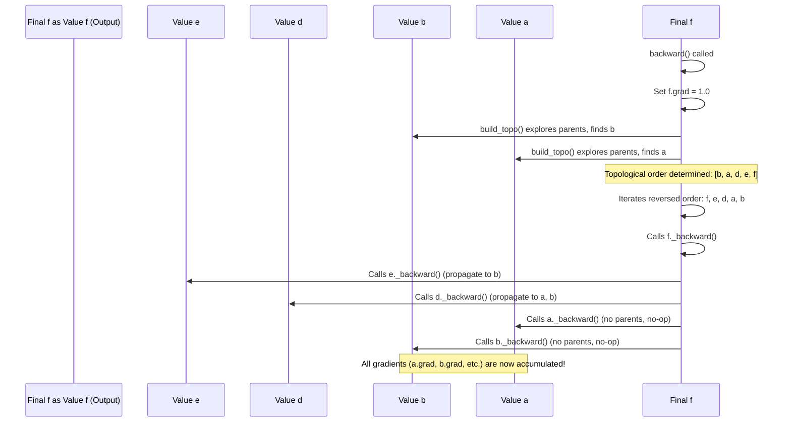

# Chapter 2: backward

In [Chapter 1: Value](01_value.md), we learned how `Value` objects store numbers (`data`) and, critically, remember their computational "family tree" by linking to their parents (`_prev`) and noting the operation (`_op`) that created them. This forms a **computational graph**, a detailed record of every calculation. We saw how a "forward pass" correctly computes the numerical `data` for a final output.

But if you remember, the `grad` attribute for all `Value` objects remained `0`. This `grad` is the "sensitivity score" we talked about, the crucial piece of information a neural network needs to learn.

## The Problem: Assigning Credit Where Credit is Due

Imagine a large company with many departments, each performing various operations (marketing, sales, production, R&D). At the end of the year, the company reports its final profit or loss. Now, the CEO wants to know: **How much did each department contribute to that final profit or loss?** Which department's performance, if slightly improved or worsened, would have the biggest impact on the bottom line?

This is a classic "credit assignment problem." In our `micrograd` world, the "company's profit" is the final `Value` object's `data`, and the "departments" are all the intermediate `Value` objects (and ultimately, the initial inputs like weights and biases). We need a systematic way to trace backward through the company's financial records to assign a "contribution score" (`grad`) to every operation and every initial resource.

## Introducing `backward()`: Tracing the Sensitivity

This is precisely what the `backward()` method on a `Value` object does. When you call `some_final_value.backward()`, you are instructing `micrograd` to start the "credit assignment" process. It will:

1.  **Initialize the final output's `grad`:** The first step is to state that the final output's sensitivity to *itself* is `1`. If you change the final output by `X`, it changes by `X`. So, `self.grad` is set to `1.0`.
2.  **Traverse the graph in reverse:** It moves backward through the computational graph, from the final output all the way to the initial inputs.
3.  **Apply the Chain Rule:** At each `Value` object, it uses a small, stored function (`_backward`) to calculate and accumulate the gradient for its parents, based on its own already-calculated gradient. This is the heart of the **chain rule** from calculus.

Let's look at a simple example to illustrate the chain rule:

If `c = a + b`, then `dc/da = 1` and `dc/db = 1`.
If `d = c * e`, then `dd/dc = e` and `dd/de = c`.

Now, if we want `dd/da`, we use the chain rule: `dd/da = (dd/dc) * (dc/da)`.
This means: `dd/da = e * 1`.

The `_backward` functions inside each `Value` object know these small, local derivatives. When `backward()` is called, it triggers these `_backward` functions in the correct order, passing the accumulated `grad` backward.

## The Blueprint for Backpropagation: `_backward` Functions

Recall from [Chapter 1: Value](01_value.md) that every time a new `Value` object `out` is created from an operation, a special `_backward` function is attached to it. This function holds the specific rules for how gradients should be propagated *backward* for that particular operation.

Let's revisit the `__add__` and `__mul__` methods from `micrograd/engine.py` to see their `_backward` implementations:

```python
# From micrograd/engine.py (simplified)
class Value:
    # ... initializer and other methods ...

    def __add__(self, other):
        other = other if isinstance(other, Value) else Value(other)
        out = Value(self.data + other.data, (self, other), '+')

        def _backward():
            # For addition, the gradient from 'out' flows directly to both inputs.
            # E.g., if out = self + other, then dout/dself = 1 and dout/dother = 1.
            # So, dL/dself = dL/dout * dout/dself = dL/dout * 1
            # And, dL/dother = dL/dout * dout/dother = dL/dout * 1
            self.grad += out.grad
            other.grad += out.grad
        out._backward = _backward
        return out

    def __mul__(self, other):
        other = other if isinstance(other, Value) else Value(other)
        out = Value(self.data * other.data, (self, other), '*')

        def _backward():
            # For multiplication, the gradient is scaled by the *other* input's data.
            # E.g., if out = self * other, then dout/dself = other.data and dout/dother = self.data.
            # So, dL/dself = dL/dout * dout/dself = dL/dout * other.data
            # And, dL/dother = dL/dout * dout/dother = dL/dout * self.data
            self.grad += other.data * out.grad
            other.grad += self.data * out.grad
        out._backward = _backward
        return out
```

Notice how these `_backward` functions take `out.grad` (the gradient *from* the subsequent nodes in the graph) and distribute it to `self.grad` and `other.grad` (the gradients *for* the preceding nodes). This is the local application of the chain rule.

## The `backward()` Method: Orchestrating the Credit Assignment

The `backward()` method on the final `Value` object acts as the conductor for this gradient propagation symphony. It needs to ensure that gradients are calculated in the correct order.

Consider the simple graph `f = d + e` from [Chapter 1: Value](01_value.md). For `f` to correctly update the gradients of `d` and `e`, `f.grad` must already be known. Similarly, for `d` to update `a` and `b`, `d.grad` must be known. This implies a reverse traversal.

To handle complex graphs with branching paths and shared inputs (like `a` contributing to both `c` and `d` in the example from `README.md`), `micrograd` uses a standard algorithm called **topological sort**.

### Topological Sort: The Right Order

A topological sort orders the nodes in a directed acyclic graph (DAG) such that for every directed edge from node A to node B, A comes before B in the ordering. For backpropagation, we need the *reverse* of this order: we need to process `Value` objects from the output back to the inputs.

Here's how `micrograd` achieves this using a helper function `build_topo`:

```python
# From micrograd/engine.py
class Value:
    # ... (other methods) ...

    def backward(self):

        # 1. Build a topological order of the graph nodes
        topo = []
        visited = set()
        def build_topo(v):
            if v not in visited:
                visited.add(v)
                for child in v._prev: # Recursively visit parents
                    build_topo(child)
                topo.append(v) # Add current node to topo list *after* its children
        build_topo(self) # Start building from the current (final) Value

        # 2. Initialize the gradient of the output node
        self.grad = 1.0 # The gradient of the output with respect to itself is 1

        # 3. Iterate through the graph in reverse topological order
        #    and call each node's _backward() function
        for v in reversed(topo):
            v._backward()
```

Let's visualize the flow when `backward()` is called on a final `Value` object, `f`. Imagine a small graph where `f = d + e`, and `d` depends on `a` and `b`, while `e` depends only on `b`.



1.  `build_topo(self)` recursively explores the graph, adding `Value` objects to the `topo` list only after all their children (nodes that depend on them) have been processed. This results in `topo` containing nodes from inputs to output (e.g., `[b, a, d, e, f]`).
2.  `self.grad` (the gradient of the final output with respect to itself) is initialized to `1.0`.
3.  The loop then iterates `for v in reversed(topo):`. This ensures that we process nodes from output back to input (e.g., `f`, then `e`, then `d`, then `a`, then `b`).
4.  For each `v`, `v._backward()` is called. This triggers the specific gradient propagation logic for that operation, accumulating `grad` values for its parents. Since we're moving in reverse topological order, by the time `v._backward()` is called, `v.grad` (the credit assigned to `v`) is already fully accumulated from all subsequent operations.

## Putting It All Together

Let's use the example from `micrograd`'s `README.md` to see the `backward()` method in action:

```python
from micrograd.engine import Value

a = Value(-4.0)
b = Value(2.0)

# Build a more complex computational graph (forward pass)
c = a + b
d = a * b + b**3
c += c + 1
c += 1 + c + (-a)
d += d * 2 + (b + a).relu()
d += 3 * d + (b - a).relu()
e = c - d
f = e**2
g = f / 2.0
g += 10.0 / f

print(f'{g.data:.4f}') # The final numerical result

# Now, call backward() on the final output 'g'
g.backward()

# Inspect the gradients for the initial inputs 'a' and 'b'
print(f'dg/da: {a.grad:.4f}') # This is a.grad
print(f'dg/db: {b.grad:.4f}') # This is b.grad
```

Output:

```
24.7041
dg/da: 138.8338
dg/db: 645.5773
```

When `g.backward()` is called:

1.  `g.grad` is set to `1.0`.
2.  A topological sort of the entire graph (from `g` all the way back to `a` and `b`) is performed.
3.  `micrograd` then iterates through the nodes in reverse topological order.
4.  For each node, its specific `_backward()` function is executed. This function, using the chain rule, calculates how much that node's parents should "take credit" for its current gradient, adding it to the parents' `grad` attributes.
5.  By the time the loop finishes, all `Value` objects in the graph, including our initial inputs `a` and `b`, have their `grad` attributes correctly populated, telling us their sensitivity to the final output `g`.

This is the power of `micrograd`: it automates the complex calculus of backpropagation, turning the "credit assignment problem" into a straightforward function call.

## What's Next?

We've now mastered how `Value` objects manage numerical data and, more importantly, how the `backward()` method efficiently calculates gradients across an entire computational graph. This mechanism for calculating sensitivities is the bedrock of training neural networks.

However, building a neural network involves more than just individual numbers. It requires organizing these `Value` objects into reusable structures like neurons and layers. In the next chapter, [Module](03_module.md), we'll see how `micrograd` provides a foundational class for building such structured components, making it easier to construct complex neural networks.