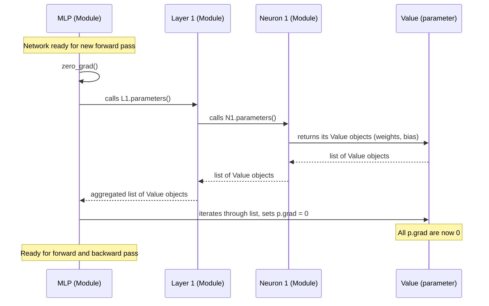

# Chapter 3: Module

In [Chapter 1: Value](01_value.md), we learned how `Value` objects wrap numbers and build a computational graph, automatically remembering all calculations. In [Chapter 2: backward](02_backward.md), we mastered how to traverse this graph in reverse using `backward()` to calculate the "sensitivity scores" (gradients) for every `Value` object involved. This automated backpropagation is the core engine for learning.

## The Problem: Managing a Neural Network's Internal Parts

Imagine you're building a sophisticated machine, like a car. You wouldn't just have a pile of nuts, bolts, and wires (our `Value` objects) lying around. Instead, you'd organize them into larger, functional units: an engine, a transmission, a wheel assembly. Each unit has its own specific job and contains many smaller parts.

Neural networks are similar. They aren't just a single mathematical expression, but a collection of interconnected "neurons" and "layers." Each of these components, in turn, contains many `Value` objects representing learnable parameters (weights and biases).

Consider the task of training such a network. During each training step, we calculate gradients with `backward()`. But before we can calculate *new* gradients for the *next* training step, we need to "clean the slate." All the `grad` attributes on every single weight and bias `Value` object from the *previous* step must be reset to `0`. If we don't, the gradients will accumulate incorrectly, leading to faulty updates.

How do we efficiently find and reset the `grad` for potentially thousands or millions of `Value` objects spread across a complex network structure? And how do we access all these learnable `Value` objects when it's time to update them? Manually tracking them would be a nightmare!

## Introducing `Module`: The Blueprint for Organized Components

This is where the `Module` class comes in. It's a foundational blueprint provided by `micrograd` for any part of a neural network that contains learnable parameters. Think of `Module` as a standard contract or interface. It doesn't do much on its own, but it ensures that any component built *from* it (like a `Neuron` or a `Layer`) will adhere to a consistent way of managing its internal `Value` objects.

A `Module` is like a blueprint for a LEGO set piece that ensures all "buildable" components have a standard way to:

1.  **"Clean up" their internal parts:** Reset the `grad` attribute of all their learnable `Value` objects to `0`.
2.  **"List all their buildable parts":** Provide a list of all their learnable `Value` objects (weights and biases) so they can be inspected or updated.

Let's look at `micrograd`'s `Module` class:

```python
# From micrograd/nn.py
class Module:

    def zero_grad(self):
        for p in self.parameters():
            p.grad = 0

    def parameters(self):
        return []
```

Notice a few key things:

*   It's a very small class! It defines two methods: `zero_grad()` and `parameters()`.
*   The `parameters()` method, in the base `Module` class, simply returns an empty list. This is because the base `Module` itself doesn't hold any parameters directly. It's meant to be subclassed.
*   The `zero_grad()` method iterates through the list returned by `self.parameters()` and sets each `Value` object's `grad` attribute to `0`.

This means any class that inherits from `Module` *must* implement its own `parameters()` method to correctly return all the `Value` objects it contains that are meant to be learned. `Module` then provides the `zero_grad()` functionality automatically based on that.

## `zero_grad()`: The Gradient Reset Button

The `zero_grad()` method is crucial for the training loop of a neural network. After each `backward()` call, gradients are calculated and stored in the `grad` attribute of `Value` objects. Before the next iteration of training (where we'll calculate new gradients from a new batch of data), we must reset these gradients to `0`.

Why `0`? Because gradients from different backward passes for different data points or steps should not accumulate. Each `backward()` call calculates the gradient for a specific loss, and those gradients are then used to update the parameters. If you don't reset, you're effectively adding gradients from the previous step, which would corrupt the learning process.

For example, if you have a neural network named `model`, you can simply call:

```python
# Assuming 'model' is an instance of a class that inherits from Module
model.zero_grad()
```

And `micrograd` will ensure that every single learnable `Value` object within that `model` has its `grad` attribute set to `0`, ready for a fresh gradient calculation. This saves you from tedious manual resets like `model.layer1.neuron1.w[0].grad = 0`.

## `parameters()`: The Inventory List

The `parameters()` method acts as a standard interface to retrieve all learnable `Value` objects within a module. For the base `Module` class, it returns an empty list, as it's just a template. However, any *subclass* of `Module` (like `Neuron`, `Layer`, or `MLP`) will override this method to return a list of all its weights and biases, which are indeed `Value` objects.

For example, if a `Neuron` contains weights `w` and a bias `b` (all `Value` objects), its `parameters()` method would return `self.w + [self.b]`. This allows higher-level modules (like a `Layer` containing multiple `Neuron`s) to also implement `parameters()` by collecting the parameters from *its* constituent `Neuron`s. This forms a recursive structure that allows `zero_grad()` to work across the entire network.

## How `Module` Enables Network Management

The `Module` class is a powerful abstraction because it makes it incredibly easy to manage the state of an entire neural network, no matter how complex it becomes.

Consider a full Multi-Layer Perceptron (MLP) network, which is composed of multiple `Layer`s, and each `Layer` is composed of multiple `Neuron`s. By having `Neuron`, `Layer`, and `MLP` all inherit from `Module` and correctly implement `parameters()`, a single call to `mlp_model.zero_grad()` effectively drills down through the entire network, resetting all gradients.



This diagram illustrates how `zero_grad()` on the top-level `MLP` module works. It recursively gathers all the `Value` objects that represent learnable parameters from its layers and neurons, and then resets their gradients. This ensures consistency and correctness across the entire network.

## What's Next?

We've established `Module` as the crucial organizational blueprint for neural network components, providing standard ways to manage learnable `Value` objects. Now that we have this framework, we can start building the fundamental units of a neural network.

In the next chapter, [Neuron](04_neuron.md), we will put `Value` and `Module` into practice by constructing the most basic processing unit of a neural network: a single neuron, which calculates a weighted sum of its inputs and applies an activation function.