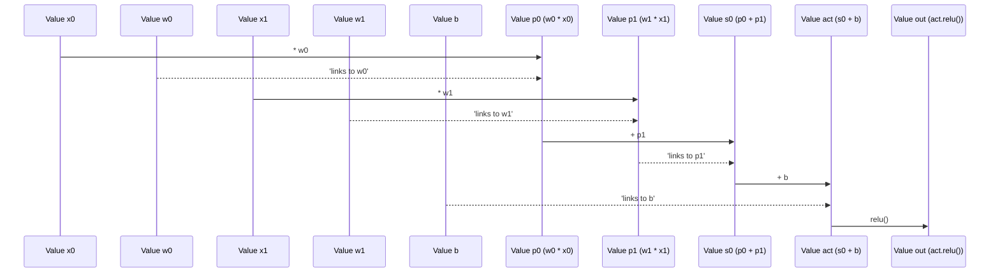

# Chapter 4: Neuron

## The Problem: Making a Basic Decision from Multiple Signals

Imagine you're trying to decide whether to grab your umbrella. You don't just look at one thing; you consider several pieces of information: "Is it cloudy?" (yes/no), "Is the forecast sunny?" (yes/no), "Did I hear thunder?" (yes/no). Each piece of information has a different level of importance to your decision. Hearing thunder might be very important, while a distant cloud might be less so.

How can we build a computational unit that mimics this kind of decision-making process? It needs to take multiple inputs, assign different levels of importance (or "weight") to each, combine them, and then make a simple "yes" or "no" (or "strong yes" / "weak yes") output. This is the fundamental task of a **neuron** in a neural network.

## Introducing the `Neuron`: A Simple Decision-Maker

In `micrograd`, a `Neuron` is the smallest processing unit that can take multiple inputs and produce a single output. It's built upon the `Value` objects we explored in [Chapter 1: Value](01_value.md) and adheres to the management principles of the `Module` class from [Chapter 3: Module](03_module.md).

Think of a `Neuron` as a tiny, specialized calculator. It performs three key steps:

1.  **Weighted Sum:** It takes multiple numerical inputs. Each input is multiplied by its own "secret number" (called a **weight**), reflecting its importance.
2.  **Bias Adjustment:** All these weighted inputs are then added together, and one final "secret number" (called a **bias**) is added to the sum. This bias essentially sets a baseline or threshold for the neuron's activation.
3.  **Activation:** The final sum is then passed through an **activation function**. This function decides whether the neuron "fires" or not, or what strength its output should be. A common choice is ReLU, which outputs the sum if it's positive, and zero otherwise.

These "secret numbers" (weights and biases) are the learnable parameters of the neuron. During training, `micrograd` will adjust these `Value` objects to make the neuron's output more accurate.

## Building a `Neuron`: Weights, Bias, and Non-linearity

Let's look at the `Neuron` class in `micrograd`, specifically its initialization and how it processes inputs.

```python
# From micrograd/nn.py
import random
from micrograd.engine import Value
from micrograd.nn import Module # We inherit from Module!

class Neuron(Module): # Neuron is a Module

    def __init__(self, nin, nonlin=True):
        # 1. Initialize weights: one for each input
        self.w = [Value(random.uniform(-1,1)) for _ in range(nin)]
        # 2. Initialize bias: a single Value
        self.b = Value(0)
        # 3. Store whether to use a non-linear activation (like ReLU)
        self.nonlin = nonlin
```

### `__init__`: Setting Up the Neuron's Brain

When you create a `Neuron` (e.g., `Neuron(2)` for two inputs), the `__init__` method does the following:

1.  **`self.w` (Weights):** It creates a list of `nin` (number of inputs) `Value` objects. Each `Value` is initialized with a small random number between -1 and 1. These are the "importance scores" for each input, and they are learnable.
2.  **`self.b` (Bias):** It creates a single `Value` object, initialized to `0`. This is the "baseline adjustment," also learnable.
3.  **`self.nonlin` (Non-linearity Flag):** A boolean flag, `True` by default, indicating whether the neuron should apply a non-linear activation function (like ReLU) at the end of its calculation.

All `self.w` and `self.b` are `Value` objects, which means `micrograd` will automatically track their operations and calculate their gradients when `backward()` is called.

### `__call__`: The Neuron's Calculation

The `__call__` method defines what happens when you "run" the neuron, passing it a list of inputs `x`.

```python
# From micrograd/nn.py (inside Neuron class)

    def __call__(self, x):
        # Calculate the weighted sum + bias
        # For each weight wi and input xi, multiply them: wi*xi
        # Then sum all these products and add the bias b
        act = sum((wi*xi for wi,xi in zip(self.w, x)), self.b)

        # Optionally apply the non-linear activation function (ReLU)
        return act.relu() if self.nonlin else act
```

Let's break down this crucial part:

1.  **`zip(self.w, x)`:** This pairs each weight (`wi`) with its corresponding input (`xi`). For example, if `self.w = [w0, w1]` and `x = [x0, x1]`, this creates pairs `(w0, x0)` and `(w1, x1)`.
2.  **`wi*xi for wi,xi in ...`:** For each pair, the weight `wi` is multiplied by the input `xi`. Since `wi` and `xi` are both `Value` objects (or `xi` is converted to `Value` by `micrograd`'s `__mul__` method if it's a regular number), these multiplications create new `Value` objects that automatically become part of the computational graph.
3.  **`sum(..., self.b)`:** All these products (`wi*xi`) are summed together, and finally, the bias `self.b` is added. The `sum` function here works directly with `Value` objects, chaining additions and building the graph. The result, `act`, is a new `Value` object representing the total weighted sum.
4.  **`act.relu() if self.nonlin else act`:** If `self.nonlin` is `True` (which it is by default), the `relu()` method is called on the `act` `Value` object. As seen in [Chapter 1: Value](01_value.md), `relu()` creates a new `Value` object that holds `max(0, act.data)`. This introduces non-linearity, which is crucial for neural networks to learn complex patterns. If `nonlin` is `False`, the neuron acts as a simple linear unit, just outputting the `act` value directly.

### `parameters()`: Exposing Learnable Values

The `Neuron` class, by inheriting from `Module`, must provide a way to list its learnable parameters. This is done through the `parameters()` method:

```python
# From micrograd/nn.py (inside Neuron class)

    def parameters(self):
        # Returns all weights and the bias as a single list of Value objects
        return self.w + [self.b]
```

This method simply concatenates the list of weights `self.w` with a list containing the single bias `self.b`. Now, if we have a `Neuron` instance called `n`, we can easily get all its learnable `Value` objects by calling `n.parameters()`. This allows a higher-level `Module` (like a `Layer`) to efficiently collect and manage the parameters of all its constituent neurons, as we saw in [Chapter 3: Module](03_module.md).

### `__repr__`: For Debugging

The `__repr__` method provides a helpful string representation of the neuron, making it easier to inspect in an interactive session.

```python
# From micrograd/nn.py (inside Neuron class)

    def __repr__(self):
        return f"{'ReLU' if self.nonlin else 'Linear'}Neuron({len(self.w)})"
```

## Neuron in Action: A Simple Example

Let's create a `Neuron` and see it process some inputs:

```python
from micrograd.engine import Value
from micrograd.nn import Neuron

# Create a neuron that expects 3 inputs
n = Neuron(3)

print(n) # Check its representation
print(f"Initial weights: {[w.data for w in n.w]}")
print(f"Initial bias: {n.b.data}")

# Provide 3 input values
inputs = [Value(1.0), Value(2.0), Value(-3.0)]

# Perform the forward pass
output = n(inputs)

print(f"\nNeuron output: {output.data:.4f}")

# The output is a Value object, so we can call backward() on it
output.backward()

# Now, inspect the gradients of the neuron's parameters
print(f"\nGradients after backward pass:")
for i, w in enumerate(n.w):
    print(f"Weight {i} grad: {w.grad:.4f}")
print(f"Bias grad: {n.b.grad:.4f}")

# And remember to zero the gradients before the next step
n.zero_grad()
print(f"\nGradients after zero_grad:")
for i, w in enumerate(n.w):
    print(f"Weight {i} grad: {w.grad:.4f}")
print(f"Bias grad: {n.b.grad:.4f}")
```

Example Output (weights will vary due to random initialization):

```
ReLUNeuron(3)
Initial weights: [-0.6025062061099605, 0.4491741160350702, 0.812368936082531]
Initial bias: 0

Neuron output: 0.0000

Gradients after backward pass:
Weight 0 grad: 0.0000
Weight 1 grad: 0.0000
Weight 2 grad: 0.0000
Bias grad: 0.0000

Gradients after zero_grad:
Weight 0 grad: 0.0000
Weight 1 grad: 0.0000
Weight 2 grad: 0.0000
Bias grad: 0.0000
```

Wait, why are all gradients zero? In this particular run, the `output.data` was `0.0`. This likely means the weighted sum `act` was negative, and `relu()` clamped it to `0`. When ReLU outputs `0`, its derivative (and thus the gradient flow) is `0`. Let's try to ensure a positive output for a better gradient example.

```python
from micrograd.engine import Value
from micrograd.nn import Neuron

n = Neuron(2, nonlin=False) # Create a linear neuron for simplicity
n.w = [Value(0.5), Value(1.0)] # Manually set weights
n.b = Value(0.1) # Manually set bias

inputs = [Value(2.0), Value(3.0)]

output = n(inputs) # (0.5 * 2.0) + (1.0 * 3.0) + 0.1 = 1.0 + 3.0 + 0.1 = 4.1

print(f"Neuron output: {output.data:.4f}")

output.backward()

print(f"\nGradients after backward pass:")
for i, w in enumerate(n.w):
    print(f"Weight {i} grad: {w.grad:.4f}")
print(f"Bias grad: {n.b.grad:.4f}")

# And remember to zero the gradients before the next step
n.zero_grad()
print(f"\nGradients after zero_grad:")
for i, w in enumerate(n.w):
    print(f"Weight {i} grad: {w.grad:.4f}")
print(f"Bias grad: {n.b.grad:.4f}")
```

Output with manual weights/bias and `nonlin=False`:

```
Neuron output: 4.1000

Gradients after backward pass:
Weight 0 grad: 2.0000
Weight 1 grad: 3.0000
Bias grad: 1.0000

Gradients after zero_grad:
Weight 0 grad: 0.0000
Weight 1 grad: 0.0000
Bias grad: 0.0000
```

Now we see meaningful gradients! For a linear neuron `output = w0*x0 + w1*x1 + b`:
*   `d(output)/dw0 = x0` (which is `2.0`)
*   `d(output)/dw1 = x1` (which is `3.0`)
*   `d(output)/db = 1`

Since we called `output.backward()`, `output.grad` was initialized to `1.0`. `micrograd` then used the chain rule (as described in [Chapter 2: backward](02_backward.md)) to correctly propagate this `1.0` backward to `w0`, `w1`, and `b`, resulting in their respective `grad` values being `2.0`, `3.0`, and `1.0`. Finally, `n.zero_grad()` reset them all to `0`.

## The Neuron's Computational Graph

Let's visualize a simple `Neuron` with two inputs, `x0` and `x1`, its weights `w0`, `w1`, and bias `b`.



This diagram illustrates how the `__call__` method builds a small but complete computational graph for each neuron's calculation. Every intermediate step (like `p0`, `p1`, `s0`, `act`, `out`) is a `Value` object, automatically tracking its parent `Value` objects and the operation that created it. This is how `micrograd` is able to backpropagate gradients through the entire neuron.

## What's Next?

We've now successfully built and understood the fundamental processing unit: the `Neuron`. It combines inputs, applies weights and biases, and uses an activation function to produce an output, all while building a computational graph for gradient calculation.

However, a single neuron is typically not powerful enough for complex tasks. Neural networks are made of many neurons working together in organized structures. In the next chapter, [Layer](05_layer.md), we will learn how to combine multiple `Neuron` objects to form a `Layer`, enabling parallel processing and adding more complexity to our neural network.