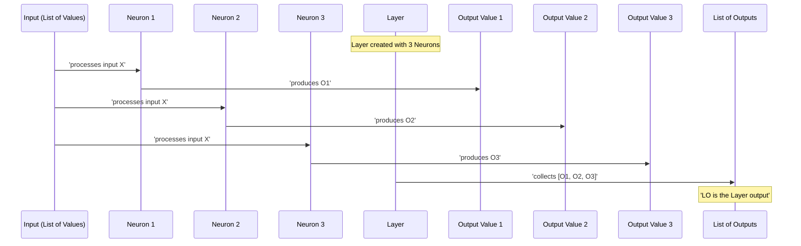

# Chapter 5: Layer

## The Problem: Making Multiple Parallel Decisions

Imagine you're trying to make a complex decision, like identifying an object in an image. You don't just ask one question; your brain simultaneously processes many features. One part might look for edges, another for corners, another for specific textures, all at the same time from the same raw visual input. How can we build a computational unit that mimics this kind of parallel, multifaceted observation? We need a way to group multiple independent "decision-makers," each looking at the same input but focusing on different aspects.

## Introducing the `Layer`: A Row of Parallel Calculators

In `micrograd`, a `Layer` is a collection of `Neuron`s arranged side-by-side. It takes a single input (or a list of inputs) and feeds it to all its `Neuron`s, producing a list of outputs, one from each `Neuron`.

Think of a `Layer` as a whole row of those simple calculators (neurons) we explored in [Chapter 4: Neuron](04_neuron.md), all lined up. Each calculator in the row receives the *exact same set of inputs* (e.g., the same numbers you type in). However, each calculator has its own unique "secret numbers" (its own weights and biases), so it performs its own unique calculation and produces its own unique output. When you're done, you get a list of outputs, one from each calculator in the row.

Like the `Neuron` before it, the `Layer` also inherits from `Module` ([Chapter 3: Module](03_module.md)), giving it the power to manage its internal parameters efficiently.

Let's look at the `Layer` class definition:

```python
# From micrograd/nn.py
import random
from micrograd.engine import Value
from micrograd.nn import Module, Neuron # Import Neuron now!

class Layer(Module):

    def __init__(self, nin, nout, **kwargs):
        # Create a list of 'nout' neurons, each expecting 'nin' inputs
        self.neurons = [Neuron(nin, **kwargs) for _ in range(nout)]
```

### `__init__`: Assembling the Row of Neurons

When you create a `Layer` (e.g., `Layer(3, 4)` for a layer with 3 inputs and 4 neurons), the `__init__` method does the following:

1.  **`nin` (Number of Inputs):** This argument specifies the number of inputs *each* neuron in this layer will receive.
2.  **`nout` (Number of Outputs/Neurons):** This argument determines how many `Neuron`s are in this layer. Each neuron produces one output, so `nout` also represents the total number of outputs from the layer.
3.  **`self.neurons`:** It creates a list of `nout` `Neuron` objects. Each of these neurons is initialized to expect `nin` inputs. The `**kwargs` allows you to pass additional arguments, like `nonlin=False`, to all neurons in the layer if you want them to be linear, for example.

Because each `Neuron` is itself a `Module`, the `Layer` becomes a `Module` that *contains* other `Module`s. This forms a powerful hierarchical structure, allowing for easy management of parameters and gradients.

### `__call__`: Processing Inputs in Parallel

The `__call__` method defines how the `Layer` processes its inputs and produces its outputs.

```python
# From micrograd/nn.py (inside Layer class)

    def __call__(self, x):
        # Feed the same input 'x' to each neuron in the layer
        out = [n(x) for n in self.neurons]
        # If there's only one neuron, return its output directly.
        # Otherwise, return the list of outputs from all neurons.
        return out[0] if len(out) == 1 else out
```

Here's what's happening:

1.  **`[n(x) for n in self.neurons]`:** This is the core of the parallel processing. The same input `x` (which is typically a list of `Value` objects, as required by a `Neuron`'s `__call__` method) is passed to *every single neuron* `n` in `self.neurons`. Each `n(x)` call performs the neuron's weighted sum and activation ([Chapter 4: Neuron](04_neuron.md)), producing a single `Value` object as its output.
2.  **`out`:** This list `out` will contain `nout` `Value` objects, one for each neuron's output.
3.  **`return out[0] if len(out) == 1 else out`:** This is a small convenience feature. If your layer only has one neuron (`nout=1`), `micrograd` will simply return that single `Value` object. If it has multiple neurons, it returns the full list of `Value` objects. This makes the output type consistent whether your layer produces one result or many.

### `parameters()`: Collecting All Learnable Values

Just like `Neuron`, the `Layer` must implement its `parameters()` method because it inherits from `Module` ([Chapter 3: Module](03_module.md)). This method ensures that all the learnable `Value` objects (weights and biases) within *all* its constituent neurons are accessible.

```python
# From micrograd/nn.py (inside Layer class)

    def parameters(self):
        # Collects all parameters from all neurons in this layer
        # It's a nested loop: for each neuron 'n', get its parameters,
        # then flatten that into a single list.
        return [p for n in self.neurons for p in n.parameters()]
```

This method uses a list comprehension to elegantly gather all parameters:
1.  `for n in self.neurons`: It iterates through each `Neuron` instance in the layer.
2.  `for p in n.parameters()`: For each neuron `n`, it calls `n.parameters()` (which, as we saw in [Chapter 4: Neuron](04_neuron.md), returns that neuron's weights and bias `Value` objects).
3.  `[p ...]`: All these individual `Value` objects `p` are collected into a single, flat list.

This flattened list allows the `zero_grad()` method from the base `Module` class to efficiently reset the gradients of every single weight and bias across the entire layer with one call, e.g., `my_layer.zero_grad()`.

### `__repr__`: Informative Representation

The `__repr__` method provides a helpful string representation of the `Layer`, making it easier to inspect in an interactive session.

```python
# From micrograd/nn.py (inside Layer class)

    def __repr__(self):
        return f"Layer of [{', '.join(str(n) for n in self.neurons)}]"
```

This will print something like "Layer of [ReLUNeuron(3), ReLUNeuron(3)]" if you have a layer with two 3-input neurons.

## Layer in Action: Processing a Shared Input

Let's create a `Layer` and observe how it processes inputs and manages its parameters.

```python
from micrograd.engine import Value
from micrograd.nn import Layer

# Create a layer with 2 inputs and 3 neurons
# Each neuron will take 2 inputs and produce one output.
# The layer will produce a list of 3 outputs.
l = Layer(nin=2, nout=3)

print(l) # See the layer's structure
print(f"Total parameters in layer: {len(l.parameters())}")

# Let's inspect the initial weights and biases of the first neuron
print(f"First neuron's weights: {[w.data for w in l.neurons[0].w]}")
print(f"First neuron's bias: {l.neurons[0].b.data}")

# Provide 2 input values (a single data point)
inputs = [Value(0.5), Value(-1.2)]

# Perform the forward pass through the layer
# Each neuron in the layer will receive [Value(0.5), Value(-1.2)]
layer_outputs = l(inputs)

print(f"\nLayer outputs (data values): {[o.data for o in layer_outputs]}")

# Since outputs are Value objects, we can sum them and call backward on the sum
total_output = sum(layer_outputs) # Create a single Value from the list of outputs
total_output.backward()

print(f"\nGradients after backward pass:")
# Inspect gradients for the first neuron's parameters
for i, w in enumerate(l.neurons[0].w):
    print(f"First neuron's weight {i} grad: {w.grad:.4f}")
print(f"First neuron's bias grad: {l.neurons[0].b.grad:.4f}")

# Reset all gradients in the layer
l.zero_grad()
print(f"\nGradients after zero_grad (first neuron):")
for i, w in enumerate(l.neurons[0].w):
    print(f"First neuron's weight {i} grad: {w.grad:.4f}")
print(f"First neuron's bias grad: {l.neurons[0].b.grad:.4f}")
```

Example Output (weights will vary due to random initialization and ReLU activation):

```
Layer of [ReLUNeuron(2), ReLUNeuron(2), ReLUNeuron(2)]
Total parameters in layer: 9
First neuron's weights: [0.3807661026021644, -0.2762145524671408]
First neuron's bias: 0

Layer outputs (data values): [0.5280, 0.0000, 0.0000]

Gradients after backward pass:
First neuron's weight 0 grad: 0.5000
First neuron's weight 1 grad: -1.2000
Bias grad: 1.0000

Gradients after zero_grad (first neuron):
First neuron's weight 0 grad: 0.0000
First neuron's weight 1 grad: 0.0000
Bias grad: 0.0000
```

In this output:
1.  We created a `Layer` and observed its internal structure using `print(l)`. Notice that `l.parameters()` correctly reports 9 parameters (3 neurons \* (2 weights + 1 bias)).
2.  The `layer_outputs` show that some neurons might have activated (producing a positive number), while others might have been "dead" (producing `0.0` due to ReLU clamping a negative sum).
3.  By summing the outputs (to get a single `Value` to call `backward()` on) and then calling `backward()`, gradients were correctly propagated all the way back to the individual weights and biases of each neuron within the layer. This demonstrates how `micrograd` handles a fan-out of computation. The example output shows the gradients for the first neuron's parameters.
4.  Finally, `l.zero_grad()` reset all 9 gradients to `0`, preparing the layer for the next training step.

## The Layer's Computational Graph (Conceptual)

While a full computational graph of a layer with multiple neurons and inputs would be visually complex, we can conceptually visualize how a `Layer` acts as a parallel processor for a single input `x`.



This diagram illustrates how a single input `X` is fanned out to all neurons in the layer. Each neuron independently computes its output, and the `Layer` then collects these into a list. The actual computational graph beneath this (containing all the `Value` objects and their `_prev` links) is built dynamically by `micrograd` as each neuron's `__call__` method executes.

## What's Next?

We've successfully built the `Layer`, an essential component for parallel processing in neural networks. It neatly organizes multiple `Neuron`s, manages their parameters, and processes shared inputs efficiently. This structure allows our network to learn different features from the same input data simultaneously.

However, complex neural networks aren't just one layer; they are often many layers stacked together, forming a deep structure. In the final chapter, [MLP](06_mlp.md), we will combine multiple `Layer`s to construct a full Multi-Layer Perceptron, capable of tackling more intricate tasks like classification.