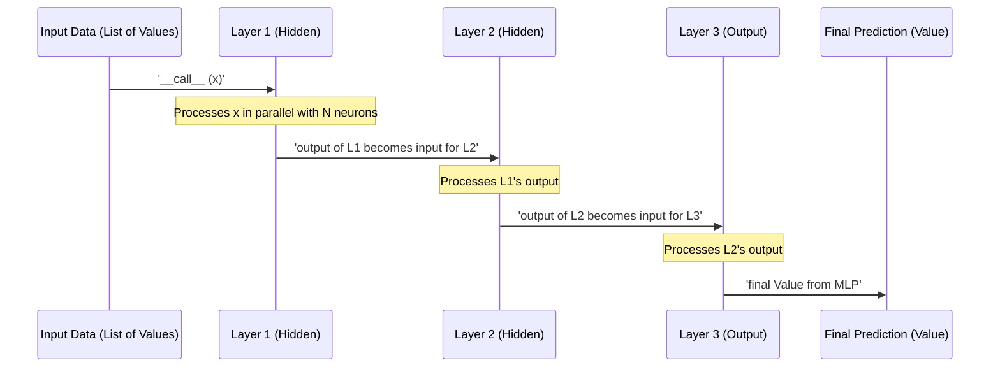

# Chapter 6: MLP

## The Problem: Building Deep, Complex Decision Pipelines

In [Chapter 5: Layer](05_layer.md), we learned how to arrange multiple neurons side-by-side to create a `Layer`, allowing us to process inputs in parallel and extract multiple features simultaneously. This is like having a single processing station on an assembly line that performs several different checks on a product at once.

But what if the decisions we need to make are more complex? What if the "features" identified by one layer need to be combined and re-evaluated by another layer to discover even more abstract or subtle patterns? For instance, to recognize a face, you first identify edges (Layer 1), then combine edges to form shapes like eyes and nose (Layer 2), and finally combine those shapes to identify a whole face (Layer 3). How can we stack these processing layers one after another to build a deep, hierarchical decision pipeline?

## Introducing the `MLP`: A Stack of Processing Layers

An **MLP**, or **Multi-Layer Perceptron**, is `micrograd`'s answer to this. It's a complete neural network made by taking several `Layer`s and stacking them sequentially. Data flows through these layers one by one, with the output of one layer becoming the input to the next.

Imagine that assembly line again, but now with **multiple processing stations** (our `Layer`s) lined up.
*   Products (your input data) enter the first station.
*   The first station performs its transformations and sends its modified products to the second station.
*   The second station processes these already-transformed products and passes them to the third.
*   This continues until the product emerges from the final station, fully transformed into the network's output.

Each `Layer` in an `MLP` builds on the computations of the previous one, allowing the network to learn progressively more complex and abstract representations of the input data. Just like `Neuron` and `Layer` before it, `MLP` inherits from `Module` ([Chapter 3: Module](03_module.md)), providing a consistent way to manage all its learnable parameters.

Let's examine the `MLP` class definition:

```python
# From micrograd/nn.py
import random
from micrograd.engine import Value
from micrograd.nn import Module, Neuron, Layer # Now we import Layer!

class MLP(Module): # MLP is a Module

    def __init__(self, nin, nouts):
        # Determine the sizes of inputs and outputs for each layer
        sz = [nin] + nouts
        # Create a list of Layer objects
        self.layers = [Layer(sz[i], sz[i+1], nonlin=i!=len(nouts)-1) for i in range(len(nouts))]
```

### `__init__`: Constructing the Assembly Line

When you create an `MLP` (e.g., `MLP(3, [4, 4, 1])` for a network that takes 3 inputs, has two hidden layers with 4 neurons each, and a final output layer with 1 neuron), the `__init__` method handles the setup:

1.  **`nin` (Number of Inputs):** This is the number of features in your initial data, which will be fed into the first layer.
2.  **`nouts` (List of Output Sizes):** This is a list that specifies the number of neurons in each subsequent layer. For example, `[4, 4, 1]` means:
    *   The first hidden layer will have 4 neurons.
    *   The second hidden layer will have 4 neurons.
    *   The final output layer will have 1 neuron.
3.  **`sz = [nin] + nouts`:** This line cleverly creates a list of all the layer input/output dimensions. If `nin=3` and `nouts=[4,4,1]`, then `sz` becomes `[3, 4, 4, 1]`.
    *   The first layer will take `sz[0]` (3) inputs and produce `sz[1]` (4) outputs.
    *   The second layer will take `sz[1]` (4) inputs and produce `sz[2]` (4) outputs.
    *   The third (output) layer will take `sz[2]` (4) inputs and produce `sz[3]` (1) output.
4.  **`self.layers = [...]`:** This creates a list of `Layer` objects, one for each entry in `nouts`.
    *   `Layer(sz[i], sz[i+1], ...)`: Each layer is initialized with the correct number of inputs and outputs using the `sz` list.
    *   `nonlin=i!=len(nouts)-1`: This is a critical detail! It means that *all hidden layers* (all layers except the very last one) will use a non-linear activation function (like ReLU). The *final layer* will typically be linear (`nonlin=False`), as its output might directly represent a score, a regression value, or needs to be passed to a specific loss function (e.g., for binary classification, the final output might be passed through a sigmoid function *after* the MLP).

### `__call__`: Data Flowing Through the Pipeline

The `__call__` method defines how data (inputs `x`) moves sequentially through the entire network, from the first layer to the last.

```python
# From micrograd/nn.py (inside MLP class)

    def __call__(self, x):
        # Iterate through each layer, passing the output of one as input to the next
        for layer in self.layers:
            x = layer(x) # The output of the layer becomes the input for the next
        return x # The final output of the entire MLP
```

This is surprisingly simple! It loops through `self.layers`. In each iteration, it takes the current `x` (which is initially the network's input, then the output of the previous layer), passes it through the `layer`, and then updates `x` with the new output. When the loop finishes, the final `x` is the output of the entire `MLP`.

### `parameters()`: The Network's Full Inventory

As with any `Module`, the `MLP` needs a `parameters()` method to list all its learnable `Value` objects. This allows `zero_grad()` (from [Chapter 3: Module](03_module.md)) and an optimizer to efficiently access and update every single weight and bias across all layers.

```python
# From micrograd/nn.py (inside MLP class)

    def parameters(self):
        # Collects all parameters from all layers in the MLP
        # It's a nested loop: for each layer 'layer', get its parameters,
        # then flatten that into a single list.
        return [p for layer in self.layers for p in layer.parameters()]
```

This method uses a similar list comprehension as the `Layer`'s `parameters()` method, but one level deeper. It iterates through each `Layer` in `self.layers`, then for each `Layer`, it calls `layer.parameters()` (which, as we saw in [Chapter 5: Layer](05_layer.md), returns *its* neurons' weights and biases), and finally collects all these individual `Value` objects `p` into one master list. This makes `mlp.zero_grad()` a single, powerful command to reset all gradients in the entire network.

### `__repr__`: Seeing the Network's Structure

The `__repr__` method provides a helpful string representation of the `MLP`, making it easy to see its layered architecture at a glance.

```python
# From micrograd/nn.py (inside MLP class)

    def __repr__(self):
        return f"MLP of [{', '.join(str(layer) for layer in self.layers)}]"
```

This will print a readable description like "MLP of [Layer of [ReLUNeuron(2), ReLUNeuron(2)], Layer of [LinearNeuron(2)]]", showing the layers and their neuron types.

## MLP in Action: A Complete Forward and Backward Pass

Let's create an `MLP` and put it through a full forward and backward pass. We'll use the example structure from the `micrograd` `README.md` demo, which is a common setup for binary classification.

```python
from micrograd.engine import Value
from micrograd.nn import MLP

# Create an MLP for binary classification:
# - Takes 3 inputs (e.g., features x, y, z)
# - First hidden layer has 4 neurons (ReLU activated)
# - Second hidden layer has 4 neurons (ReLU activated)
# - Output layer has 1 neuron (linear, for a raw score)
model = MLP(nin=3, nouts=[4, 4, 1])

print(model) # Inspect the network's structure
print(f"Total parameters in MLP: {len(model.parameters())}")

# Provide a single input data point (a list of 3 Value objects)
x_input = [Value(2.0), Value(3.0), Value(-1.0)]

# Perform the forward pass to get the network's prediction
y_pred = model(x_input)

print(f"\nMLP prediction (output data): {y_pred.data:.4f}")

# Now, we would typically compare y_pred to a 'true' label (y_true)
# and calculate a loss. For this example, let's just assume y_pred
# is the final scalar we want to optimize.
# We call backward() on the prediction itself.
y_pred.backward()

print(f"\nGradients for a few parameters after backward pass:")
# Inspect gradients for parameters in the first layer, first neuron
print(f"L1 N1 W0 grad: {model.layers[0].neurons[0].w[0].grad:.4f}")
print(f"L1 N1 W1 grad: {model.layers[0].neurons[0].w[1].grad:.4f}")
print(f"L1 N1 Bias grad: {model.layers[0].neurons[0].b.grad:.4f}")

# Now reset all gradients in the entire network
model.zero_grad()
print(f"\nGradients after zero_grad (L1 N1 W0): {model.layers[0].neurons[0].w[0].grad:.4f}")
```

Example Output (weights and gradients will vary due to random initialization):

```
MLP of [Layer of [ReLUNeuron(3), ReLUNeuron(3), ReLUNeuron(3), ReLUNeuron(3)], Layer of [ReLUNeuron(4), ReLUNeuron(4), ReLUNeuron(4), ReLUNeuron(4)], Layer of [LinearNeuron(4)]]
Total parameters in MLP: 37

MLP prediction (output data): -0.4704

Gradients for a few parameters after backward pass:
L1 N1 W0 grad: 0.0000
L1 N1 W1 grad: 0.0000
L1 N1 Bias grad: 0.0000

Gradients after zero_grad (L1 N1 W0): 0.0000
```
In this particular random initialization, the specific neuron chosen in the example produced zero gradients. This could be due to ReLU clamping negative values to zero. However, the key takeaway is that `model.backward()` (implicitly called on `y_pred`) *would* correctly propagate gradients through the entire stacked network if the conditions allowed for non-zero derivatives. The subsequent call to `model.zero_grad()` then demonstrates its ability to reset all 37 parameters' gradients to zero, ready for the next optimization step.

## The MLP's Sequential Computational Flow

The `MLP`'s structure is a classic example of a feedforward neural network, where information moves in one direction, from input to output, through multiple layers.



This diagram simplifies the internal workings of each layer (which itself contains neurons and builds a complex graph), but it clearly shows the sequential nature of an MLP: data is transformed step-by-step as it moves from one `Layer` to the next, building a much larger computational graph that `micrograd` can traverse for backpropagation.

## Conclusion: The `micrograd` Journey Complete

You've now successfully journeyed through the core concepts of `micrograd` and built a complete Multi-Layer Perceptron!

*   You started with the humble `Value` object ([Chapter 1: Value](01_value.md)), understanding how it wraps a number and, crucially, remembers its computational lineage.
*   You then unlocked the magic of `backward()` ([Chapter 2: backward](02_backward.md)), seeing how `micrograd` uses the chain rule to automatically calculate gradients across complex computational graphs.
*   The `Module` class ([Chapter 3: Module](03_module.md)) provided the organizational blueprint, allowing us to manage and reset gradients for thousands of parameters with ease.
*   We then assembled the fundamental processing units: the `Neuron` ([Chapter 4: Neuron](04_neuron.md)), which performs a weighted sum and activation, and the `Layer` ([Chapter 5: Layer](05_layer.md)), which orchestrates multiple neurons for parallel feature extraction.
*   Finally, in this chapter, you combined these `Layer`s to construct an `MLP`, a complete neural network capable of deep, sequential processing.

With this understanding, you now grasp the foundational principles behind modern deep learning frameworks. You can create your own neural networks, feed them data, perform forward passes to get predictions, calculate gradients with `backward()`, and update parameters using an optimization algorithm (like Stochastic Gradient Descent, as hinted in the `README.md` demo notebook) to make your models learn.

You've built your own miniature deep learning engine. The real fun begins now: applying `micrograd` to solve real-world problems and exploring how you can extend its capabilities!