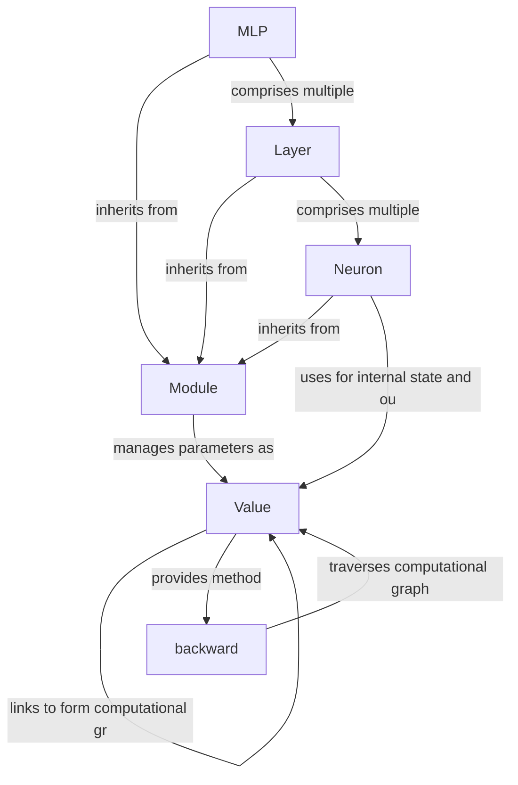

# micrograd

_Lens: beginner-tutorial_

Micrograd is a lightweight automatic differentiation engine that builds a computational graph using scalar `Value` objects to enable reverse-mode backpropagation. On top of this engine, it provides a small library for constructing neural networks, including `Neuron`s, `Layer`s, and Multi-Layer Perceptrons (MLPs).

## Architecture

## Chapters

- [Value](01_value.md)
- [backward](02_backward.md)
- [Module](03_module.md)
- [Neuron](04_neuron.md)
- [Layer](05_layer.md)
- [MLP](06_mlp.md)