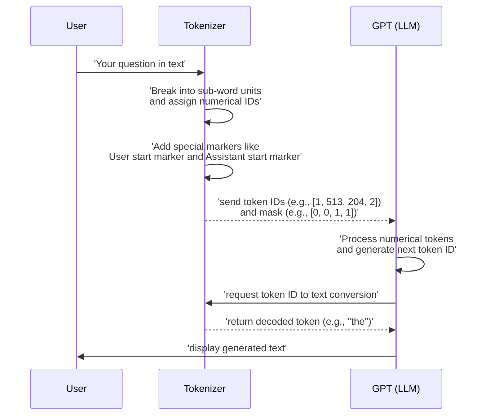

# Chapter 1: Tokenizer

Imagine you're trying to talk to a foreign friend who only understands a specific language, but you only know English. You need a translator, right? Similarly, Large Language Models (LLMs) like GPT don't "understand" human words directly. They operate on numbers. So, how does your English question "What is the capital of France?" become something a machine can process?

The answer lies with the **Tokenizer**. This crucial component acts as the universal translator for your LLM. Its job is to convert your human-readable text into a sequence of numerical tokens that the GPT model can understand, and then convert those numerical tokens back into human text when the model wants to respond. Think of it like taking a complex LEGO creation (your sentence) and breaking it down into individual, numbered LEGO bricks (tokens). Each unique word, part of a word, or even punctuation mark gets its own number.

## The Core Transformation: Text to Tokens and Back

At its heart, the tokenizer performs two main operations:

1.  **Encoding**: Taking a string of text (e.g., "hello world") and breaking it down into smaller units, assigning a unique numerical ID to each unit.
2.  **Decoding**: Taking a sequence of these numerical IDs and reassembling them into a coherent string of human-readable text.

These units aren't always full words. Sometimes, a common word like "unbelievable" might be broken into "un", "believe", and "able" to save space in the vocabulary and allow the model to generalize better. This process is called Byte Pair Encoding (BPE), and it's what GPT models typically use.

## Inside `nanochat`'s Tokenizer

The `nanochat` project leverages a robust tokenizer implementation, primarily found in [`nanochat/tokenizer.py`](nanochat/tokenizer.py). It uses a combination of `rustbpe` for efficient vocabulary training and `tiktoken` (OpenAI's BPE library) for super-fast inference.

Let's look at some key definitions and functions within this file.

### Special Tokens

LLMs often need special markers to understand the structure of text, especially during conversational tasks or when interacting with tools. `nanochat` defines several such tokens:

```python
# nanochat/tokenizer.py
SPECIAL_TOKENS = [
    "<|bos|>", # Beginning of Sequence (document delimiter)
    "<|user_start|>", "<|user_end|>", # User messages
    "<|assistant_start|>", "<|assistant_end|>", # Assistant messages
    "<|python_start|>", "<|python_end|>", # Assistant invokes Python tool
    "<|output_start|>", "<|output_end|>", # Python tool output
]
```

These tokens are reserved during tokenization and assigned specific IDs. For instance, `<|bos|>` (Beginning of Sequence) is like a "start-of-new-document" signal to the model, ensuring it knows when a new piece of text begins. During fine-tuning for chat, `<|user_start|>` and `<|assistant_start|>` help the model understand who is speaking.

### Splitting Text into Base Units

Before BPE can merge common sequences, the text first needs to be broken into initial "base units." This is done using a regular expression:

```python
# nanochat/tokenizer.py
SPLIT_PATTERN = r"""'(?i:[sdmt]|ll|ve|re)|[^\r\n\p{L}\p{N}]?+\p{L}+|\p{N}{1,2}| ?[^\s\p{L}\p{N}]++[\r\n]*|\s*[\r\n]|\s+(?!\S)|\s+"""
```

This pattern smartly separates words, punctuation, and even handles contractions like "it's" or "I'll". Notice the `\p{N}{1,2}` part, which means it initially splits numbers into groups of one or two digits. This detail is often carefully tuned based on the target vocabulary size.

### The `RustBPETokenizer` Class

This class is the workhorse of `nanochat`'s tokenization.

#### Learning a New Vocabulary (`train_from_iterator`)

You can train your own tokenizer to understand a specific dataset. This function takes an iterator of text (like a stream of sentences from a dataset) and learns the most common word-parts to create a vocabulary.

```python
# nanochat/tokenizer.py (simplified)
class RustBPETokenizer:
    @classmethod
    def train_from_iterator(cls, text_iterator, vocab_size):
        tokenizer = rustbpe.Tokenizer()
        vocab_size_no_special = vocab_size - len(SPECIAL_TOKENS)
        tokenizer.train_from_iterator(text_iterator, vocab_size_no_special, pattern=SPLIT_PATTERN)
        # ... then convert to tiktoken encoding for fast inference
        return cls(enc, "<|bos|>")
```
This process happens in [`scripts/tok_train.py`](scripts/tok_train.py) during the pretraining stage. The tokenizer learns a `vocab_size` (e.g., 32,768) distinct numerical IDs to represent all the text it sees.

#### Loading a Pre-trained Tokenizer (`from_directory`)

Once trained, the tokenizer (its `tiktoken` encoding object) is saved to disk. When you run `nanochat`, it usually loads an existing tokenizer from `~/.cache/nanochat/tokenizer`.

```python
# nanochat/tokenizer.py (simplified)
    @classmethod
    def from_directory(cls, tokenizer_dir):
        pickle_path = os.path.join(tokenizer_dir, "tokenizer.pkl")
        with open(pickle_path, "rb") as f:
            enc = pickle.load(f)
        return cls(enc, "<|bos|>")
```

#### Encoding and Decoding Text

These are the fundamental methods for translation:

```python
# nanochat/tokenizer.py (simplified)
    def encode(self, text, prepend=None, append=None, num_threads=8):
        # Converts text (string or list of strings) into a list of token IDs.
        # 'prepend' or 'append' can add special tokens like '<|bos|>'
        # For example: tokenizer.encode("Hello world", prepend="<|bos|>")
        pass # implementation details omitted for brevity

    def decode(self, ids):
        # Converts a list of token IDs back into a single string.
        # For example: tokenizer.decode([1, 2, 3]) -> "hello world"
        return self.enc.decode(ids)
```

#### Structuring Conversations (`render_conversation`)

This function is critical for preparing chat data for **Supervised Fine-Tuning (SFT)**. It takes a conversation (a list of messages with roles like "user" and "assistant") and converts it into a single sequence of token IDs.

Crucially, it also produces a `mask`. This mask tells the model which tokens it *should* try to predict (usually the assistant's responses) and which tokens it *should not* (like the user's prompts or special formatting tokens).

```python
# nanochat/tokenizer.py (simplified)
    def render_conversation(self, conversation, max_tokens=2048):
        ids, mask = [], []
        # ... logic to add special tokens for user/assistant roles,
        #     encode message content, and set mask to 0 or 1.
        # For example:
        # add_tokens(user_start, 0) # User start token, mask = 0 (not for training)
        # add_tokens(self.encode(user_message), 0) # User message, mask = 0
        # add_tokens(user_end, 0) # User end token, mask = 0
        # add_tokens(assistant_start, 0) # Assistant start token, mask = 0
        # add_tokens(self.encode(assistant_response), 1) # Assistant response, mask = 1 (TRAIN HERE!)
        # add_tokens(assistant_end, 1) # Assistant end token, mask = 1
        # ...
        return ids, mask
```

Here's a small example of what `render_conversation` might produce for a simple chat:

```text
# Input conversation
conversation = {
    "messages": [
        {"role": "user", "content": "Tell me a story."},
        {"role": "assistant", "content": "Once upon a time..."}
    ]
}

# Example output (simplified token IDs and mask)
ids = [
    1, # <|bos|>
    2, # <|user_start|>
    100, 101, 102, # "Tell me a story."
    3, # <|user_end|>
    4, # <|assistant_start|>
    200, 201, 202, 203, # "Once upon a time..."
    5, # <|assistant_end|>
]
mask = [
    0, # <|bos|>
    0, # <|user_start|>
    0, 0, 0, # "Tell me a story."
    0, # <|user_end|>
    0, # <|assistant_start|>
    1, 1, 1, 1, # "Once upon a time..." (these are the tokens the model learns to predict)
    1, # <|assistant_end|>
]
```

The `visualize_tokenization` helper method in `nanochat/tokenizer.py` is very useful for inspecting this output.

#### Priming for Completion (`render_for_completion`)

For tasks like **Reinforcement Learning (RL)** or pure inference, you want the model to generate a response *from scratch*. This function takes a conversation, removes the last assistant message (the one the model is supposed to generate), and then appends an `<|assistant_start|>` token to prompt the model to begin generating its own assistant response.

```python
# nanochat/tokenizer.py (simplified)
    def render_for_completion(self, conversation):
        # ... removes last assistant message ...
        ids, mask = self.render_conversation(conversation)
        assistant_start = self.encode_special("<|assistant_start|>")
        ids.append(assistant_start)
        return ids # no mask needed for inference/RL, only the input sequence
```

### Tokenizer in Action

Here's how text flows through the tokenizer and into the GPT model:



## Where the Tokenizer is Used

The tokenizer is a foundational component, used across almost every stage of the LLM lifecycle in `nanochat`:

*   **Pretraining**: To convert raw text from the pretraining dataset ([DataLoader](04_dataloader.md)) into tokens for the base model ([GPT](03_gpt.md)). This happens in [`scripts/base_train.py`](scripts/base_train.py).
*   **Supervised Fine-tuning (SFT)**: To prepare structured conversational data for training chat models ([Task](08_task.md)). This is handled by [`scripts/chat_sft.py`](scripts/chat_sft.py).
*   **Reinforcement Learning (RL)**: To encode prompts and decode generated responses, especially when models use external tools. This is seen in [`scripts/chat_rl.py`](scripts/chat_rl.py).
*   **Inference**: For real-time chat interactions, quickly encoding user input and decoding the model's output in the [Engine](09_engine.md), used by applications like [`scripts/chat_web.py`](scripts/chat_web.py).

Now that you understand how human language is transformed into numerical tokens for the LLM, you might wonder how the LLM itself is structured and configured. What defines its "brain" and capabilities? That's precisely what we'll explore in the next chapter: [GPTConfig](02_gptconfig.md).