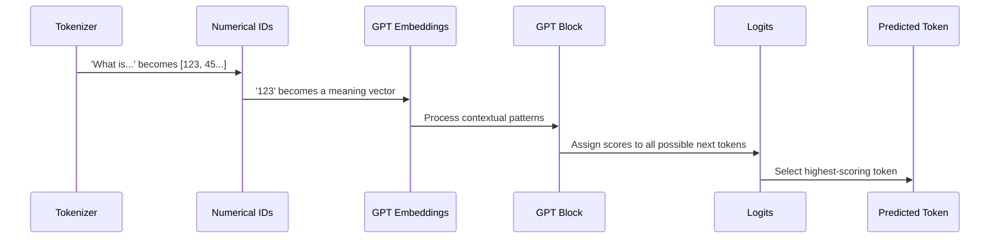

# Chapter 2: GPT

In the previous chapter, we saw how the [Tokenizer](01_tokenizer.md) transforms your human language into a sequence of numbers, called tokens. For `nanochat`, a query like "What is the capital of France?" becomes a list of integers: `[123, 45, 67, 89]`. But how does a long string of these numerical IDs become coherent understanding? How does the model know that `45` refers to "capital" and `89` refers to "France," and how does it connect these concepts to infer the answer "Paris"?

This is where **GPT** comes in – the true "brain" of `nanochat`. GPT, which stands for Generative Pre-trained Transformer, is a large neural network designed to process these numerical sequences, understand their underlying patterns, and then generate new sequences. You can think of it as a master storyteller or a predictive text engine operating on a massive scale. Its fundamental task is deceptively simple: given a sequence of tokens, predict the *next* token. By repeating this prediction many times, it can generate entire sentences, paragraphs, or even full conversations.

`nanochat`'s GPT model is defined in the `nanochat/gpt.py` file. Let's peel back the layers and see how this numerical magic happens.



### From Numbers to Meaningful Vectors: Embeddings

The raw numerical IDs are just arbitrary identifiers; they don't carry any inherent meaning. The first step for GPT is to convert these discrete IDs into rich, dense numerical representations called **embeddings**.

Imagine each unique token in the tokenizer's vocabulary is a color. The numerical ID is just a label for that color (e.g., `1` for red, `2` for blue). The embedding layer is like an artist's palette that takes each color label and gives it a detailed, multi-dimensional description: "red, slightly warm, evokes passion, similar to crimson but brighter." These descriptions are numerical vectors, where similar words (like "king" and "queen") will have similar vectors.

In `nanochat`, this is handled by `nn.Embedding`. Let's look at `GPT`'s `__init__` method:

```python
# nanochat/gpt.py

class GPT(nn.Module):
    def __init__(self, config, pad_vocab_size_to=64):
        # ...
        self.transformer = nn.ModuleDict({
            "wte": nn.Embedding(padded_vocab_size, config.n_embd), # wte = word token embedding
            "h": nn.ModuleList([Block(config, layer_idx) for layer_idx in range(config.n_layer)]),
        })
        self.lm_head = Linear(config.n_embd, padded_vocab_size, bias=False)
        # ...
```

The `wte` (word token embedding) layer takes a token ID and returns a vector of `config.n_embd` dimensions. This vector now captures the semantic essence of the token, ready for deeper processing.

### The Core Processor: Transformer Blocks

Once tokens are converted into embeddings, they enter the heart of the GPT model: a stack of identical **Transformer Blocks**. Each block is designed to refine the understanding of the input sequence. Think of these blocks as specialized workshops, each adding layers of context and insight to the data before passing it on to the next.

A key concept here is the `n_layer` parameter in `GPTConfig`, which dictates how many of these Transformer blocks are stacked together:

```python
# nanochat/gpt.py

@dataclass
class GPTConfig:
    # ...
    n_layer: int = 12 # The depth of the transformer model
    # ...
```

The `speedrun.sh` script, for instance, trains a GPT-2 capability model with a depth of `24` layers:

```bash
# runs/speedrun.sh
# ...
torchrun --standalone --nproc_per_node=8 -m scripts.base_train -- --depth=24 ...
# ...
```

Each `Block` in the `nn.ModuleList` `h` performs two main operations:

1.  **Causal Self-Attention (`CausalSelfAttention`):** This is the core mechanism that allows the model to "look at" other words in the input sequence to understand the context of each word. Crucially, "causal" means it can only attend to words that came *before* it in the sequence, preventing information leakage from the future (which would make it too easy to predict the next word!).

    Imagine you're reading a sentence, and you want to understand the meaning of the word "bank." You'd look at surrounding words: "river bank" suggests land, while "money bank" suggests a financial institution. Self-attention does something similar, but in a highly parallel, numerical way. Each token essentially queries all preceding tokens, asking "how relevant are you to my current meaning?"

    `nanochat`'s `CausalSelfAttention` also incorporates advanced features like **Rotary Embeddings** for positional information and uses highly optimized **Flash Attention 3** for speed on modern GPUs (as you can see from `nanochat/flash_attention.py`).

    ```python
    # nanochat/gpt.py

    class CausalSelfAttention(nn.Module):
        def __init__(self, config, layer_idx):
            # ...
            self.c_q = Linear(self.n_embd, self.n_head * self.head_dim, bias=False)
            self.c_k = Linear(self.n_embd, self.n_kv_head * self.head_dim, bias=False)
            self.c_v = Linear(self.n_embd, self.n_kv_head * self.head_dim, bias=False)
            # ...
        def forward(self, x, ve, cos_sin, window_size, kv_cache):
            # ...
            q, k = apply_rotary_emb(q, cos, sin), apply_rotary_emb(k, cos, sin)
            # ...
            if kv_cache is None: # Training: causal attention
                y = flash_attn.flash_attn_func(q, k, v, causal=True, window_size=window_size)
            # ...
            y = self.c_proj(y) # Project back to residual stream
            return y
    ```

2.  **MLP (Feed-Forward Network):** After attention has contextualized the tokens, each token's representation is passed through a simple, position-wise Multi-Layer Perceptron (MLP). This is a standard neural network component that allows the model to perform further, non-linear processing on each token's contextualized information independently. `nanochat` uses a `F.relu(x).square()` activation function here for enhanced non-linearity.

    ```python
    # nanochat/gpt.py

    class MLP(nn.Module):
        def __init__(self, config):
            super().__init__()
            self.c_fc = Linear(config.n_embd, 4 * config.n_embd, bias=False)
            self.c_proj = Linear(4 * config.n_embd, config.n_embd, bias=False)

        def forward(self, x):
            x = self.c_fc(x)
            x = F.relu(x).square() # Unique activation function in nanochat
            x = self.c_proj(x)
            return x
    ```

These attention and MLP sub-layers are wrapped with **residual connections** (adding the input to the output) and **layer normalization** (scaling activations to a standard range) to help stabilize training and enable the flow of information through many layers.

### Predicting the Next Token: The Language Model Head

After passing through all the Transformer blocks, the model has a highly refined, context-aware vector for each token in the input sequence. The final step is to convert these internal representations back into probabilities over the entire vocabulary. This is the job of the **Language Model Head (`lm_head`)**.

```python
# nanochat/gpt.py

class GPT(nn.Module):
    def __init__(self, config, pad_vocab_size_to=64):
        # ...
        self.lm_head = Linear(config.n_embd, padded_vocab_size, bias=False)
        # ...

    def forward(self, idx, targets=None, kv_cache=None, loss_reduction='mean'):
        # ...
        x = norm(x) # Final normalization before lm_head

        # Forward the lm_head (compute logits)
        softcap = 15 # smoothly cap the logits
        logits = self.lm_head(x) # (B, T, padded_vocab_size)
        logits = logits[..., :self.config.vocab_size] # Slice to remove padding
        logits = logits.float() # Switch to fp32 for logit softcap and loss computation
        logits = softcap * torch.tanh(logits / softcap) # Squash the logits
        # ...
```

The `lm_head` is another linear layer that maps the final `n_embd`-dimensional vector for each position to a vector of `vocab_size` dimensions. Each value in this output vector (called **logits**) represents the model's unnormalized "score" for every possible next token in the vocabulary. Higher scores mean the model thinks that token is more likely to be the next word. A `softcap` and `tanh` activation are applied to ensure these scores remain within a stable range, which can improve training stability.

If `targets` are provided (during training, as covered in `scripts/base_train.py`), these logits are used to compute a **cross-entropy loss**, comparing the model's predictions to the actual next tokens. This loss signal is then used to adjust all the weights in the model, gradually teaching it to make better predictions.

If `targets` are not provided (during inference, as shown in `scripts/chat_cli.py` or `scripts/chat_web.py`), the model simply returns these logits. A sampling strategy (like choosing the token with the highest logit or sampling probabilistically) is then applied to select the actual next token, which can then be fed back into the model to generate the subsequent token, and so on. This iterative process is how `nanochat` generates human-like text, token by token.

### GPT in Action: Training and Inference

The entire GPT model, from token embedding to the final `lm_head`, works together in a seamless pipeline. During pretraining (`scripts/base_train.py`), the model learns this next-token prediction task on a massive dataset, developing a general understanding of language. Then, during supervised fine-tuning (`scripts/chat_sft.py`), it's guided to become a helpful assistant, learning to respond to prompts and even use tools.

For inference, `nanochat` provides an `Engine` (covered in a later chapter) that efficiently manages the generation process, including caching previous computations (KV cache) to speed up sequential token generation.

The calculations performed by this GPT brain are immense, involving billions of floating-point operations. For such large-scale models, the numerical precision used for these calculations—whether `float32`, `bfloat16`, or even `float8`—becomes a critical factor for both memory usage and computational speed. In the next chapter, we'll dive into `nanochat`'s approach to managing this numerical precision with `COMPUTE_DTYPE`, a foundational aspect of efficient LLM training and inference.