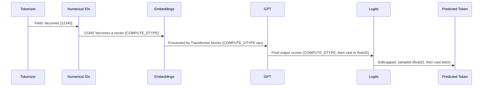

# Chapter 3: COMPUTE_DTYPE

In the previous chapter, we journeyed into the [GPT](02_gpt.md) model, witnessing how it transforms numerical token IDs into meaningful, context-rich vectors and uses complex calculations to predict the next token. These calculations, involving matrix multiplications and activations across dozens of layers, require an immense number of floating-point operations. But here's a crucial question: how precise do these numbers need to be? Is it always necessary to perform calculations with maximum accuracy, or can we cut corners to save time and memory?

Imagine you're an architect using a CAD program. You could design a building with measurements precise down to nanometers, but for a typical structure, millimeters or even centimeters are perfectly adequate. Over-precision in design would slow down your computer, consume vast amounts of memory, and yield little practical benefit. Similarly, in large language models, the **COMPUTE_DTYPE** is like choosing the precision level for our LLM's internal calculations. It defines how accurately numbers are stored and processed, a critical setting that directly impacts performance, memory usage, and numerical stability during both training and inference.

Let's visualize where this precision setting fits into the overall flow:



### The Trade-offs of Precision

Why not always use the highest precision (like `float32`)? Because every bit of precision comes at a cost:

*   **`float32` (Single-precision float):** This is the standard. It offers high accuracy but requires 32 bits per number. For billions of parameters and activations, this translates to slower operations and significant memory consumption.
*   **`bfloat16` (Brain float):** A popular choice for modern LLMs, especially on NVIDIA A100/H100 GPUs. It uses 16 bits but maintains the *same exponent range* as `float32`. This means it can represent very large and very small numbers accurately (avoiding overflow/underflow), making it numerically stable for LLM training while being twice as fast and consuming half the memory of `float32`.
*   **`float16` (Half-precision float):** Also 16 bits, but with a *smaller exponent range* than `float32`. While fast and memory-efficient, its limited range makes it more prone to numerical issues like gradient underflow during training, often requiring techniques like `GradScaler` to keep training stable.
*   **`float8` (Eighth-precision float):** The cutting edge. Using only 8 bits, it offers unparalleled speed and memory savings. However, it requires specialized hardware (like NVIDIA H100+ GPUs) and careful implementation to ensure numerical stability.

`nanochat` offers a flexible approach to managing `COMPUTE_DTYPE`, defaulting to sensible options based on your hardware but allowing explicit overrides.

### `nanochat`'s Precision Management

Instead of relying on PyTorch's automatic mixed precision (`torch.amp.autocast`), `nanochat` explicitly controls precision through a single global `COMPUTE_DTYPE`. This provides full transparency and fine-grained control over numerical operations.

You can find the core logic for `COMPUTE_DTYPE` in `nanochat/common.py`, which is then referenced throughout the codebase.

```python
# nanochat/common.py

# ... (imports)

# Set the default compute dtype and provide a reason for it
if device_type == "cuda" and torch.cuda.get_device_capability()[0] >= 8:
    COMPUTE_DTYPE = torch.bfloat16 # A100, H100+ have native bf16 tensor cores
    COMPUTE_DTYPE_REASON = "CUDA SM 80+ detected (A100, H100)"
elif device_type == "cuda":
    COMPUTE_DTYPE = torch.float32 # V100, T4, etc. - fp32 or manual fp16 + GradScaler
    COMPUTE_DTYPE_REASON = "CUDA SM < 80 detected (V100, T4)"
else:
    COMPUTE_DTYPE = torch.float32 # CPU, MPS - no reduced-precision tensor cores
    COMPUTE_DTYPE_REASON = "Non-CUDA device (CPU, MPS)"
```

As indicated in the `README.md`, `nanochat` intelligently auto-detects the optimal `COMPUTE_DTYPE` for your hardware:

| Hardware                      | Default dtype  | Why                                              |
| :---------------------------- | :------------- | :----------------------------------------------- |
| CUDA SM 80+ (A100, H100, ...) | `bfloat16`     | Native bf16 tensor cores                         |
| CUDA SM < 80 (V100, T4, ...)  | `float32`      | No bf16; fp16 available via `NANOCHAT_DTYPE=float16` (uses GradScaler) |
| CPU / MPS                     | `float32`      | No reduced-precision tensor cores                |

You can override this default using the `NANOCHAT_DTYPE` environment variable:

```bash
NANOCHAT_DTYPE=float32 python -m scripts.chat_cli -p "hello"   # force fp32
NANOCHAT_DTYPE=bfloat16 torchrun --nproc_per_node=8 -m scripts.base_train  # force bf16
```

### How `nanochat` implements mixed precision:

1.  **Weights stored in `float32`, but cast during forward pass:** For numerical stability during optimization (which we'll cover in a later chapter on [MuonAdamW](05_muonadamw.md)), model weights (especially in `Linear` layers) are kept in `float32` "master weights." However, during the forward pass, they are converted to `COMPUTE_DTYPE` just before the matrix multiplication.

    This is handled by `nanochat`'s custom `Linear` layer in `nanochat/gpt.py`:

    ```python
    # nanochat/gpt.py

    class Linear(nn.Linear):
        """nn.Linear that casts weights to match input dtype in forward.
        Replaces autocast: master weights stay fp32 for optimizer precision,
        but matmuls run in the activation dtype (typically bf16 from embeddings)."""
        def forward(self, x):
            return F.linear(x, self.weight.to(dtype=x.dtype))
    ```

2.  **Embeddings stored directly in `COMPUTE_DTYPE` (mostly):** The word token embeddings (`wte`) and value embeddings (`value_embeds`) are large and consume significant memory. `nanochat` stores these directly in `COMPUTE_DTYPE` to save memory, except when `COMPUTE_DTYPE` is `float16`. `float16` requires `GradScaler`, which needs embeddings to be in `float32` to correctly unscale gradients.

    This explicit casting happens in `GPT.init_weights()`:

    ```python
    # nanochat/gpt.py

    class GPT(nn.Module):
        # ... (init)

        @torch.no_grad()
        def init_weights(self):
            # ... (other initializations)

            # Cast embeddings to COMPUTE_DTYPE: optimizer can tolerate reduced-precision
            # embeddings and it saves memory. Exception: fp16 requires fp32 embeddings
            # because GradScaler cannot unscale fp16 gradients.
            if COMPUTE_DTYPE != torch.float16:
                self.transformer.wte.to(dtype=COMPUTE_DTYPE)
                for ve in self.value_embeds.values():
                    ve.to(dtype=COMPUTE_DTYPE)
    ```

3.  **Logits cast to `float32` for stability:** The final output of the model, called `logits`, represents unnormalized scores for each possible next token. These values can vary widely, so they are explicitly cast to `float32` before applying a `softcap` (squashing them into a stable range) and computing the loss. This helps maintain numerical stability during the critical loss calculation.

    ```python
    # nanochat/gpt.py

    class GPT(nn.Module):
        # ... (other methods)

        def forward(self, idx, targets=None, kv_cache=None, loss_reduction='mean'):
            # ... (transformer blocks processing)

            x = norm(x) # Final normalization before lm_head

            # Forward the lm_head (compute logits)
            softcap = 15 # smoothly cap the logits
            logits = self.lm_head(x) # (B, T, padded_vocab_size)
            logits = logits[..., :self.config.vocab_size] # Slice to remove padding
            logits = logits.float() # Switch to fp32 for logit softcap and loss computation
            logits = softcap * torch.tanh(logits / softcap) # Squash the logits
            # ...
    ```

4.  **`GradScaler` for `float16` training:** As mentioned, `float16` can suffer from gradient underflow. To counteract this, `nanochat` automatically enables `torch.amp.GradScaler` when `COMPUTE_DTYPE` is `float16` (e.g., if you override it via `NANOCHAT_DTYPE=float16`). The `GradScaler` dynamically scales loss values to prevent gradients from becoming too small during backpropagation.

    You can see this in action in `scripts/base_train.py`:

    ```python
    # scripts/base_train.py

    # ... (compute init)
    print0(f"COMPUTE_DTYPE: {COMPUTE_DTYPE} ({COMPUTE_DTYPE_REASON})")

    # GradScaler for fp16 training (bf16/fp32 don't need it — bf16 has the same exponent range as fp32)
    scaler = torch.amp.GradScaler() if COMPUTE_DTYPE == torch.float16 else None
    if scaler is not None:
        print0("GradScaler enabled for fp16 training")
    ```

5.  **`float8` support for advanced GPUs:** For NVIDIA H100+ GPUs, `nanochat` includes experimental support for `float8` training. This is enabled with the `--fp8` flag, as seen in the `speedrun.sh` script:

    ```bash
    # runs/speedrun.sh
    # ...
    torchrun --standalone --nproc_per_node=8 -m scripts.base_train -- --depth=24 --target-param-data-ratio=8 --device-batch-size=16 --fp8 --run=$WANDB_RUN
    # ...
    ```

    The `nanochat/fp8.py` file provides a minimalist `Float8Linear` implementation that wraps PyTorch's `torch._scaled_mm` (the underlying FP8 CUDA kernel). This allows for efficient FP8 computation without relying on the more complex `torchao` library, striking a balance between cutting-edge performance and code simplicity.

By carefully managing `COMPUTE_DTYPE`, `nanochat` ensures that training and inference are as efficient as possible, leveraging the latest hardware capabilities without sacrificing numerical stability. This optimization is crucial for achieving high throughput and reducing the cost of running large language models.

But feeding numerical IDs to the GPT model and processing them efficiently is only half the battle. How do we get these vast quantities of tokenized data to the model in the first place? How are multi-gigabyte datasets loaded, shuffled, and presented to the GPU efficiently in batches? That's the domain of the next chapter, where we'll explore `nanochat`'s sophisticated [DataLoader](04_dataloader.md).