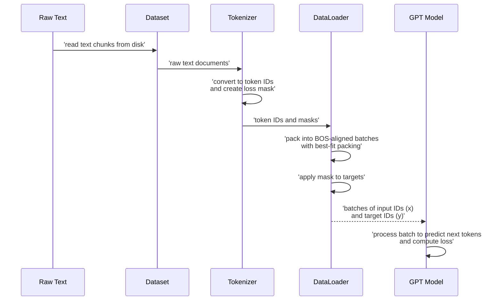

# Chapter 4: DataLoader

In [Chapter 1: Tokenizer](01_tokenizer.md), we learned how raw human language is transformed into a stream of numerical tokens, the fundamental currency of a Large Language Model (LLM). Then, in [Chapter 3: GPT](03_gpt.md), we explored the intricate neural network architecture that processes these tokens. But with colossal amounts of data—think gigabytes or even terabytes of text—how do we efficiently deliver these tokens to our GPT model during training?

Imagine you're trying to feed an entire library of books to a very fast reader. You wouldn't hand them one word at a time, or even one page. You'd want to deliver entire chapters or even whole books, neatly organized and ready to be consumed. Furthermore, if you have multiple readers working in parallel (like GPUs), you'd need a sophisticated system to ensure each reader gets unique, relevant material without wasteful duplication or idle time.

This is precisely the role of the **DataLoader**. In the context of LLMs, the DataLoader is the unsung hero of the training pipeline, a high-performance data logistics system. Its job is to efficiently fetch raw text, convert it into tokenized sequences using our [Tokenizer](01_tokenizer.md), organize these sequences into optimized batches, and then feed them to the GPT model. It handles complex tasks like shuffling the data for better generalization, intelligently packing variable-length sequences to maximize GPU utilization, and distributing unique data chunks across multiple GPUs in a coordinated fashion.

Without an efficient DataLoader, even the fastest GPT model would starve for data, rendering the entire training process painfully slow and inefficient.

## The Data Logistics System: Inside `nanochat`'s DataLoader

The `nanochat` project's DataLoader, primarily found in [`nanochat/dataloader.py`](nanochat/dataloader.py), is designed for maximal efficiency during pretraining and supervised fine-tuning (SFT). It works hand-in-hand with the tokenizer to prepare data in a format immediately consumable by the `GPT` model.

### Fetching Raw Data

The `DataLoader` doesn't directly read raw files. Instead, it relies on a `Dataset` utility to provide iterators of text. For pretraining, `nanochat` uses `nanochat/dataset.py`, which iterates over `parquet` files containing vast amounts of text.

The `parquets_iter_batched` function from `nanochat/dataset.py` is the initial entry point for raw text:

```python
# nanochat/dataset.py (simplified)
def parquets_iter_batched(split, start=0, step=1):
    """
    Iterate through the dataset, in batches of underlying row_groups for efficiency.
    - split can be "train" or "val". the last parquet file will be val.
    - start/step are useful for skipping rows in DDP. e.g. start=rank, step=world_size
    """
    # ... logic to find and read parquet files ...
    for filepath in parquet_paths:
        pf = pq.ParquetFile(filepath)
        for rg_idx in range(start, pf.num_row_groups, step):
            rg = pf.read_row_group(rg_idx)
            texts = rg.column('text').to_pylist()
            yield texts # yields lists of strings (documents)
```

This function streams documents, often in batches corresponding to "row groups" within the `parquet` files, to minimize I/O overhead. The `start` and `step` parameters are crucial for distributed training, ensuring each GPU (`rank`) processes a unique subset of the data.

### `tokenizing_distributed_data_loader_bos_bestfit`: Efficient Batching

The core DataLoader function for pretraining is `tokenizing_distributed_data_loader_bos_bestfit`. Let's break down its key characteristics:

*   **`bos_bestfit`**: This refers to two critical optimizations:
    *   **BOS-aligned**: Every sequence (document) in a batch *starts* with a `<|bos|>` (Beginning Of Sequence) token. This helps the model understand that each element is a distinct, independent piece of text, which is fundamental for causal language modeling.
    *   **Best-fit packing**: When forming a batch, the DataLoader intelligently tries to fit as many documents as possible into each `max_seq_len` slot. Instead of simply concatenating documents until the max length is reached (which often leaves significant empty space at the end of a batch element), "best-fit" attempts to find the largest available document from a buffer that perfectly fits the remaining space, minimizing wasted tokens due to padding. This significantly increases GPU utilization.
*   **`distributed`**: The DataLoader is aware of `torch.distributed` and ensures that each GPU (or "rank") in a multi-GPU setup receives a unique stream of data, preventing redundant processing and maximizing throughput.

Here's a simplified look at how it's used in [`scripts/base_train.py`](scripts/base_train.py):

```python
# scripts/base_train.py (simplified)
from nanochat.dataloader import tokenizing_distributed_data_loader_bos_bestfit

# ... (tokenizer and model setup) ...

# Initialize the DataLoaders for train/val
train_loader = tokenizing_distributed_data_loader_bos_bestfit(
    tokenizer,
    args.device_batch_size, # e.g., 32
    args.max_seq_len,       # e.g., 2048
    split="train",
    device=device
)

# Fetching a batch for training
x, y, dataloader_state_dict = next(train_loader)
# x: input token IDs for the GPT model (B, T)
# y: target token IDs for loss computation (B, T)
```

The DataLoader yields `x` and `y` tensors. `x` contains the input token IDs for the model, and `y` contains the shifted target token IDs. For instance, if `x` is `[token_A, token_B, token_C]`, then `y` would be `[token_B, token_C, token_D]` if `token_D` were the next token. This is how the model learns to predict the next token in a sequence.

### `tokenizing_distributed_data_loader_with_state_bos_bestfit`: Resuming Training

A variant, `tokenizing_distributed_data_loader_with_state_bos_bestfit`, is specifically designed to resume training from a checkpoint. It takes a `resume_state_dict` and restores the exact position in the dataset, ensuring seamless continuation without re-processing already seen data.

```python
# scripts/base_train.py (simplified)
from nanochat.dataloader import tokenizing_distributed_data_loader_with_state_bos_bestfit

# ... (load checkpoint, get dataloader_resume_state_dict) ...

train_loader = tokenizing_distributed_data_loader_with_state_bos_bestfit(
    tokenizer,
    args.device_batch_size,
    args.max_seq_len,
    split="train",
    device=device,
    resume_state_dict=dataloader_resume_state_dict # key for resuming
)
```

### SFT Data Loading: `TaskMixture`

For Supervised Fine-Tuning (SFT), `nanochat` uses a different data source: `TaskMixture` from [`tasks/common.py`](tasks/common.py). This allows combining various conversational datasets (e.g., MMLU, GSM8K, SmolTalk, custom identity data) into a single logical dataset. The SFT training script (`scripts/chat_sft.py`) then provides its own `sft_data_generator_bos_bestfit` function, which wraps `TaskMixture` and handles tokenization and batching specific to chat conversations. This custom generator also applies a `mask` (from `tokenizer.render_conversation`) to the `targets`, ensuring the model *only* learns to predict the assistant's responses and not the user's prompts or special formatting tokens.

```python
# scripts/chat_sft.py (simplified snippet)
from tasks.common import TaskMixture
from tasks.gsm8k import GSM8K
from tasks.smoltalk import SmolTalk

train_tasks = [
    SmolTalk(split="train"),
    *[GSM8K(subset="main", split="train") for _ in range(args.gsm8k_epochs)],
    # ... other tasks ...
]
train_dataset = TaskMixture(train_tasks)

# The sft_data_generator_bos_bestfit function then uses this dataset
# and calls tokenizer.render_conversation to get (ids, mask) for each example.
# The mask is used to set target tokens to -1 (ignore_index) for non-assistant tokens.
```

### The Flow of Data

Here's how data flows through these components during training:



## Where the DataLoader is Used

The DataLoader is a critical component for any data-intensive phase of the LLM lifecycle in `nanochat`:

*   **Pretraining (`scripts/base_train.py`):** This is where the DataLoader truly shines, efficiently streaming billions of tokens from the `climbmix-400b-shuffle` dataset to train the base GPT model.
*   **Supervised Fine-tuning (SFT) (`scripts/chat_sft.py`):** For conversational models, the DataLoader prepares curated chat datasets (often mixtures of various tasks) in an optimized format, including handling conversational roles and tool calls.
*   **Evaluation (`scripts/base_eval.py`):** The DataLoader is also used to prepare data for evaluating metrics like Bits Per Byte (BPB), which measures the model's compression capabilities on unseen text.

By mastering the art of efficient data delivery, the DataLoader ensures that the powerful [GPT](03_gpt.md) model can continuously learn without bottlenecks. Now that we've seen how the data is prepared and fed to the model, the next logical question is: how does the model actually *learn* from this data? How does it adjust its internal parameters to get better at predicting the next token? That's what we'll explore in the next chapter: [Optimizer](05_optimizer.md).