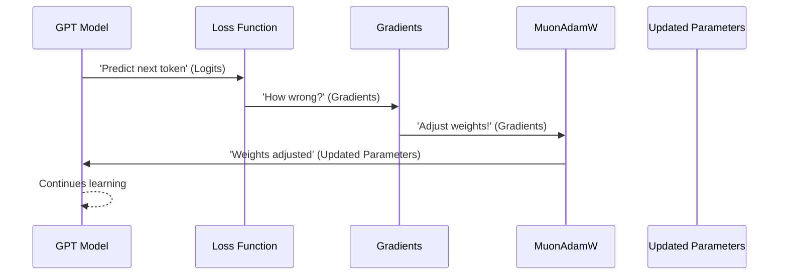

# Chapter 5: MuonAdamW

In the previous chapters, we've brought our `nanochat` model to life: the [Tokenizer](01_tokenizer.md) translates human text into numbers, the [GPT](02_gpt.md) model processes these numbers using efficient `COMPUTE_DTYPE` (Chapter 3), and the [DataLoader](04_dataloader.md) ensures a continuous, optimized stream of data. But the GPT model, with its billions of connections (called "weights" or "parameters"), doesn't inherently know how to be a good conversationalist or a smart problem-solver. It starts as a blank slate, making mostly random predictions.

So, how does `nanochat`'s GPT model actually *learn*? How does it adjust those millions of connections based on its performance, getting smarter and faster with each new piece of data it sees? This is the critical role of the **optimizer**, and in `nanochat`, that advanced optimization algorithm is called **MuonAdamW**.

Think of MuonAdamW as the model's expert coach. After each practice session (a batch of data), the model performs some actions (makes predictions), and a scorekeeper (the loss function) tells the coach how well it did (the "loss"). The coach then analyzes this feedback (the "gradients," which tell us the direction and magnitude of error for each connection) and meticulously adjusts every single connection in the network. This isn't a simple adjustment; it's a sophisticated, multi-faceted strategy to ensure the model improves efficiently and robustly.



The core implementation of `nanochat`'s optimizer is found in `nanochat/optim.py`. It combines two powerful optimization techniques: AdamW and Muon.

### The Foundation: AdamW

Before diving into MuonAdamW, let's briefly understand AdamW, which is a widely used and highly effective optimization algorithm. AdamW stands for "Adaptive Moment Estimation with Weight Decay." It works like a smart coach that:

1.  **Remembers Past Moves (Moments):** For each parameter, it keeps track of the average of past gradients (first moment, `exp_avg`) and the average of past squared gradients (second moment, `exp_avg_sq`). This helps it understand the general direction and consistency of parameter updates.
2.  **Adapts Learning Rates:** By using these moments, AdamW can give different parameters their own "learning speeds." Parameters with consistently high gradients might get larger steps, while those with noisy or sparse gradients get smaller, more cautious steps.
3.  **Decoupled Weight Decay:** Unlike traditional Adam, AdamW separates weight decay (a technique to prevent overfitting by gently pushing weights towards zero) from the adaptive learning rate update. This has been shown to improve generalization.

In `nanochat`, the AdamW step is highly optimized using a "fused kernel" (a single GPU operation combining multiple steps) for speed:

```python
# nanochat/optim.py

@torch.compile(dynamic=False, fullgraph=True)
def adamw_step_fused(
    p: Tensor,              # parameter tensor
    grad: Tensor,           # gradient, same shape as p
    exp_avg: Tensor,        # first moment, same shape as p
    exp_avg_sq: Tensor,     # second moment, same shape as p
    step_t: Tensor,         # step count
    lr_t: Tensor,           # learning rate
    beta1_t: Tensor,        # beta1
    beta2_t: Tensor,        # beta2
    eps_t: Tensor,          # epsilon
    wd_t: Tensor,           # weight decay
) -> None:
    """
    Fused AdamW step: weight_decay -> momentum_update -> bias_correction -> param_update
    All in one compiled graph to eliminate Python overhead between ops.
    """
    # 1. Apply weight decay
    p.mul_(1 - lr_t * wd_t)
    # 2. Update running averages (first and second moments)
    exp_avg.lerp_(grad, 1 - beta1_t)
    exp_avg_sq.lerp_(grad.square(), 1 - beta2_t)
    # 3. Bias corrections for the moments
    bias1 = 1 - beta1_t ** step_t
    bias2 = 1 - beta2_t ** step_t
    # 4. Compute update and apply to parameter
    denom = (exp_avg_sq / bias2).sqrt() + eps_t
    step_size = lr_t / bias1
    p.add_(exp_avg / denom, alpha=-step_size)
```

This `adamw_step_fused` function efficiently updates a single parameter `p` using its gradient `grad` and the optimizer's internal state.

### The Specialized Approach: Muon

While AdamW is great for general-purpose parameters, the vast majority of parameters in a Transformer model are found in large 2D matrices (the weights of the `Linear` layers in the [GPT](02_gpt.md) blocks). Updating these matrices optimally is crucial. This is where **Muon** comes in.

Muon, short for "Momentum Orthogonalized by Newton-schulz," is an optimizer specifically designed for these high-dimensional matrix parameters. Imagine you're trying to sculpt a perfect sphere. AdamW might chip away at it from all angles, making progress, but potentially introducing subtle unevenness. Muon, on the other hand, is like a sculptor who, after each chip, carefully re-evaluates the entire surface to ensure it remains perfectly round (orthogonal).

The core ideas behind Muon (as implemented in `nanochat`):

1.  **Nesterov Momentum:** It first calculates a "look-ahead" gradient (Nesterov momentum), which often leads to more stable and faster convergence.
2.  **Polar Express Orthogonalization:** This is the heart of Muon. It takes the momentum-adjusted gradient matrix and "orthogonalizes" it. In simpler terms, it finds an update direction that is "well-behaved" and prevents matrix updates from introducing undesirable distortions that can hurt training stability. This is done via an iterative process (like Newton-Schulz iteration or the Polar Express Sign Method), which aims to make the update matrix as close to an orthogonal matrix as possible.
3.  **Variance Reduction (NorMuon):** After orthogonalization, Muon applies a per-neuron/column adaptive learning rate (NorMuon) that normalizes update scales. This ensures that different parts of the matrix update with appropriate intensities, preventing some neurons from becoming overly active or inactive.
4.  **Cautious Weight Decay:** Finally, a careful weight decay is applied, but only to parameters whose updates move them in the same direction as the decay.

Similar to AdamW, Muon's steps are combined into a single fused kernel for maximum efficiency:

```python
# nanochat/optim.py

@torch.compile(dynamic=False, fullgraph=True)
def muon_step_fused(
    stacked_grads: Tensor,          # stacked gradients for multiple parameters
    stacked_params: Tensor,         # stacked parameters
    momentum_buffer: Tensor,        # first moment buffer
    second_momentum_buffer: Tensor, # factored second moment buffer
    momentum_t: Tensor,             # momentum coefficient
    lr_t: Tensor,                   # learning rate
    wd_t: Tensor,                   # weight decay
    beta2_t: Tensor,                # beta2 for second moment
    ns_steps: int,                  # number of Polar Express iterations
    red_dim: int,                   # reduction dimension for variance
) -> None:
    """
    Fused Muon step: momentum -> polar_express -> variance_reduction -> cautious_update
    """

    # 1. Nesterov momentum: calculate a look-ahead gradient
    momentum = momentum_t.to(stacked_grads.dtype)
    momentum_buffer.lerp_(stacked_grads, 1 - momentum)
    g = stacked_grads.lerp_(momentum_buffer, momentum)

    # 2. Polar Express: orthogonalize the gradient update (X becomes the orthogonalized gradient)
    X = g.bfloat16() if COMPUTE_DTYPE == torch.bfloat16 else g # Cast for speed
    # Normalize X to prevent explosion during iterations
    X = X / (X.norm(dim=(-2, -1), keepdim=True) * 1.01 + 1e-6)
    if g.size(-2) > g.size(-1): # Tall matrix
        for a, b, c in polar_express_coeffs[:ns_steps]:
            A = X.mT @ X
            B = b * A + c * (A @ A)
            X = a * X + X @ B
    else: # Wide matrix
        for a, b, c in polar_express_coeffs[:ns_steps]:
            A = X @ X.mT
            B = b * A + c * (A @ A)
            X = a * X + B @ X
    g = X # g now holds the orthogonalized gradient update

    # 3. Variance reduction (NorMuon): adaptively scale updates per neuron
    beta2 = beta2_t.to(g.dtype)
    v_mean = g.float().square().mean(dim=red_dim, keepdim=True)
    # ... (more calculations to compute final_scale)
    g = g * final_scale.to(g.dtype)

    # 4. Cautious weight decay + parameter update
    lr = lr_t.to(g.dtype)
    wd = wd_t.to(g.dtype)
    mask = (g * stacked_params) >= 0 # apply decay only if update and param have same sign
    stacked_params.sub_(lr * g + lr * wd * stacked_params * mask)
```

Notice that Muon operates on `stacked_grads` and `stacked_params`. This means that multiple parameters of the same shape (e.g., all `c_q` weights from different attention heads) are grouped together and processed in a single, efficient batch operation on the GPU. This is a significant optimization.

### `nanochat`'s Combined Optimizer: MuonAdamW

`nanochat` intelligently combines these two strategies in its `MuonAdamW` optimizer. It uses:

*   **Muon** for the large 2D matrix parameters (like `c_q`, `c_k`, `c_v`, `c_proj` in the attention heads, and the `c_fc`, `c_proj` in the MLP layers) that form the bulk of the Transformer model. These benefit most from Muon's specialized matrix updates.
*   **AdamW** for all other parameters, such as token embeddings (`wte`), value embeddings (`value_embeds`), the language model head (`lm_head`), and various scalar parameters (`resid_lambdas`, `x0_lambdas`, `smear_lambda`, `smear_gate`, `backout_lambda`). These are typically lower-dimensional or require different adaptive learning behaviors, for which AdamW is well-suited.

This hybrid approach, `MuonAdamW`, allows `nanochat` to leverage the strengths of both optimizers, ensuring efficient and stable training across all parts of the model.

The `GPT` module itself contains the `setup_optimizer` method, which classifies all parameters into these groups and configures the `MuonAdamW` optimizer:

```python
# nanochat/gpt.py

class GPT(nn.Module):
    # ...
    def setup_optimizer(self, unembedding_lr=0.004, embedding_lr=0.2, matrix_lr=0.02, weight_decay=0.0, scalar_lr=0.5):
        # Separate out all parameters into groups (matrix_params, embedding_params, etc.)
        matrix_params = list(self.transformer.h.parameters())
        value_embeds_params = list(self.value_embeds.parameters())
        embedding_params = list(self.transformer.wte.parameters())
        lm_head_params = list(self.lm_head.parameters())
        resid_params = [self.resid_lambdas]
        x0_params = [self.x0_lambdas]
        smear_params = [self.smear_gate.weight, self.smear_lambda, self.backout_lambda]
        # ... (further LR scaling based on model dimension)

        param_groups = [
            # AdamW groups
            dict(kind='adamw', params=lm_head_params, lr=unembedding_lr * dmodel_lr_scale, betas=(0.8, 0.96), eps=1e-10, weight_decay=0.01),
            dict(kind='adamw', params=embedding_params, lr=embedding_lr * dmodel_lr_scale, betas=(0.8, 0.995), eps=1e-10, weight_decay=0.001),
            dict(kind='adamw', params=value_embeds_params, lr=embedding_lr * dmodel_lr_scale * 0.5, betas=(0.8, 0.995), eps=1e-10, weight_decay=0.01),
            dict(kind='adamw', params=resid_params, lr=scalar_lr * 0.01, betas=(0.8, 0.95), eps=1e-10, weight_decay=0.05),
            dict(kind='adamw', params=x0_params, lr=scalar_lr, betas=(0.96, 0.95), eps=1e-10, weight_decay=0.0),
            dict(kind='adamw', params=smear_params, lr=0.2, betas=(0.8, 0.95), eps=1e-10, weight_decay=0.0),
        ]
        # Muon groups (grouped by shape for stacking)
        for shape in sorted({p.shape for p in matrix_params}):
            group_params = [p for p in matrix_params if p.shape == shape]
            param_groups.append(dict(
                kind='muon', params=group_params, lr=matrix_lr,
                momentum=0.95, ns_steps=5, beta2=0.9, weight_decay=weight_decay,
            ))

        Factory = DistMuonAdamW if ddp else MuonAdamW
        optimizer = Factory(param_groups)
        # ... (store initial LRs)
        return optimizer
```

### Distributed Training with `DistMuonAdamW`

For training on multiple GPUs, `nanochat` uses `DistMuonAdamW`, a distributed version of the optimizer. This version implements a strategy similar to ZeRO-2, where the optimizer state (like momentum buffers) is sharded across GPUs. Each GPU is only responsible for updating a portion of the model's parameters and storing their corresponding optimizer states.

`DistMuonAdamW` uses a clever 3-phase asynchronous communication pattern to maximize overlap between computation and data transfer:

1.  **Phase 1: Launch Async Reduce Ops:** Gradients are computed, and then either `all_reduce` (for small parameters) or `reduce_scatter` (for large parameters and Muon groups) operations are launched asynchronously. This means the gradients are sent to other GPUs for aggregation and sharding in the background while the GPU can start other work.
2.  **Phase 2: Wait for Reduces, Compute Updates, Launch Gathers:** Each GPU waits for its incoming gradient slices, computes the parameter updates for the portions of the model it "owns," and then launches `all_gather` operations to share these updated parameters with all other GPUs. Again, these are asynchronous.
3.  **Phase 3: Wait for Gathers, Copy Back:** Finally, all GPUs wait for the `all_gather` operations to complete, ensuring everyone has the full, updated set of parameters before the next training step.

This intricate dance of computation and communication allows `nanochat` to scale efficiently across multiple GPUs, making large-scale LLM training feasible. The `scripts/base_train.py` and `scripts/chat_sft.py` scripts are where this optimizer is instantiated and used to drive the learning process.

By carefully tuning each parameter group and orchestrating distributed communication, MuonAdamW is `nanochat`'s engine for efficient and effective learning, transforming a randomly initialized network into a capable language model.

But what happens to all these learned weights and the optimizer's state when training needs to pause, or when we want to use the trained model later? How does `nanochat` save and load its entire "brain" to continue learning or to be deployed for inference? That's the crucial role of the `CheckpointManager`, which we'll explore in the next chapter.