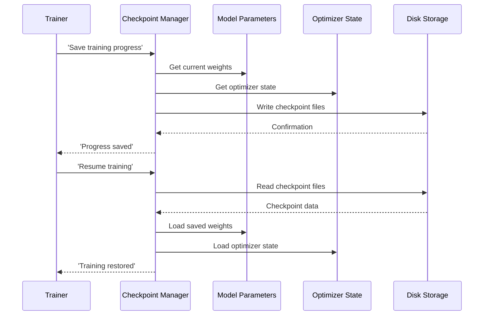

# Chapter 6: CheckpointManager

Imagine you're deep into an epic video game quest. You've battled countless monsters, solved intricate puzzles, and gathered rare treasures. Suddenly, your power goes out, or you realize it's 3 AM and you need to sleep. If the game didn't have a **save game** feature, all your progress would be lost! You'd have to start all over again, enduring the same tedious early-game grind.

Training a large language model like `nanochat` is remarkably similar to playing such a game, but on a much grander scale. It involves iterating through billions of tokens (our "training data"), adjusting billions of parameters (our "model's brain") using sophisticated algorithms like [MuonAdamW](05_muonadamw.md), and calculating performance metrics, all over many hours or even days. What happens if your GPU node crashes? Or if you want to experiment with different fine-tuning strategies starting from a particular point in pre-training? Or perhaps you've achieved a desired performance level and want to deploy *that specific version* of your model for inference?

This is where the **CheckpointManager** comes in. Think of it as `nanochat`'s robust "save game" system. It periodically takes a complete snapshot of the model's entire state and its trainer's progress (like the optimizer parameters) and saves them securely to disk. This allows you to pause training, resume later exactly where you left off, or recall any specific version of your trained model, ensuring that no hard-earned learning is ever truly lost.



The core logic for `nanochat`'s checkpointing resides in `nanochat/checkpoint_manager.py`.

### What's in a Checkpoint?

A `nanochat` checkpoint is more than just the model's weights. It's a comprehensive record of the training state, typically including:

1.  **Model Parameters:** The billions of learned weights and biases (the `state_dict` of our [GPT](02_gpt.md) module) that define the model's knowledge and capabilities.
2.  **Optimizer State:** The internal state of the optimizer (e.g., the `exp_avg` and `exp_avg_sq` momentum buffers for [MuonAdamW](05_muonadamw.md)). These are crucial for the optimizer to continue applying updates correctly from where it left off.
3.  **Metadata:** Additional information about the training run, such as:
    *   The current `step` number.
    *   The last calculated `validation bpb` (bits per byte) or loss.
    *   The `model_config` that defines the architecture.
    *   The `user_config` (command-line arguments) that launched the run.
    *   The `dataloader_state_dict` from [DataLoader](04_dataloader.md), allowing data loading to resume from the exact position in the dataset.
    *   Any other "loop state" variables needed for a seamless resume.

### Saving Checkpoints

The `save_checkpoint` function is the primary mechanism for persisting this state.

```python
# nanochat/checkpoint_manager.py

import os
import torch
import json
import shutil
import glob
import re

from nanochat.common import print0, get_base_dir

def save_checkpoint(checkpoint_dir, step, model_state, optimizer_state, meta_data, rank=0):
    """
    Saves a training checkpoint to disk.

    - model_state: dict of model parameters (orig_model.state_dict())
    - optimizer_state: dict of optimizer state (optimizer.state_dict())
    - meta_data: dict of any additional metadata (e.g., step, loss, configs)
    - rank: for DDP, only rank 0 saves the model, but all ranks save optimizer state
    """
    os.makedirs(checkpoint_dir, exist_ok=True)
    step_str = f"{step:06d}"

    # Only master rank saves the full model state
    if rank == 0:
        model_filepath = os.path.join(checkpoint_dir, f"model_{step_str}.pt")
        torch.save(model_state, model_filepath)
        print0(f"Saved model checkpoint to {model_filepath}")

    # All ranks save their portion of the optimizer state (if distributed)
    if optimizer_state is not None:
        optimizer_filepath = os.path.join(checkpoint_dir, f"optimizer_{step_str}_rank{rank}.pt")
        torch.save(optimizer_state, optimizer_filepath)
        print0(f"Saved optimizer checkpoint to {optimizer_filepath}")

    # Only master rank saves metadata
    if rank == 0:
        meta_filepath = os.path.join(checkpoint_dir, f"meta_{step_str}.json")
        with open(meta_filepath, 'w') as f:
            json.dump(meta_data, f, indent=2)
        print0(f"Saved metadata to {meta_filepath}")

    # Manage old checkpoints to keep disk usage low
    _clean_old_checkpoints(checkpoint_dir)
```

Key aspects of `save_checkpoint`:

*   **Directory Structure**: Checkpoints are stored in a `checkpoint_dir` (e.g., `~/.cache/nanochat/base_checkpoints/d24`).
*   **Step-based Naming**: Each checkpoint is named with a padded step number (e.g., `model_000500.pt`, `optimizer_000500_rank0.pt`), making it easy to identify and load specific versions.
*   **Distributed Training (DDP)**: In a multi-GPU setup, only the `master_process` (rank 0) saves the full `model_state`. However, each rank saves its *own portion* of the `optimizer_state` (`optimizer_000500_rank0.pt`, `optimizer_000500_rank1.pt`, etc.) if the optimizer state is sharded (as in `DistMuonAdamW` from [MuonAdamW](05_muonadamw.md)). This optimizes memory by not replicating optimizer state across all GPUs.
*   **Metadata**: A `.json` file (`meta_000500.json`) accompanies the model and optimizer states, containing all the crucial context for resuming.
*   **Automatic Cleanup**: The `_clean_old_checkpoints` helper ensures that older checkpoints are pruned, preventing disk space from filling up excessively.

In `scripts/base_train.py`, the `save_checkpoint` function is called regularly (e.g., every `args.save_every` steps) and at the very end of training:

```python
# scripts/base_train.py (excerpt)

    # ... (inside the training loop)
    if last_step or (step > 0 and step != args.resume_from_step and args.save_every > 0 and step % args.save_every == 0):
        save_checkpoint(
            checkpoint_dir,
            step,
            orig_model.state_dict(), # model parameters
            optimizer.state_dict(), # optimizer state
            { # metadata saved as json
                "step": step,
                "val_bpb": val_bpb, # loss at last step
                "model_config": model_config_kwargs,
                "user_config": user_config, # inputs to the training script
                "device_batch_size": args.device_batch_size,
                "max_seq_len": args.max_seq_len,
                "total_batch_size": total_batch_size,
                "dataloader_state_dict": dataloader_state_dict, # <-- Important for resuming data loading
                "loop_state": { # all loop state (other than step) so that we can resume training
                    "min_val_bpb": min_val_bpb,
                    "smooth_train_loss": smooth_train_loss,
                    "total_training_time": total_training_time,
                },
            },
            rank=ddp_rank,
        )
    # ...
```

### Loading Checkpoints

Loading involves reversing this process, carefully re-instating the model and optimizer states. `nanochat` provides a `load_model` utility function that orchestrates this, automatically finding the correct checkpoint files and loading them onto the specified device.

```python
# nanochat/checkpoint_manager.py (excerpt)

def load_checkpoint(checkpoint_dir, step, device, load_optimizer=False, rank=0):
    """
    Loads a training checkpoint from disk.
    Returns (model_state, optimizer_state, meta_data) or just (model_state, meta_data) if load_optimizer=False.
    """
    # ... (logic to find correct step number and file paths)

    # Load model state (only rank 0 has the full state, others get it via DDP broadcast)
    model_state = torch.load(model_filepath, map_location=device)
    if torch.distributed.is_initialized():
        # Broadcast model_state from rank 0 to all other ranks
        if rank != 0:
            model_state = [None]
        dist.broadcast_object_list(model_state, src=0, device=device)
        if rank != 0:
            model_state = model_state[0]

    # Load optimizer state (each rank loads its own sharded state)
    optimizer_state = None
    if load_optimizer:
        optimizer_filepath = os.path.join(checkpoint_dir, f"optimizer_{step_str}_rank{rank}.pt")
        optimizer_state = torch.load(optimizer_filepath, map_location=device)

    # Load metadata
    meta_filepath = os.path.join(checkpoint_dir, f"meta_{step_str}.json")
    with open(meta_filepath, 'r') as f:
        meta_data = json.load(f)

    # ... (return loaded states)
```

In distributed training, the `model_state` is only physically present on rank 0's disk. When `load_checkpoint` is called, rank 0 loads the model and then `dist.broadcast_object_list` sends a copy to all other ranks. Each rank, however, directly loads its own sharded `optimizer_state`.

The `load_model` wrapper (not shown here, but defined in the same file) builds the `GPT` model and its tokenizer, then calls `load_checkpoint` to populate them. It also intelligently handles finding the latest step if a specific `step` is not provided.

In `scripts/base_train.py`, `load_checkpoint` is crucial for resuming interrupted training:

```python
# scripts/base_train.py (excerpt)

    # If we are resuming, overwrite the model parameters with those of the checkpoint
    # ...
    resuming = args.resume_from_step != -1
    if resuming:
        print0(f"Resuming optimization from step {args.resume_from_step}")
        model_data, optimizer_data, meta_data = load_checkpoint(checkpoint_dir, args.resume_from_step, device, load_optimizer=True, rank=ddp_rank)
        model.load_state_dict(model_data, strict=True, assign=True)
        del model_data # free up this memory after the copy
    # ...
    # Initialize the Optimizer ... (later loads optimizer_data)
    # ...
    # Initialize the DataLoaders for train/val ... (dataloader_resume_state_dict comes from meta_data)
```

This ensures that the model, optimizer, and even the data loader all restart precisely where they left off.

### Checkpoints for Fine-tuning and Inference

Checkpoints aren't just for resuming training; they're also fundamental for moving between different training stages or deploying models:

*   **Supervised Fine-Tuning (SFT)**: The `scripts/chat_sft.py` script starts by loading a `base` model checkpoint, usually the latest or best-performing one from pre-training. It then continues to train this model on conversational data.

    ```python
    # scripts/chat_sft.py (excerpt)
    # ...
    # Load the model and tokenizer
    model, tokenizer, meta = load_model("base", device, phase="train", model_tag=args.model_tag, step=args.model_step)
    # ... (then init optimizer and continue SFT training)
    ```

*   **Inference**: When you want to chat with your model using `scripts/chat_cli.py` or `scripts/chat_web.py`, these scripts load a fully trained `sft` (or `rl`) model checkpoint to power the conversation. No optimizer state is needed here, only the model parameters.

The `CheckpointManager` acts as the steadfast archivist and restorer of your LLM's learning journey, guaranteeing that the immense computational investment in training is preserved and reusable across various stages and applications.

Now that we understand how `nanochat` saves and loads its entire "brain," the next logical step is to explore how we define what that brain should *do*. How do we specify the problems, questions, or tasks we want the LLM to learn or evaluate itself on? That's the exciting topic of the next chapter, where we'll delve into the `Task` abstraction.