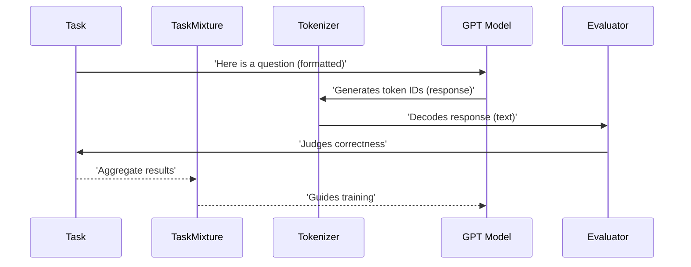

# Chapter 7: Task

Imagine you've spent days meticulously training your `nanochat` model, refining its [GPT](02_gpt.md) architecture and feeding it endless data through your optimized [DataLoader](04_dataloader.md). Now you want to know: is it actually *smart*? Can it answer math problems, follow instructions, or correctly spell words? How do you give it a specific test, objectively grade its performance, and know if it genuinely understands the challenge?

This is where the **Task** abstraction comes in. A `Task` is like a carefully designed exam for your LLM. It defines a specific problem set (e.g., a collection of math problems, multiple-choice questions, or coding challenges), along with clear instructions on how the model should respond, and a precise method for judging whether its answer is correct. It's the blueprint for evaluating and, in some cases, even training the model on specific capabilities.



In `nanochat`, tasks are defined in the `tasks/` directory. They provide a standardized interface that allows different training and evaluation scripts to interact with diverse datasets in a consistent manner.

### The Foundation: The `Task` Base Class

All specific tasks in `nanochat` inherit from the `Task` base class, found in `tasks/common.py`. This class establishes the fundamental contract for any challenge we want to pose to our LLM.

```python
# tasks/common.py

class Task:
    """
    Base class of a Task. Allows for lightweight slicing of the underlying dataset.
    """
    def __init__(self, start=0, stop=None, step=1):
        # ... (slicing logic)
        pass

    @property
    def eval_type(self):
        # one of 'generative' | 'categorical'
        raise NotImplementedError

    def num_examples(self):
        raise NotImplementedError

    def get_example(self, index):
        raise NotImplementedError

    def __len__(self):
        # ... (length calculation)
        pass

    def __getitem__(self, index: int):
        # ... (access example by index)
        pass

    def evaluate(self, problem, completion):
        raise NotImplementedError
```

Key aspects of the `Task` base class:

*   **`eval_type`**: This property is crucial. It categorizes the task as either `'generative'` (where the model generates a free-form response, like answering a math problem) or `'categorical'` (where the model chooses from a set of predefined options, like multiple-choice questions). This distinction significantly impacts how the model is evaluated.
*   **`num_examples()` and `get_example(index)`**: These methods provide access to the dataset. They allow `nanochat` to fetch individual problems or conversations from the task's dataset. The `__len__` and `__getitem__` methods make tasks behave like standard Python lists or datasets.
*   **`evaluate(problem, completion)`**: This is the core logic for judging correctness. Given the original `problem` and the model's `completion` (its generated answer), this method returns a numerical score (typically 0 for incorrect, 1 for correct).

### Combining Tasks: `TaskMixture` and `TaskSequence`

Just as you might prepare for an exam by practicing different types of problems, LLMs benefit from training on a diverse set of tasks. `nanochat` provides two special `Task` subclasses for this purpose:

1.  **`TaskMixture`**:
    *   **Analogy**: A shuffled playlist of practice problems.
    *   This class takes a list of other `Task` objects and combines them into a single, larger dataset. When you request an example from a `TaskMixture`, it randomly (but deterministically, for reproducibility) samples from any of the underlying tasks. This is ideal for supervised fine-tuning (SFT) to expose the model to a wide range of abilities simultaneously.

    ```python
    # tasks/common.py

    class TaskMixture(Task):
        def __init__(self, tasks, **kwargs):
            super().__init__(**kwargs)
            self.tasks = tasks
            # ... (shuffles indices from all tasks)

        def get_example(self, index):
            # ... returns a randomly selected example from one of the sub-tasks
            pass
    ```

2.  **`TaskSequence`**:
    *   **Analogy**: A structured curriculum.
    *   This class concatenates tasks sequentially. You first train on all examples from Task A, then all from Task B, and so on. This is useful for curriculum learning or multi-stage training.

    ```python
    # tasks/common.py

    class TaskSequence(Task):
        def __init__(self, tasks, **kwargs):
            super().__init__(**kwargs)
            self.tasks = tasks
            # ... (simply concatenates tasks)

        def get_example(self, index):
            # ... returns example from tasks in sequential order
            pass
    ```

### Standardized Formatting: `render_mc`

For tasks that involve multiple-choice questions, consistency in prompt formatting is vital, especially for smaller models. The `render_mc` helper function ensures that multiple-choice questions are always presented to the LLM in a uniform, clear way.

```python
# tasks/common.py

def render_mc(question, letters, choices):
    """
    The common multiple choice rendering format we will use.
    ... (formatting logic)
    """
    query = f"Multiple Choice question: {question}\n"
    query += "".join([f"- {choice}={letter}\n" for letter, choice in zip(letters, choices)])
    query += "\nRespond only with the letter of the correct answer."
    return query
```

As highlighted in the code, `nanochat` makes specific choices here, like placing the answer `letter` *after* the `choice` (e.g., `- Choice A=A`) and removing whitespace between the `=` and the letter. These seemingly minor details are crucial because the [Tokenizer](01_tokenizer.md) might assign different IDs to " A" versus "A", and we want the model to learn to generate the exact token for the answer.

### Real-world Examples: Diving into Specific Tasks

Let's look at how specific challenges are implemented as `Task` subclasses in `nanochat`:

*   **`GSM8K` (Grade School Math 8K):** (from `tasks/gsm8k.py`)
    *   **`eval_type`: `'generative'`**. The model must generate a step-by-step solution culminating in a numerical answer.
    *   **Tool Use**: `GSM8K` problems often involve the model invoking a Python calculator (e.g., `<<0.2*50=10>>`). The `get_example` method parses these tool calls from the raw dataset into structured `content` lists for the assistant's message.
    *   **Evaluation**: The `evaluate` method uses a regular expression (`GSM_RE`) to extract the final numerical answer from both the ground truth and the model's generated response, then compares them. It also provides a `reward` method for Reinforcement Learning (RL) training.

*   **`MMLU` (Massive Multitask Language Understanding):** (from `tasks/mmlu.py`)
    *   **`eval_type`: `'categorical'`**. The model selects from multiple-choice options across various academic subjects.
    *   **`render_mc`**: This task heavily utilizes the `render_mc` helper to present questions consistently.
    *   **Evaluation**: Since it's categorical, evaluation can be highly optimized. The `scripts/chat_eval.py` script doesn't generate full text responses; instead, it directly examines the model's *logits* (unnormalized scores from the [GPT](02_gpt.md)'s `lm_head`) for the available answer letters, picking the highest-scoring one. This is much faster.

*   **`SpellingBee`**: (from `tasks/spellingbee.py`)
    *   **`eval_type`: `'generative'`**. Simple tasks like "Spell the word 'apple'" or "How many 'r' are in 'strawberry'?"
    *   **Evaluation**: Compares the model's generated text to the expected answer.

### Tasks in Action: Training and Evaluation

`Task` objects are central to many stages of the `nanochat` pipeline:

*   **Supervised Fine-tuning (SFT) (`scripts/chat_sft.py`):**
    *   The `scripts/chat_sft.py` script uses a `TaskMixture` to train the model on a rich blend of conversations, `MMLU` problems (to teach multiple-choice reasoning), `GSM8K` problems (to teach math and tool use), and `SpellingBee` tasks.
    *   The `sft_data_generator_bos_bestfit` (a specialized [DataLoader](04_dataloader.md)) takes conversation objects from this `TaskMixture` and, using `tokenizer.render_conversation`, generates both `ids` and a `mask`. Crucially, this `mask` ensures the model only learns to predict tokens for the *assistant's responses*, not the user's prompts or tool outputs.

*   **Evaluation (`scripts/chat_eval.py`):**
    *   This script orchestrates the model's assessment on various tasks. It dynamically selects the appropriate evaluation loop (`run_generative_eval` or `run_categorical_eval`) based on the `task_object.eval_type`.
    *   For generative tasks, it uses the [Engine](08_engine.md) to sample multiple completions. For categorical tasks, it efficiently queries logits for answer choices.
    *   The results from multiple tasks are then combined to compute the `ChatCORE` metric, a composite score reflecting the model's overall conversational and reasoning abilities.

*   **Reinforcement Learning (RL) (`scripts/chat_rl.py`):**
    *   In `scripts/chat_rl.py`, tasks like `GSM8K` provide the `reward` signal that guides the model's learning. The `get_batch` function performs rollouts, generating multiple samples for a given problem, and then uses the task's `reward` method to score each sample. This reward (or advantage) is then used by the [MuonAdamW](05_muonadamw.md) optimizer to improve the model's policy.

The `Task` abstraction, therefore, serves as the standardized interface through which `nanochat` defines, presents, and judges the challenges that shape its LLM's intelligence. It's the critical link between raw data and measurable capability.

With the `Task` fully understood, we now have all the components for training and evaluating our LLM. But what about actually *using* the model for interactive chat or complex multi-turn reasoning, taking advantage of all the optimizations we've built? That's the role of the `Engine`, which we'll explore in the final chapter.