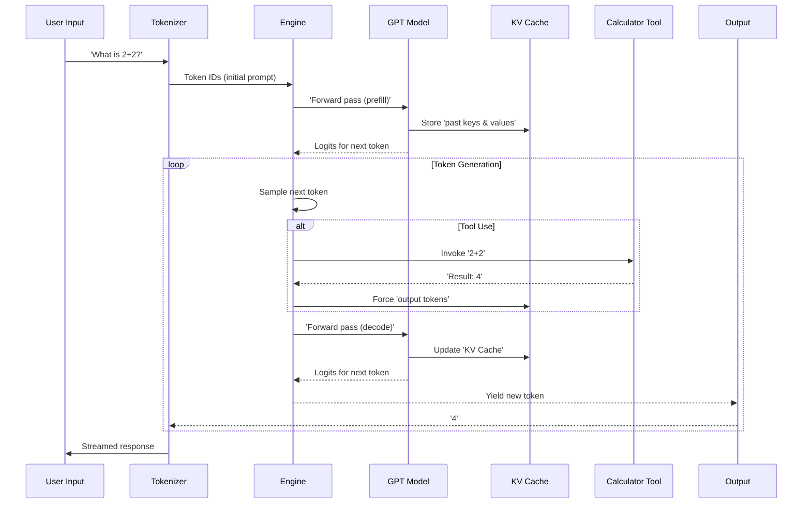

# Chapter 8: Engine

Imagine you've meticulously trained your `nanochat` model, honed its [GPT](02_gpt.md) brain, and optimized every part of its learning journey. Now comes the moment of truth: you want to *talk* to it. You type a question, and you expect a coherent, helpful response, generated word by word, in real time. But how does the model maintain context across multiple turns of a conversation, remembering what was said earlier without re-processing the entire chat history every single time? How does it efficiently generate text, and what if it needs to use an external tool, like a calculator, mid-sentence?

This is where the **Engine** comes in. The `Engine` is `nanochat`'s "thinking machine" for real-time conversations and evaluations. It’s responsible for efficiently driving the model during inference, managing its short-term memory (the KV cache), orchestrating token generation, and even allowing the LLM to use external tools dynamically during a chat. Without the `Engine`, interacting with the model would be slow, memory-intensive, and far less capable.



The core logic for `nanochat`'s `Engine` is found in `nanochat/engine.py`.

### The Brain's Scratchpad: KV Cache

The most critical component for efficient inference in a Transformer model is the **KV Cache** (Key-Value Cache). Imagine you're reading a long book, and someone asks you a question about the beginning of the book. You wouldn't re-read the entire book; you'd just recall the relevant information from your memory.

In a Transformer's self-attention mechanism, every time a new token is generated, it needs to "attend" to all previous tokens in the sequence. This involves computing Key (`K`) and Value (`V`) vectors for *all* tokens seen so far. If you did this from scratch for every new token, the computation would grow quadratically with sequence length, making long conversations impossibly slow.

The KV Cache solves this. It's a special memory bank that stores the `K` and `V` vectors of all previously processed tokens. When the model generates a new token, it only needs to compute `K` and `V` for *that single new token*, and then concatenates them with the cached `K` and `V`s from the past. This drastically speeds up generation, making it constant-time per token (after the initial prompt processing).

`nanochat` implements its `KVCache` in `nanochat/engine.py`:

```python
# nanochat/engine.py

class KVCache:
    def __init__(self, batch_size, num_heads, seq_len, head_dim, num_layers, device, dtype):
        self.batch_size = batch_size
        self.max_seq_len = seq_len
        self.n_layers = num_layers
        self.n_heads = num_heads
        self.head_dim = head_dim
        # Pre-allocate cache tensors: (n_layers, B, T, H, D)
        self.k_cache = torch.zeros(num_layers, batch_size, seq_len, num_heads, head_dim, device=device, dtype=dtype)
        self.v_cache = torch.zeros(num_layers, batch_size, seq_len, num_heads, head_dim, device=device, dtype=dtype)
        # Current sequence length per batch element (FA3 needs int32)
        self.cache_seqlens = torch.zeros(batch_size, dtype=torch.int32, device=device)
        self.prev_embedding = None # for the smear mechanism (GPT's forward pass)
```

Notice the shape `(n_layers, B, T, H, D)`. This specific layout is optimized for Flash Attention 3, which `nanochat` integrates (see `nanochat/flash_attention.py`). The `flash_attn.flash_attn_with_kvcache` function, used within the [GPT](02_gpt.md) model's `CausalSelfAttention` block, is designed to efficiently read from and write to this cache in-place.

There are two main phases when using the KV Cache:

1.  **Prefill**: When you give the model an initial prompt (e.g., "Tell me a story about..."), the entire prompt is processed in one go. The `GPT` model's forward pass computes all `K` and `V` vectors for these prompt tokens and stores them in the KV Cache.
    The `KVCache.prefill` method facilitates this by copying a pre-computed cache (from a single-sample prefill) to multiple samples for parallel generation.

    ```python
    # nanochat/engine.py

    class KVCache:
        # ... (init and other methods)
        def prefill(self, other):
            """
            Copy cached KV from another cache into this one.
            Used when we do batch=1 prefill and then want to generate multiple samples in parallel.
            """
            assert self.get_pos() == 0, "Cannot prefill a non-empty KV cache"
            # ... (copy cache tensors and update cache_seqlens)
    ```

2.  **Decode**: After the prefill, the model generates one token at a time. For each new token, it only computes its own `K` and `V` vectors, and then `flash_attn_with_kvcache` efficiently uses the stored cache *and* the new vectors to compute attention. The `KVCache.advance` method keeps track of the current position in the sequence.

### Orchestrating Generation: `Engine.generate`

The `Engine.generate` method is the heart of `nanochat`'s inference. It's an `async` generator (when used in `chat_web.py`) that yields tokens one by one, allowing for a streaming, interactive experience. It handles all the complexities:

*   **Batched Generation**: It can generate multiple independent sequences in parallel (`num_samples`). This is particularly useful for tasks like `pass@k` evaluation in [RL](scripts/chat_rl.py) or for exploring different responses.
*   **Sampling Strategy**: It uses `sample_next_token` to select the next token based on `temperature` (controlling randomness) and `top_k` (limiting choices to the `k` most probable tokens).
*   **Tool Use**: It detects special tokens for tool invocation and executes Python code (e.g., a calculator) within a safe sandbox.
*   **State Management**: It maintains a `RowState` object for each parallel generation, tracking its current tokens, whether it's inside a Python block, and any tokens that need to be "forced" (e.g., tool outputs).

```python
# nanochat/engine.py

class Engine:
    def __init__(self, model, tokenizer):
        self.model = model
        self.tokenizer = tokenizer

    @torch.inference_mode()
    def generate(self, tokens, num_samples=1, max_tokens=None, temperature=1.0, top_k=None, seed=42):
        # ... (KV cache prefill and initialization for decode phase) ...

        row_states = [RowState(tokens.copy()) for _ in range(num_samples)]
        num_generated = 0

        while True:
            # ... (stop conditions) ...

            # Sample the next token for each row
            logits = self.model.forward(ids, kv_cache=kv_cache_decode)[:, -1, :] # (B, vocab_size)
            next_ids = sample_next_token(logits, rng, temperature, top_k)  # (B, 1)
            sampled_tokens = next_ids[:, 0].tolist()

            token_column = []
            token_masks = []
            for i, state in enumerate(row_states):
                # Select the next token (forced or sampled)
                is_forced = len(state.forced_tokens) > 0
                token_masks.append(0 if is_forced else 1)
                next_token = state.forced_tokens.popleft() if is_forced else sampled_tokens[i]
                token_column.append(next_token)
                state.current_tokens.append(next_token)

                # Handle tool use state machine (Python blocks)
                if next_token == python_start:
                    state.in_python_block = True
                    state.python_expr_tokens = []
                elif next_token == python_end and state.in_python_block:
                    state.in_python_block = False
                    if state.python_expr_tokens:
                        expr = self.tokenizer.decode(state.python_expr_tokens)
                        result = use_calculator(expr) # <--- Tool invocation!
                        if result is not None:
                            # Force tool output tokens into the stream
                            result_tokens = self.tokenizer.encode(str(result))
                            state.forced_tokens.append(output_start)
                            state.forced_tokens.extend(result_tokens)
                            state.forced_tokens.append(output_end)
                    state.python_expr_tokens = []
                elif state.in_python_block:
                    state.python_expr_tokens.append(next_token)

            yield token_column, token_masks # Stream tokens as they are generated
            num_generated += 1

            # Prepare inputs for the next iteration (only the newly generated tokens)
            ids = torch.tensor(token_column, dtype=torch.long, device=device).unsqueeze(1)
```

The `Engine` constantly monitors the generated `next_token` for special tool-use tokens like `<|python_start|>` and `<|python_end|>`. When a Python block is detected, it captures the subsequent tokens as a Python expression, decodes it, and passes it to `use_calculator`. If a result is returned, the engine then *forces* the calculator's output tokens (wrapped in `<|output_start|>` and `<|output_end|>`) into the generation stream, allowing the LLM to "see" the tool's result and continue its reasoning.

The `use_calculator` function itself is a small, sandboxed Python `eval` wrapper:

```python
# nanochat/engine.py

def eval_with_timeout(formula, max_time=3):
    try:
        with timeout(max_time, formula): # prevents infinite loops
            with warnings.catch_warnings():
                warnings.simplefilter("ignore", SyntaxWarning)
                return eval(formula, {"__builtins__": {}}, {}) # restricted scope
    except Exception as e:
        # ... (error handling)
        return None

def use_calculator(expr):
    # ... (sanitization and logic to only allow safe operations like .count()) ...
    return eval_with_timeout(expr)
```
This `use_calculator` logic is designed for safety, filtering out dangerous patterns and limiting operations to basic math and simple string methods like `.count()`.

### `Engine.generate_batch`

For scenarios where you don't need real-time streaming (e.g., for evaluation scripts that process many examples and then report a single accuracy), the `Engine` also provides `generate_batch`. This is a convenience wrapper around `Engine.generate` that accumulates all generated tokens and returns the complete sequences in one go.

### `Engine` in the `nanochat` Ecosystem

The `Engine` brings together almost everything we've learned in previous chapters:

*   **[Tokenizer](01_tokenizer.md)**: The `Engine` relies on the `Tokenizer` to encode user input, decode generated tokens into human-readable text, and provide special token IDs for conversation control and tool use.
*   **[GPT](02_gpt.md)**: The `Engine` continuously calls the `GPT` model's `forward` method, which performs the actual prediction of the next token, leveraging the KV Cache within its `CausalSelfAttention` layers.
*   **[COMPUTE_DTYPE](03_compute_dtype.md)**: The KV Cache and all intermediate calculations within the `GPT` model (when called by the `Engine`) adhere to the `COMPUTE_DTYPE` setting for optimal performance and memory usage.
*   **[CheckpointManager](06_checkpoint_manager.md)**: When you launch a chat interface (`scripts/chat_cli.py` or `scripts/chat_web.py`), the `CheckpointManager` loads a fully trained model into memory, which the `Engine` then utilizes.
*   **[Task](07_task.md)**: For generative evaluation tasks (like `GSM8K` or `HumanEval`), `scripts/chat_eval.py` uses the `Engine.generate_batch` method to produce multiple completions, which are then evaluated by the `Task`'s `evaluate` method. Even reinforcement learning (`scripts/chat_rl.py`) relies on the `Engine` for generating rollouts.

The `Engine` is what transforms a static, trained neural network into a dynamic, interactive conversational agent. It's the final piece of the puzzle that enables `nanochat` to efficiently generate text, manage its memory, and interact with the world through external tools, truly bringing the LLM to life.

This concludes our journey through the `nanochat` codebase! From the foundational [Tokenizer](01_tokenizer.md) that translates human language into machine-readable numbers, through the deep learning mechanics of the [GPT](02_gpt.md) model, the performance optimizations of [COMPUTE_DTYPE](03_compute_dtype.md) and the [DataLoader](04_dataloader.md), the intelligent learning of [MuonAdamW](05_muonadamw.md), the persistence of the [CheckpointManager](06_checkpoint_manager.md), and the structured evaluation of [Task](07_task.md), we've explored every key component. The `Engine` stands as the culmination, a testament to how these intricate parts synergize to create a capable and accessible large language model.