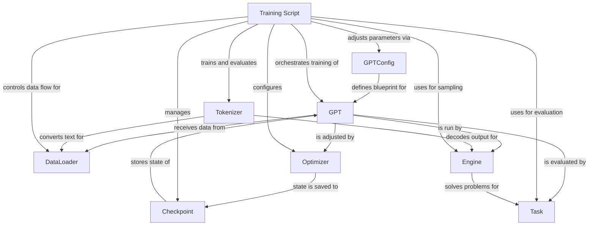

# nanochat

_Lens: beginner-tutorial_

nanochat is an experimental harness for training large language models on a single GPU node. It simplifies the entire LLM lifecycle, from tokenization and pretraining to finetuning, evaluation, and inference, aiming for minimal, hackable code.

## Architecture

## Chapters

- [Tokenizer](01_tokenizer.md)
- [GPTConfig](02_gptconfig.md)
- [GPT](03_gpt.md)
- [DataLoader](04_dataloader.md)
- [Optimizer](05_optimizer.md)
- [Checkpoint](06_checkpoint.md)
- [Training Script](07_training_script.md)
- [Task](08_task.md)
- [Engine](09_engine.md)