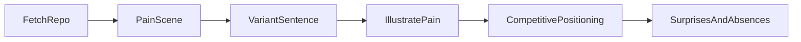

# Chapter 5. Product Intent

> Reverse engineer the PRD from the code. Five prompts, one pipeline, one polished page per repo.

## What this chapter ships

Five prompts that each extract one slice of product intent, a workflow that runs them in order, and a renderer that emits a self-contained HTML brief plus a markdown twin.

```
ch05-product-intent/
├── prompts/
│   ├── pain-scene.md              # the user's moment of frustration BEFORE this product
│   ├── variant-sentence.md        # "It's X, but Y." Pitch in one sentence.
│   ├── competitive-positioning.md # what it sacrifices, what it gains, why incumbents can't copy
│   ├── surprises-and-absences.md  # features hiding in the code; features deliberately missing
│   └── pain-illustration.md       # comic-strip image prompt anchored in the pain text
├── workflow/                      # PocketFlow pipeline running all five
├── skill/PRODUCT-STORY.md         # agent equivalent (drop into Claude Code or Cursor)
└── output/<repo>-story/
    ├── index.md                   # plain markdown story
    ├── index.html                 # polished page
    └── pain.png                   # generated before/after comic
```

## Quickstart

```bash
pip install -r ../utils/requirements.txt
export GEMINI_API_KEY=...    # required for text + image (image generation only works with Gemini)
# OR for text-only (skip illustration):
export ANTHROPIC_API_KEY=...
export CH5_NO_IMAGE=1

cd workflow
python main.py path/to/repo
```

Output:

```
  Crawled 518,311 chars from path/to/repo
  Pain scene (352 chars)
  Variant sentence: It's like building your own ChatGPT...
  Illustration: pain.png
  Positioning: 4 competitors, 4 dimensions
  Surprises: 7 present, 6 absent

Wrote ../output/repo-story/index.md
Wrote ../output/repo-story/index.html
  Open ../output/repo-story/index.html in a browser
```

## Filtering big repos with `--include` / `--exclude`

Anything over roughly 3 MB of source code overflows Gemini's 1 M token input cap. Pass `.gitignore`-style patterns to narrow the crawl:

```bash
# only feed the core source dirs
python main.py path/to/tigerbeetle \
    --include 'src/vsr/**' --include 'src/lsm/**' \
    --include 'src/state_machine.zig' --include 'src/tigerbeetle.zig' \
    --include 'README.md'

# drop noise that survives the default skip list
python main.py path/to/nats \
    --include 'server/server.go' --include 'server/jetstream*.go' \
    --include 'main.go' --include 'README.md' \
    --exclude '**_test.go'
```

`--include` and `--exclude` use `pathspec` semantics: `**` recursion, anchored paths, negation, all standard. Both flags are repeatable.

For the densest output (competitive matrix + counter-positioning + surprises) Gemini 2.5 Flash can hit its output token cap mid-YAML. Bump it for huge repos:

```bash
LLM_MAX_OUTPUT_TOKENS=32768 GEMINI_MODEL=gemini-2.5-pro python main.py path/to/repo ...
```

## How it works



Six nodes. Each LLM-calling node uses `Node(max_retries=3, wait=2)` so transient errors retry cleanly. No `try/except` in the main path.

`IllustratePain` is the only node that may skip silently. It needs `GEMINI_API_KEY` (the image model is Gemini-only) and the env var `CH5_NO_IMAGE` to be unset. If either condition fails it leaves `pain_image_path = None` and the rendered HTML omits the picture. The story is still complete without it.

## How the HTML is built

A small SaaS-landing-page aesthetic, but everything stays in one self-contained file.

- **One HTML file per repo**, double-click to open. No JS framework, no build step.
- **Vanilla HTML + an embedded `<style>` block**. ~250 lines including CSS.
- **Inter + JetBrains Mono via Google Fonts CDN** for the typography rhythm.
- **Dark gradient hero** at the top: small "Product Story" eyebrow, product name in a light blue accent, the variant sentence underneath.
- **Pain card** with red left accent and a "↳ Why this exists" label. When `pain.png` exists, the card renders as a two-column grid: pain text on the left, the comic on the right (stacks on mobile).
- **Counter-positioning** as two side-by-side cards (sacrifices in amber, gains in green) plus a soft callout for "why incumbents can't copy."
- **Competitor matrix** as a real table with bold verdicts and muted detail spans; the row for this product is highlighted in light blue.
- **Surprises and absences** as horizontal scroll-snap card rails (300 px cards), with numbered badges. Blue rails for surprises, amber rails for absences.

## How the comic illustration is built

Two LLM steps:

1. **Write the image prompt** from the pain text + variant sentence. The meta-prompt in [`prompts/pain-illustration.md`](prompts/pain-illustration.md) bans visual metaphors (no fences, no labeled skyscrapers) and pushes for literal imagery from the product's actual domain (terminals, dashboards, schemas, calendars). It also asks the writer to quote phrases from the pain text directly in the bubbles instead of paraphrasing.

2. **Render the image** with Gemini's image model. Comic-strip felt-tip-marker style, pure white background, square format, two panels with `BEFORE` / `AFTER` labels, one stick figure carrying both panels, one hand-lettered speech bubble per panel.

Saved as `output/<repo>-story/pain.png` next to the HTML. The HTML embeds it via a relative `src="pain.png"`.

## Example output

Five worked stories on intentionally confusing repos:

| Folder | Repo | Variant sentence |
| ------ | ---- | ---------------- |
| [`output/nanochat-story/`](output/nanochat-story/) | karpathy/nanochat | "Like building your own ChatGPT, but a minimal codebase that lets one developer train a GPT-2-grade chatbot for under $100." |
| [`output/dspy-story/`](output/dspy-story/) | stanfordnlp/dspy | "Like giving instructions to ChatGPT, but you write Python code to design multi-step LLM programs, and DSPy auto-tunes the internal prompts." |
| [`output/tigerbeetle-story/`](output/tigerbeetle-story/) | tigerbeetle/tigerbeetle | "A database for financial transactions that strictly enforces double-entry accounting with extreme speed and data integrity." |
| [`output/nats-story/`](output/nats-story/) | nats-io/nats-server | "Like Gmail for software services, but messages are not stored — a service must be online and subscribed to receive a message." |
| [`output/outlines-story/`](output/outlines-story/) | outlines-dev/outlines | "Like ChatGPT, but you tell it exactly what structured text to produce (a Pydantic model, a Python `Literal`), and the output is guaranteed to match." |

Open any `index.html` in a browser for the polished version. The matching `index.md` reads fine on the command line and on GitHub.

## Agent equivalent

[`skill/PRODUCT-STORY.md`](skill/PRODUCT-STORY.md) runs the same five prompts inside an agent session. Best when you're already exploring a repo in Claude Code or Cursor and don't want to switch to the CLI.
