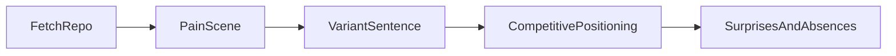

# Chapter 5. Product Intent

> Reverse engineer the PRD from the code. Four prompts. The pain, the pitch, the positioning, the bets nobody advertises.

## What this chapter ships

Four prompts that each extract one slice of product intent, plus a workflow that runs them in sequence and renders the result as a clean one-page brief.

```
ch05-product-intent/
├── prompts/
│   ├── pain-scene.md              # the user's moment of frustration BEFORE this product
│   ├── variant-sentence.md        # "It's X, but Y." Pitch in one sentence.
│   ├── competitive-positioning.md # what it sacrifices, what it gains, why incumbents can't copy
│   └── surprises-and-absences.md  # features hiding in the code; features deliberately missing
├── workflow/                      # PocketFlow pipeline running all four prompts
├── skill/PRODUCT-STORY.md         # agent equivalent (drop into Claude Code or Cursor)
└── output/<repo>-story.{md,html}
```

## Quickstart

```bash
# From the repo root — install once for all chapters.
# Pick the provider you want to use:
pip install -e .               # Anthropic (default)
pip install -e ".[openai]"     # OpenAI
pip install -e ".[google]"     # Gemini

# Or with uv:
uv sync                        # Anthropic (default)
uv sync --extra openai
uv sync --extra google

# Export the matching key:
export ANTHROPIC_API_KEY=...
# export OPENAI_API_KEY=...
# export GEMINI_API_KEY=...
# export OLLAMA_HOST=http://localhost:11434   # local Ollama, no key needed

cd workflow
python main.py path/to/repo
```

Output:

```
  Crawled 518,311 chars from path/to/repo
  Pain scene (352 chars)
  Variant sentence: It's like building your own ChatGPT, but it's a minimal codebase...
  Positioning: 4 competitors, 4 dimensions
  Surprises: 7 present, 6 absent

Wrote ../output/repo-story.md
Wrote ../output/repo-story.html
  Open ../output/repo-story.html in a browser
```

The HTML is the one to open. The markdown twin is for command line viewing and GitHub.

## How it works



Five nodes. Each LLM-calling node uses PocketFlow's `Node(max_retries=3, wait=2)`, so a bad YAML response or a transient API blip retries cleanly. No try/except in the main path.

The four prompts are independent (each just needs the codebase dump). The pipeline keeps them sequential because cache hits make re-runs instant anyway, and sequential console output is easier to debug.

## How the HTML is built

Deliberately plain:

- One self contained file. Double click to open.
- Vanilla HTML plus a small embedded `<style>` block. No JS framework, no build step.
- System font stack. Two colors plus a soft background. No icons, no web fonts.
- Pitch and pain render as quote-styled blocks at the top.
- Counter-positioning renders as two side-by-side cards (sacrifices, gains) plus a callout.
- Competitor matrix renders as a table with bold verdicts and muted detail.
- Surprises and absences render as vertical card lists: bold headline, gray code location, gray explanation paragraph. Easier to scan than wide tables.

## Example output

See [`output/nanochat-story.html`](output/nanochat-story.html) for a real run on [karpathy/nanochat](https://github.com/karpathy/nanochat). All four sections, generated end to end with Gemini 2.5 Flash for about $0.01. Open the HTML in a browser for the cleanest read. The [markdown twin](output/nanochat-story.md) lives next to it.

A taste:

> **Pitch**: It's like building your own ChatGPT, but it's a minimal codebase that allows individual developers to train a GPT-2 capability chat AI from scratch for under $100.
>
> **Pain**: An ambitious student, Kai, wants to train his own LLM to explore cutting-edge research, but each Google search reveals projects costing tens of thousands of dollars and requiring massive, complex setups. His real competitor isn't another coding framework, it's the financial barrier and the overwhelming feeling that this field is only for tech giants.

## Agent equivalent

[`skill/PRODUCT-STORY.md`](skill/PRODUCT-STORY.md) runs the same four prompts inside an agent session. Best when you're already exploring a repo in Claude Code or Cursor and don't want to switch to the CLI.
